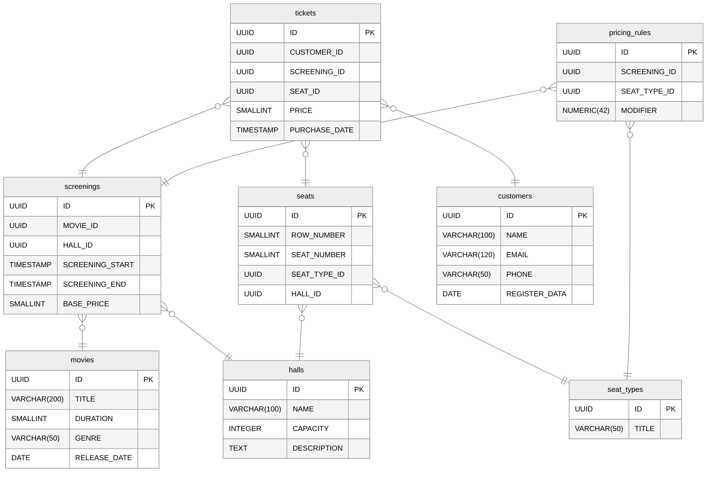

# PHP_2025

## Описание выполненного ДЗ №4
В рамках домашнего задания спроектированна схема данных для системы управления кинотеатром.
Написан запрос по определению самого прибыльного фильма.

### Логическая схема:
