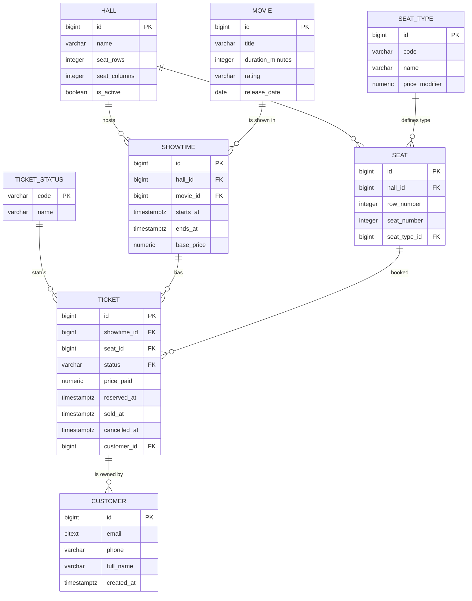

## Система управления кинотеатром

Цена = базовая цена сеанса + модификатор по типу места. Билет может быть в статусах: reserved, sold, cancelled. Схема зала — сетка ряд×место, у места есть тип (например, VIP).

