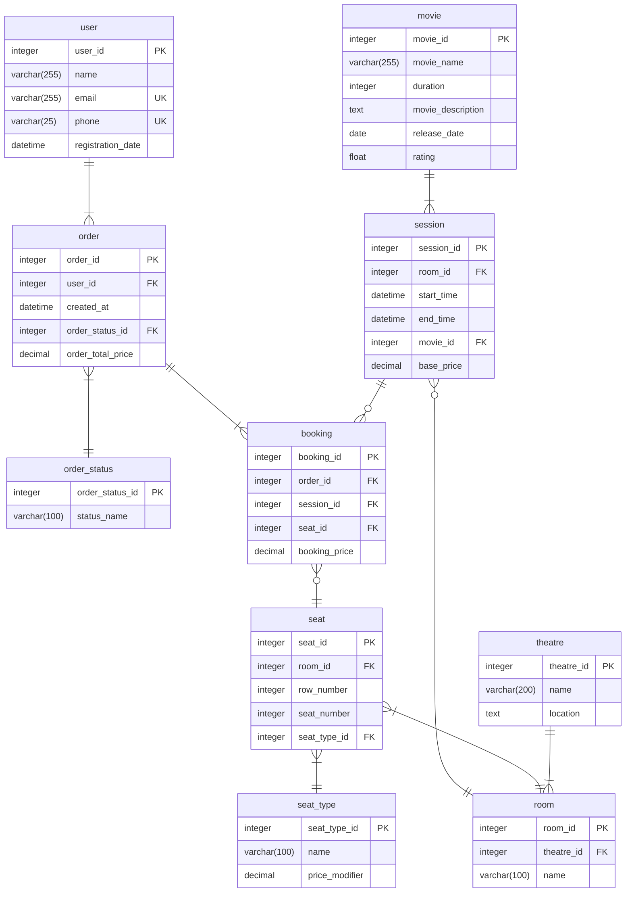

# PHP_2025 Проектирование БД

https://otus.ru/lessons/razrabotchik-php/?utm_source=github&utm_medium=free&utm_campaign=otus

# Описание 

В рамках задачи была спроектирована БД для системы управления кинотеатром

# Схема

