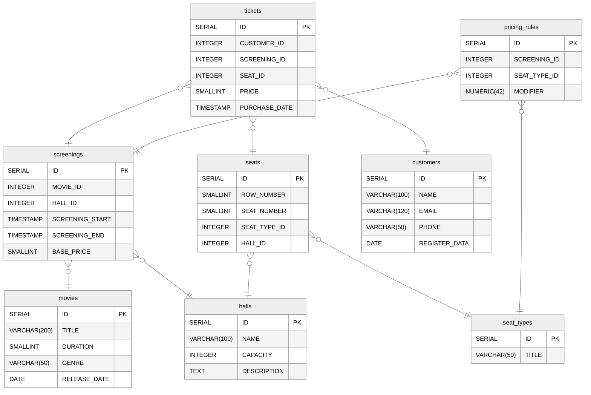

# Домашнее задание №9 - Индексирование данных

## Описание

1. Подготовить список из 6 основных запросов к БД, разработанной на предыдущих занятиях:

    1. Выбор всех фильмов на сегодня
    2. Подсчёт проданных билетов за неделю
    3. Формирование афиши (фильмы, которые показывают сегодня)
    4. Поиск 3 самых прибыльных фильмов за неделю
    5. Сформировать схему зала и показать на ней свободные и занятые места на конкретный сеанс
    6. Вывести диапазон минимальной и максимальной цены за билет на конкретный сеанс

2. Заполнить таблицы, увеличив общее количество строк текстовых данных до 10000.
   Провести анализ производительности запросов к БД, сохранить планы выполнения.

3. Заполнить таблицы, увеличив общее количество строк текстовых данных до 10000000.
   Провести анализ производительности запросов к БД, сохранить планы выполнения.

4. На основе анализа запросов и планов предложить оптимизации (индексы, структура, параметры и др.)

5. Добавьте индексы и сравните результат, приложив планы выполнения.

### Логическая схема:



## Перечень оптимизаций с пояснениями

### Созданные индексы

1. `idx_screenings_date_start`

```postgresql
CREATE INDEX IF NOT EXISTS idx_screenings_date_start ON "cinema".screenings (DATE("SCREENING_START"));
```

- Назначение: Фильтрация по дате показа (запросы 1, 3)
- Результат: Bitmap Index Scan вместо Seq Scan

2. `idx_tickets_screening_id`

```postgresql
CREATE INDEX idx_tickets_screening_id on "cinema".tickets ("SCREENING_ID");
```

- Назначение: Оптимизация JOIN операций (запросы 2, 4, 5, 6)
- Результат: Bitmap Index Scan вместо Seq Scan, Ускорение связывания ticket ↔ screening

3. `idx_tickets_purchase_time`

```postgresql
CREATE INDEX IF NOT EXISTS idx_tickets_purchase_time ON "cinema".tickets (DATE("PURCHASE_DATE"));
````

- Назначение: Фильтрация по дате покупки (запросы 2, 4)
- Результат: Bitmap Index Scan вместо Parallel Seq Scan

4. `idx_screening_movie_id`

```postgresql
CREATE INDEX IF NOT EXISTS idx_screening_movie_id ON "cinema".screenings ("MOVIE_ID");
```

- Назначение: Оптимизация JOIN с таблицей movie (запросы 1, 3, 4)
- Результат: Общее улучшение JOIN операций. Ускорение связывания screening ↔ movie.

5. `idx_screenings_hall_id`

```postgresql
CREATE INDEX IF NOT EXISTS idx_screenings_hall_id ON "cinema".screenings ("HALL_ID");
```

- Назначение: Оптимизация JOIN с таблицей hall (запросы 5, 6)
- Результат: Ускорение связывания screening ↔ hall

## Анализ БД

### Cписок (15 значений) самых больших по размеру объектов БД (таблицы, включая индексы, сами индексы)

| object\_name                 | object\_size |
|:-----------------------------|:-------------|
| tickets                      | 602554368    |
| customers                    | 465608704    |
| idx\_tickets\_purchase\_time | 70295552     |
| idx\_tickets\_screening\_id  | 68632576     |
| pricing\_rules               | 10469376     |
| screenings                   | 3448832      |
| idx\_screenings\_date\_start | 401408       |
| idx\_screenings\_hall\_id    | 368640       |
| idx\_screening\_movie\_id    | 368640       |
| seats                        | 122880       |
| movies                       | 65536        |
| idx\_movies\_title           | 32768        |
| halls                        | 16384        |
| seat\_types                  | 8192         |

### Список (по 5 значений) самых часто

| schemaname | tablename  | indexname                    | scans | tuples\_read | tuples\_fetched |
|:-----------|:-----------|:-----------------------------|:------|:-------------|:----------------|
| cinema     | tickets    | idx\_tickets\_screening\_id  | 515   | 101408       | 101400          |
| cinema     | screenings | idx\_screening\_movie\_id    | 20    | 20           | 0               |
| cinema     | screenings | idx\_screenings\_date\_start | 9     | 675          | 0               |
| cinema     | tickets    | idx\_tickets\_purchase\_time | 0     | 0            | 0               |
| cinema     | screenings | idx\_screenings\_hall\_id    | 0     | 0            | 0               |

### Список (по 5 значений) редко используемых индексов

| schemaname | tablename  | indexname                    | scans | tuples\_read | tuples\_fetched |
|:-----------|:-----------|:-----------------------------|:------|:-------------|:----------------|
| cinema     | movies     | idx\_movies\_title           | 0     | 0            | 0               |
| cinema     | screenings | idx\_screenings\_hall\_id    | 0     | 0            | 0               |
| cinema     | tickets    | idx\_tickets\_purchase\_time | 0     | 0            | 0               |
| cinema     | screenings | idx\_screenings\_date\_start | 9     | 675          | 0               |
| cinema     | screenings | idx\_screening\_movie\_id    | 20    | 20           | 0               |
