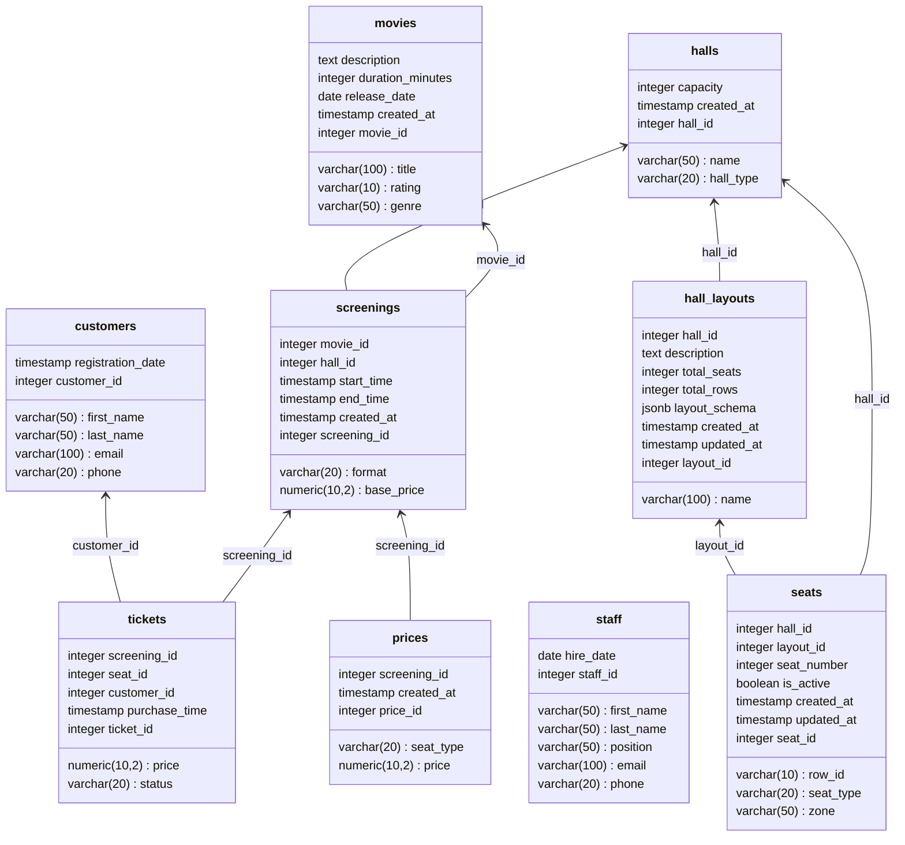

# Схема данных для системы управления кинотеатром

Кинотеатр имеет несколько залов, в каждом зале идет несколько разных сеансов, клиенты могут купить билеты на сеансы


## Логическая модель


## Пример JSON для схемы зала в таблице hall_layouts

```json
{
    "version": "1.0",
    "rows": [
        {
            "row_id": "A",
            "row_name": "Первый ряд",
            "seats": [
                {"seat_number": 1, "seat_type": "vip", "zone": "center"},
                {"seat_number": 2, "seat_type": "vip", "zone": "center"}
            ]
        },
        {
            "row_id": "B",
            "row_name": "Второй ряд",
            "seats": [
                {"seat_number": 1, "seat_type": "vip", "zone": "left"},
                {"seat_number": 2, "seat_type": "vip", "zone": "center"},
                {"seat_number": 3, "seat_type": "vip", "zone": "center"},
                {"seat_number": 4, "seat_type": "vip", "zone": "right"}
            ]
        },
        {
            "row_id": "C",
            "row_name": "Третий ряд",
            "seats": [
                {"seat_number": 1, "seat_type": "standard", "zone": "left"},
                {"seat_number": 2, "seat_type": "standard", "zone": "left"},
                {"seat_number": 3, "seat_type": "standard", "zone": "center"},
                {"seat_number": 4, "seat_type": "standard", "zone": "center"},
                {"seat_number": 5, "seat_type": "standard", "zone": "right"},
                {"seat_number": 6, "seat_type": "standard", "zone": "right"}
            ]
        }
    ],
    "zones": {
        "center": {"color": "#FF0000", "price_multiplier": 1.3},
        "left": {"color": "#00FF00", "price_multiplier": 1.0},
        "right": {"color": "#0000FF", "price_multiplier": 1.0}
    }
}
```
## Запрос для нахождения самого прибыльного фильма

```sql
WITH movie_revenue AS (
    SELECT 
        m.movie_id,
        m.title,
        SUM(t.price) AS total_revenue,
        COUNT(t.ticket_id) AS tickets_sold
    FROM 
        movies m
    JOIN 
        screenings s ON m.movie_id = s.movie_id
    JOIN 
        tickets t ON s.screening_id = t.screening_id
    WHERE 
        t.status = 'active'
    GROUP BY 
        m.movie_id, m.title
)
SELECT 
    movie_id,
    title,
    total_revenue,
    tickets_sold
FROM 
    movie_revenue
ORDER BY 
    total_revenue DESC
LIMIT 1;
```


