# Архитектура кода

Взята домашняя работа по теме Redis.  
Первая версия кода https://github.com/otusteamedu/PHP_2025/tree/ABurnysheva/hw10

## Первая версия приложения
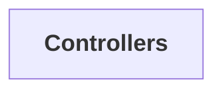

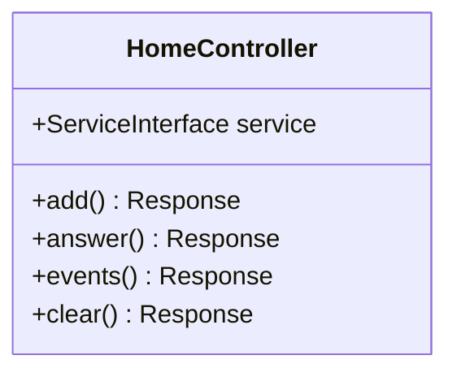

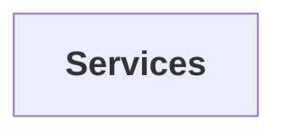

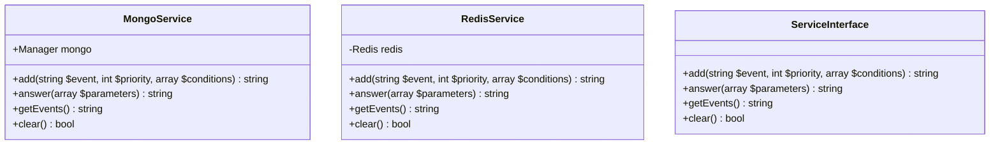

## Вторая версия приложения

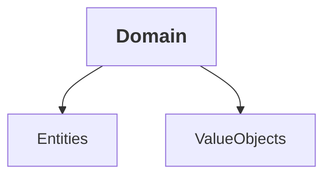

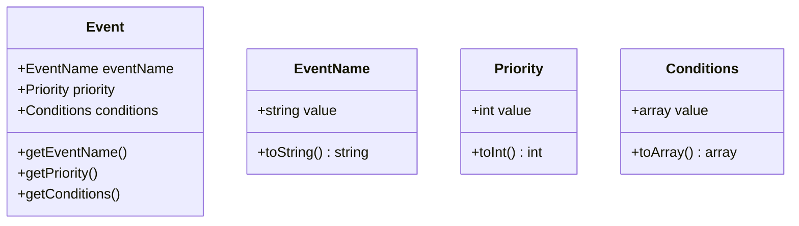

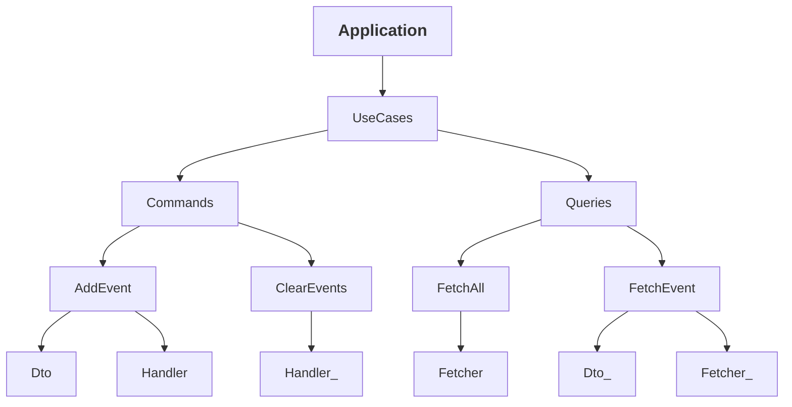

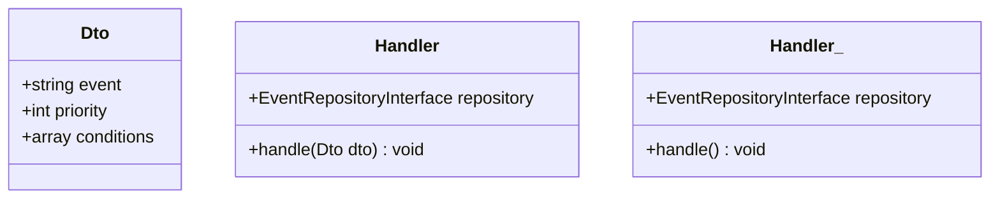

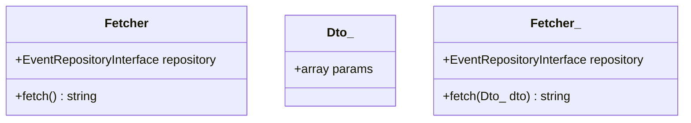

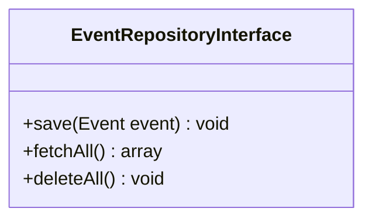

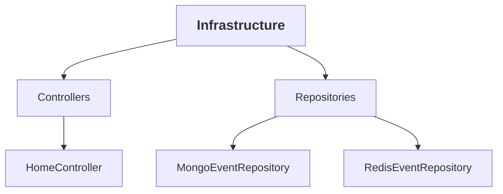

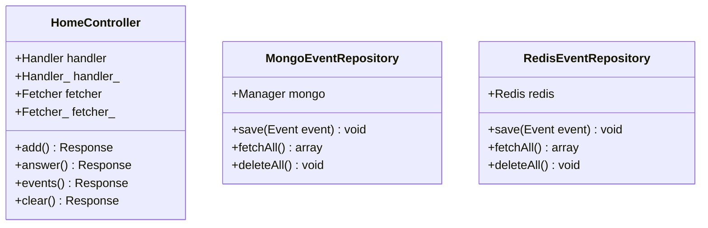

## Анализ изменений
1. Более чистая архитектура кода. Выделены слои Domain, Application, Infrastructure.
2. Код лучше соотвествует принципу единственной ответственности.  
UseCases - каждая команда делает только одно действие.  
Выделены репозитории, которые занимаются только работой с хранилищем.
3. Код лучше соответствует принципу открытости-закрытости.  
Можно добавлять новые команды, новые репозитории для работы с другими хранилищами,  
не внося изменений в уже существующий код.
4. Код лучше соответствует принципу DRY, за счет выделения слоя приложения и создания общих usecases,  
которые не зависят от типа хранилища.
5. Код лучше соотвествует принципу DIP (dependency inversion principle) -  
классы зависят от абстракций (интерфейс репозитория).  
Детали (конкретные репозитории) реализуют абстракцию.
