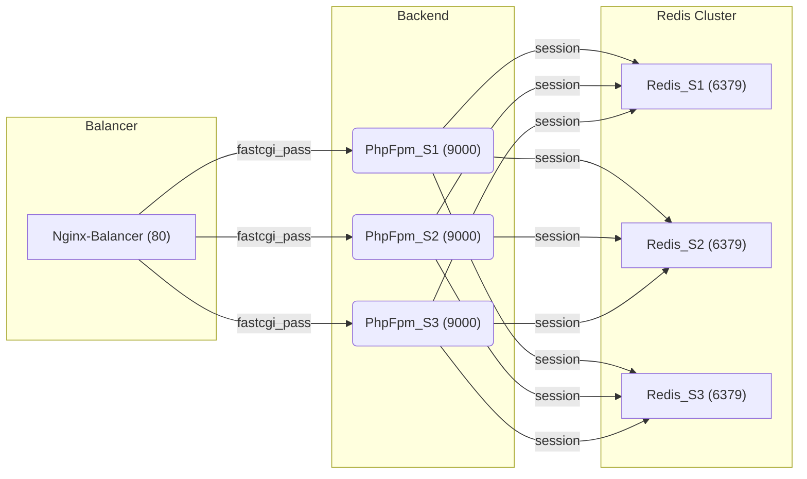

# PHP_2025

## Описание выполненного ДЗ №4
В рамках домашнего задания разработан балансируемый кластер Nginx, трех серверов PHP-FPM
и Redis Cluster из трёх серверов.

### Краткое описание архитектуры:

### Запуск
Установить зависимости через Composer:
```bash
composer install
```

Для запуска контейнеров:
1. Перейти в каталог docker
```bash
cd docker
```
2. Запустить контейнеры
```bash
docker-compose up -d
```

Инициализируйте Redis Cluster:
```bash
docker exec -it Redis_S1 redis-cli --cluster create Redis_S1:6379 Redis_S2:6379 Redis_S3:6379 --cluster-replicas 0
```