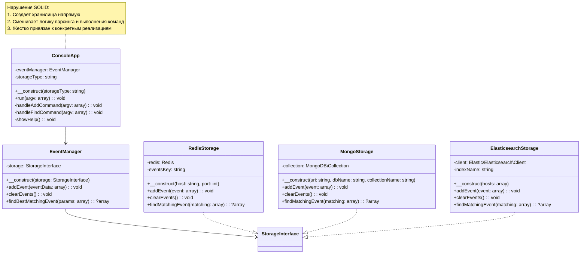
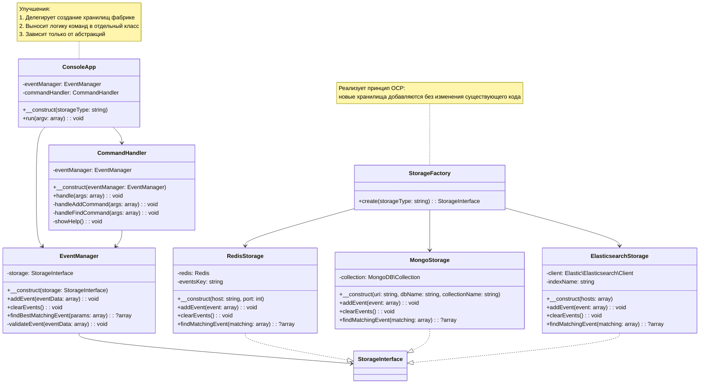

# Домашнее задание №13 - Анализ кода

Проведен анализ кода и проведен рефакторинг с использованием принципа SOLID

## Проект до рефакторинга

### Схема

### Проблемы

1. Нарушение SRP (Single Responsibility Principle):
    - ConsoleApp отвечает и за парсинг аргументов, и за создание хранилищ, и за выполнение команд
    - EventManager просто делегирует вызовы хранилищу без добавления значимой логики

2. Нарушение OCP (Open-Closed Principle):
    - Для добавления нового типа хранилища нужно изменять ConsoleApp
    - Логика создания хранилищ жестко закодирована

3. Нарушение DIP (Dependency Inversion Principle):
    - ConsoleApp зависит от конкретных реализаций хранилищ
    - EventManager зависит от интерфейса, что хорошо, но создание зависимостей происходит на неправильном уровне

## Проект после рефакторинга

### Схема

### Изменения

1. Создана фабрика для хранилищ `app/Storage/StorageFactory.php`
    - Результат: Логика создания хранилищ вынесена в отдельный класс, что соответствует SRP.
2. Упростил ConsoleApp `app/ConsoleApp.php`
3. Создан CommandHandler для обработки команд `app/CommandHandler.php`
    - Результат: Логика обработки команд вынесена в отдельный класс, что соответствует SRP.
4. Улучшен EventManager `app/EventManager.php`
    - Результат: Добавлена более детальная валидация событий, код стал более читаемым.

### Итог

1. Single Responsibility Principle:
    - Каждый класс отвечает за одну конкретную задачу
    - Логика разделена между классами более четко

2. Open-Closed Principle:
   - Для добавления нового типа хранилища нужно только добавить его в StorageFactory 
   - Остальной код не требует изменений

3. Dependency Inversion Principle:
   - Высокоуровневые модули зависят от абстракций (StorageInterface)
   - Создание конкретных реализаций вынесено в фабрику

4. Гибкость:
   - Легче добавлять новые команды или изменять существующие 
   - Проще менять реализацию отдельных компонентов