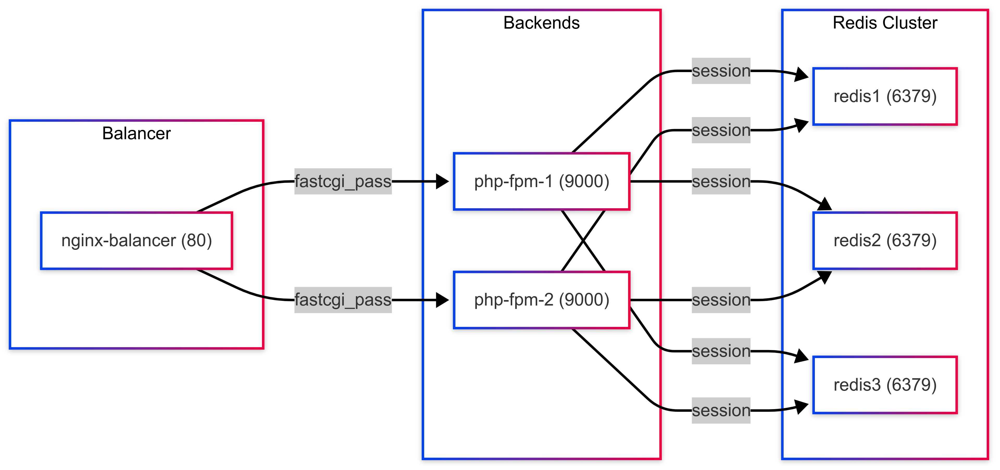

### Описание выполненного домашнего задания №4

В рамках задания создан балансируемый кластер на основе Nginx, двух серверов PHP-FPM и Redis Cluster из трёх узлов.

####
Краткое описание архитектуры:



Для запуска контейнеров выполните:
```bash
docker-compose build && docker-compose up -d
```
Установите зависимости через Composer:
```bash
docker exec -it php-fpm-1 sh -c "cd /var/www/html && composer install"
```

Инициализируйте Redis Cluster:
```bash
docker exec -it redis1 redis-cli --cluster create \
  redis1:6379 redis2:6379 redis3:6379 \
  --cluster-replicas 0
```