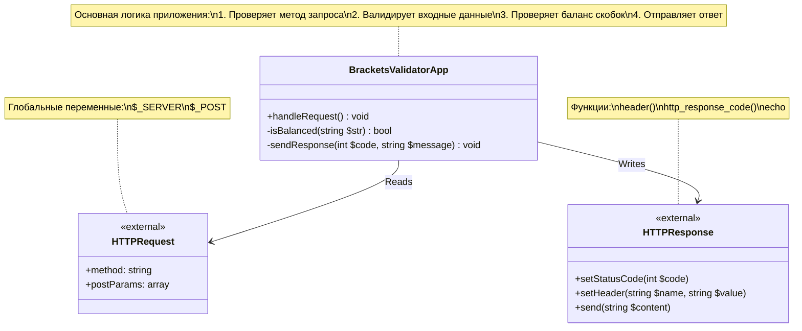
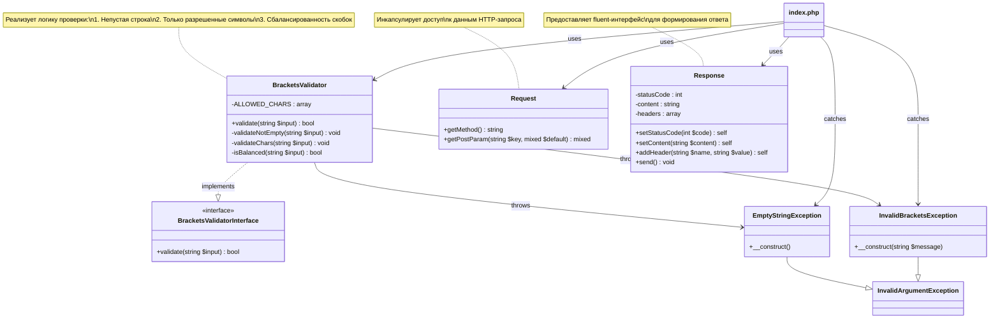

# PHP_2025

https://otus.ru/lessons/razrabotchik-php/?utm_source=github&utm_medium=free&utm_campaign=otus

## Схема приложения до рефакторинга

# SOLID принципы
* Single Responsibility: Каждый класс отвечает за одну вещь
* Open/Closed: Легко расширить валидацию новыми правилами
* Liskov Substitution: Можно создать альтернативные валидаторы
* Interface Segregation: Четкие небольшие интерфейсы
* Dependency Inversion: Зависимости от абстракций
## Обработка запроса
* Класс Request - инкапсулирует данные запроса
* Класс Response - инкапсулирует формирование ответа
* Сервисный класс BracketsValidator - содержит логику валидации
## Обработка ошибок:
* Специфичные исключения для разных сценариев
* Централизованный обработчик в index.php

## Схема классов после рефакторинга 

