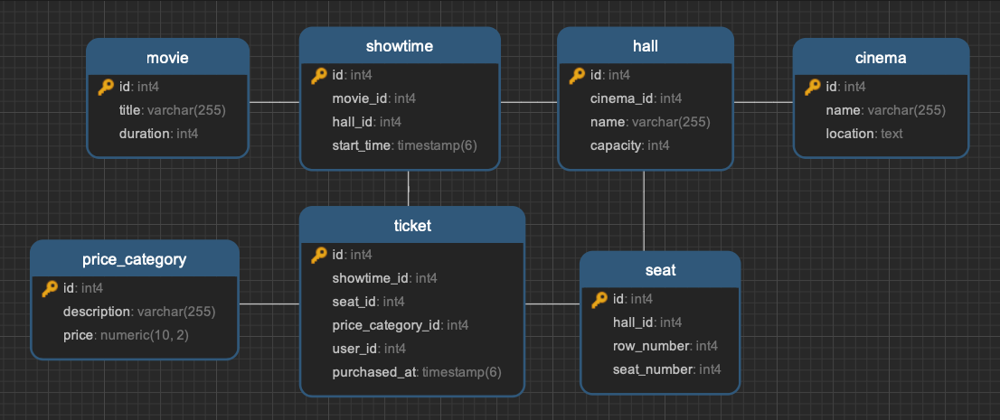

## Структура базы данных

Структура включает в себя следующие таблицы:

- **cinema**: Информация о кинотеатрах.
- **hall**: Информация о залах в кинотеатре.
- **seat**: Информация о местах в зале.
- **movie**: Информация о фильмах.
- **showtime**: Информация о сеансах.
- **price_category**: Информация о категориях цен.
- **ticket**: Информация о билетах.

## Запрос на нахождение самого прибыльного фильма

Для нахождения самого прибыльного фильма используется следующий SQL-запрос:

```sql
SELECT m.title, SUM(pc.price) AS total_revenue
FROM ticket t
JOIN showtime s ON t.showtime_id = s.id
JOIN movie m ON s.movie_id = m.id
JOIN price_category pc ON t.price_category_id = pc.id
GROUP BY m.title
ORDER BY total_revenue DESC
LIMIT 1;
```

## Файлы проекта
- **bd.sql** — Содержит SQL-запросы для создания таблиц базы данных.
- **data.sql** — Содержит тестовые данные для всех таблиц.
- **helpers.sql** — Содержит запрос для нахождения самого прибыльного фильма.

## ER Диаграмма

