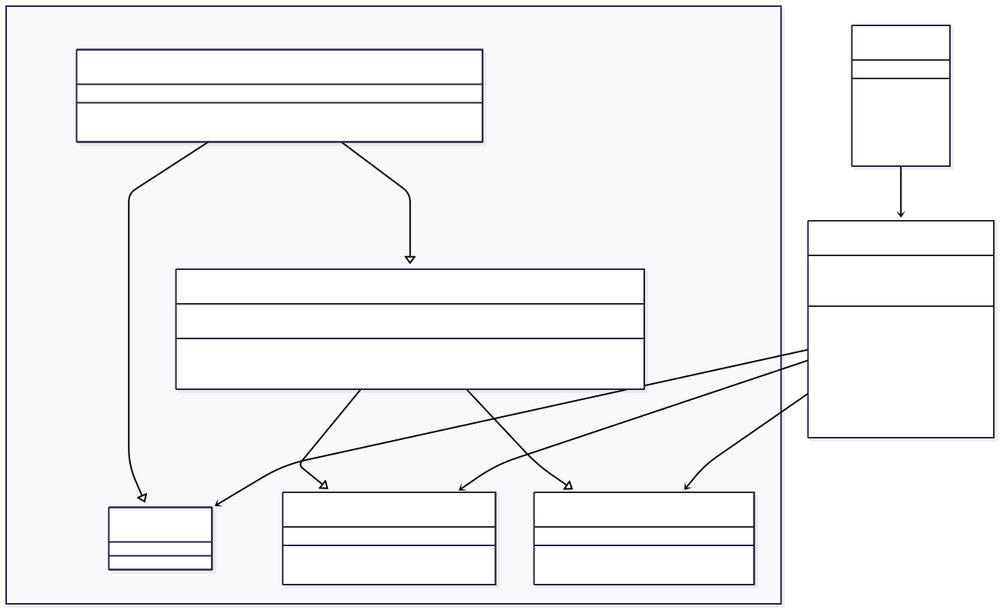

# Email validator

Для запуска приложения необходимо:
- Перейти в папку app (`cd app`);
- Запустить `composer install`;
- Перейти в родительскую директорию (`cd ..\entry_point`);
- Запустить скрипт командой `php app.php test@test`.

# Анализ кода
## app/src/
### EmailValidator.php
* Можно положить в отдельную директорию `Validators`.
* Для валидатора можно создать интерфейс ValidatorInterface 
### App.php
* В классе нарушен принцип единой ответственности.
В классе проходит и получение email и их валидация. Методы initEmail и getEmail надо вынести в отдельный класс.

## entry_point/app.php
Точка входа в приложения, не содержит ничего лишнего.

## app/src/Exceptions

### Exception.php
Класс создан, чтоб отличать Exceptions приложения от тех, что относятся к базовому классу. Здесь все ок.
### FieldException.php
Класс можно вынести в папку `app/src/Exceptions/Validation/Field`, поскольку Exception относится к полю.

### NotExistDomain.php
В конец названия класса нужно добавить `Exception`.
Класс можно вынести в папку `app/src/Exceptions/Validation`, поскольку Exception относится к валидации данных.
### NotValidException.php
Необходимо изменить название класса на `NotValidFieldException` и переместить его в `app/src/Exceptions/Validation/Field`
### EmptyFieldException.php
Класс можно вынести в папку `app/src/Exceptions/Validation/Field`, поскольку Exception относится к полю.

## Uml-диаграмма приложения AS-IS

