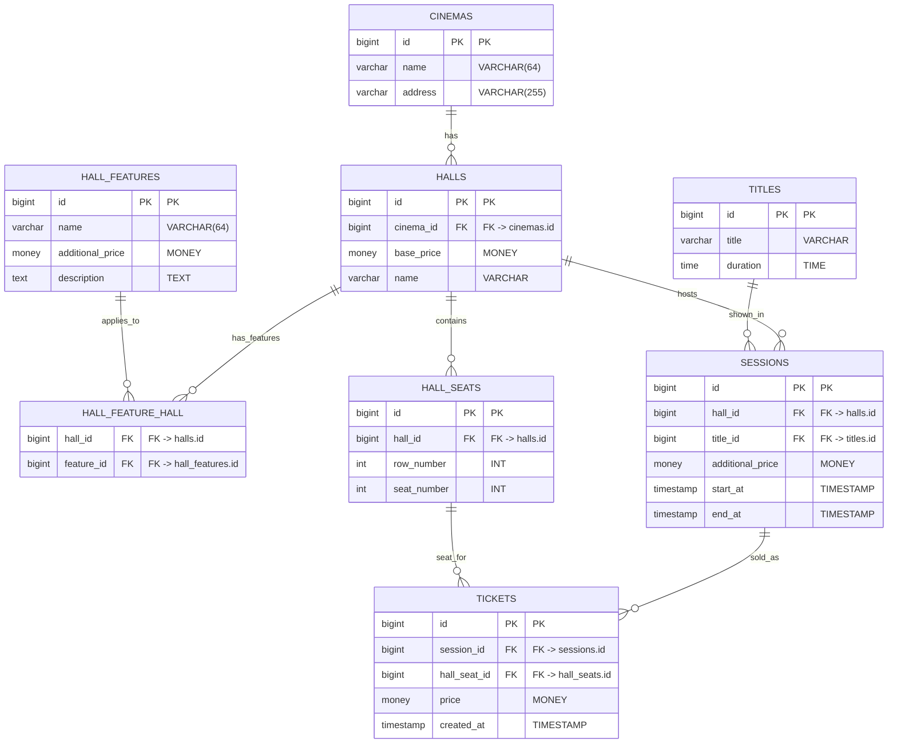

# Ilya Gainutdinov HW-7

```postgresql
-- Очистка и пересоздание схемы
DROP SCHEMA IF EXISTS public CASCADE;
CREATE SCHEMA public AUTHORIZATION CURRENT_USER;
COMMENT ON SCHEMA public IS 'Схема для управления кинотеатром';


--- Таблица кинотеатров
CREATE TABLE cinemas (
                         id BIGSERIAL PRIMARY KEY,
                         name VARCHAR(64) NOT NULL,
                         address VARCHAR(255) NOT NULL
);
COMMENT ON TABLE cinemas IS 'Кинотеатры';
COMMENT ON COLUMN cinemas.name IS 'Название кинотеатра';
COMMENT ON COLUMN cinemas.address IS 'Адрес кинотеатра';


-- Таблица залов
create table halls (
                       id BIGSERIAL primary key,
                       cinema_id BIGINT not null references cinemas(id) on
                           delete
                           cascade,
                       base_price numeric(10, 2) not null default 0,
                       name VARCHAR(64) not null
);
COMMENT ON TABLE halls IS 'Залы в кинотеатрах';
COMMENT ON COLUMN halls.base_price IS 'Базовая цена за билет в этом зале';
comment on
    column halls.name is 'Название зала';


-- Таблица особенностей залов
CREATE TABLE hall_features (
                               id BIGSERIAL PRIMARY KEY,
                               name VARCHAR(64) NOT NULL,
                               additional_price MONEY NOT NULL DEFAULT 0,
                               description TEXT
);
COMMENT ON TABLE hall_features IS 'Особенности зала (3D, VIP, IMAX и т.д.)';


-- Связующая таблица залов и особенностей
CREATE TABLE hall_feature_hall (
                                   hall_id BIGINT NOT NULL REFERENCES halls(id) ON DELETE CASCADE,
                                   feature_id BIGINT NOT NULL REFERENCES hall_features(id) ON DELETE CASCADE,
                                   PRIMARY KEY (hall_id, feature_id)
);
COMMENT ON TABLE hall_feature_hall IS 'Связь залов и их особенностей';


-- Таблица мест в зале
CREATE TABLE hall_seats (
                            id BIGSERIAL PRIMARY KEY,
                            hall_id BIGINT NOT NULL REFERENCES halls(id) ON DELETE CASCADE,
                            row_number INT NOT NULL,
                            seat_number INT NOT NULL,
                            UNIQUE (hall_id, row_number, seat_number)
);
COMMENT ON TABLE hall_seats IS 'Места в зале (ряды и кресла)';


-- Таблица фильмов
CREATE TABLE titles (
                        id BIGSERIAL PRIMARY KEY,
                        title VARCHAR(255) NOT NULL,
                        duration INTERVAL NOT NULL
);
COMMENT ON TABLE titles IS 'Фильмы (наименования и продолжительность)';


-- Таблица сеансов
CREATE TABLE sessions (
                          id BIGSERIAL PRIMARY KEY,
                          hall_id BIGINT NOT NULL REFERENCES halls(id) ON DELETE CASCADE,
                          title_id BIGINT NOT NULL REFERENCES titles(id) ON DELETE CASCADE,
                          additional_price MONEY NOT NULL DEFAULT 0,
                          start_at TIMESTAMP NOT NULL,
                          end_at TIMESTAMP NOT NULL
);
COMMENT ON TABLE sessions IS 'Сеансы фильмов';
COMMENT ON COLUMN sessions.additional_price IS 'Дополнительная цена за конкретный сеанс (например, премьера)';
COMMENT ON COLUMN sessions.start_at IS 'Дата и время начала сеанса';
COMMENT ON COLUMN sessions.end_at IS 'Дата и время окончания сеанса';


-- Таблица билетов
CREATE TABLE tickets (
                         id BIGSERIAL PRIMARY KEY,
                         session_id BIGINT NOT NULL REFERENCES sessions(id) ON DELETE CASCADE,
                         hall_seat_id BIGINT NOT NULL REFERENCES hall_seats(id) ON DELETE CASCADE,
                         price MONEY NOT NULL,
                         created_at TIMESTAMP NOT NULL DEFAULT now(),
                         UNIQUE (session_id, hall_seat_id)
);
COMMENT ON TABLE tickets IS 'Билеты, проданные на сеансы';
COMMENT ON COLUMN tickets.price IS 'Цена билета';
COMMENT ON COLUMN tickets.created_at IS 'Дата и время покупки';
```

## Запрос на нахождение самого прибыльного фильма
```postgresql
SELECT 
    t.title,
    SUM(tk.price)::money AS total_profit
FROM tickets tk
    JOIN sessions s ON s.id = tk.session_id
    JOIN titles t ON t.id = s.title_id
GROUP BY t.id, t.title
ORDER BY total_profit DESC
LIMIT 1;
```

## ER модель


```mermaid
erDiagram
    CINEMAS {
        bigint id PK "PK"
        varchar name "VARCHAR(64)"
        varchar address "VARCHAR(255)"
    }

    HALLS {
        bigint id PK "PK"
        bigint cinema_id FK "FK -> cinemas.id"
        money base_price "MONEY"
        varchar name "VARCHAR"
    }

    HALL_FEATURES {
        bigint id PK "PK"
        varchar name "VARCHAR(64)"
        money additional_price "MONEY"
        text description "TEXT"
    }

    HALL_FEATURE_HALL {
        bigint hall_id FK "FK -> halls.id"
        bigint feature_id FK "FK -> hall_features.id"
    }

    HALL_SEATS {
        bigint id PK "PK"
        bigint hall_id FK "FK -> halls.id"
        int row_number "INT"
        int seat_number "INT"
    }

    TITLES {
        bigint id PK "PK"
        varchar title "VARCHAR"
        time duration "TIME"
    }

    SESSIONS {
        bigint id PK "PK"
        bigint hall_id FK "FK -> halls.id"
        bigint title_id FK "FK -> titles.id"
        money additional_price "MONEY"
        timestamp start_at "TIMESTAMP"
        timestamp end_at "TIMESTAMP"
    }

    TICKETS {
        bigint id PK "PK"
        bigint session_id FK "FK -> sessions.id"
        bigint hall_seat_id FK "FK -> hall_seats.id"
        money price "MONEY"
        timestamp created_at "TIMESTAMP"
    }

    %% relationships
    CINEMAS ||--o{ HALLS : "has"
    HALLS ||--o{ HALL_SEATS : "contains"
    HALLS ||--o{ SESSIONS : "hosts"
    HALLS ||--o{ HALL_FEATURE_HALL : "has_features"
    HALL_FEATURES ||--o{ HALL_FEATURE_HALL : "applies_to"
    TITLES ||--o{ SESSIONS : "shown_in"
    SESSIONS ||--o{ TICKETS : "sold_as"
    HALL_SEATS ||--o{ TICKETS : "seat_for"

```
