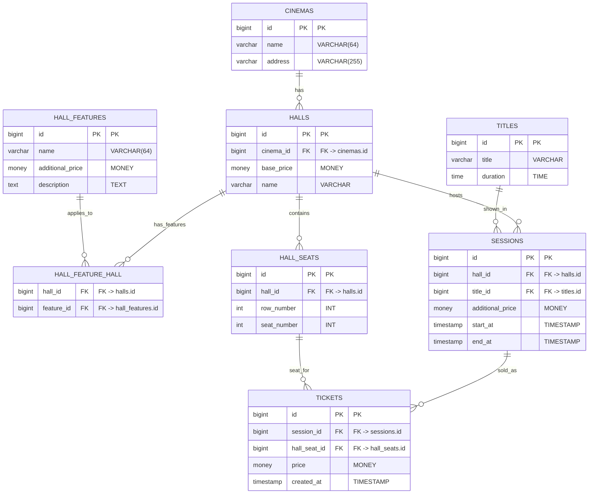

# Ilya Gainutdinov HW-7

```postgresql
-- Очистка и пересоздание схемы
DROP SCHEMA IF EXISTS public CASCADE;
CREATE SCHEMA public AUTHORIZATION CURRENT_USER;
COMMENT ON SCHEMA public IS 'Схема для управления кинотеатром';


--- Таблица кинотеатров
CREATE TABLE cinemas (
                         id BIGSERIAL PRIMARY KEY,
                         name VARCHAR(64) NOT NULL,
                         address VARCHAR(255) NOT NULL
);
COMMENT ON TABLE cinemas IS 'Кинотеатры';
COMMENT ON COLUMN cinemas.name IS 'Название кинотеатра';
COMMENT ON COLUMN cinemas.address IS 'Адрес кинотеатра';


-- Таблица залов
create table halls (
                       id BIGSERIAL primary key,
                       cinema_id BIGINT not null references cinemas(id) on
                           delete
                           cascade,
                       base_price numeric(10, 2) not null default 0,
                       name VARCHAR(64) not null
);
COMMENT ON TABLE halls IS 'Залы в кинотеатрах';
COMMENT ON COLUMN halls.base_price IS 'Базовая цена за билет в этом зале';
comment on
    column halls.name is 'Название зала';


-- Таблица особенностей залов
CREATE TABLE hall_features (
                               id BIGSERIAL PRIMARY KEY,
                               name VARCHAR(64) NOT NULL,
                               additional_price MONEY NOT NULL DEFAULT 0,
                               description TEXT
);
COMMENT ON TABLE hall_features IS 'Особенности зала (3D, VIP, IMAX и т.д.)';


-- Связующая таблица залов и особенностей
CREATE TABLE hall_feature_hall (
                                   hall_id BIGINT NOT NULL REFERENCES halls(id) ON DELETE CASCADE,
                                   feature_id BIGINT NOT NULL REFERENCES hall_features(id) ON DELETE CASCADE,
                                   PRIMARY KEY (hall_id, feature_id)
);
COMMENT ON TABLE hall_feature_hall IS 'Связь залов и их особенностей';


-- Таблица мест в зале
CREATE TABLE hall_seats (
                            id BIGSERIAL PRIMARY KEY,
                            hall_id BIGINT NOT NULL REFERENCES halls(id) ON DELETE CASCADE,
                            row_number INT NOT NULL,
                            seat_number INT NOT NULL,
                            UNIQUE (hall_id, row_number, seat_number)
);
COMMENT ON TABLE hall_seats IS 'Места в зале (ряды и кресла)';


-- Таблица фильмов
CREATE TABLE titles (
                        id BIGSERIAL PRIMARY KEY,
                        title VARCHAR(255) NOT NULL,
                        duration INTERVAL NOT NULL
);
COMMENT ON TABLE titles IS 'Фильмы (наименования и продолжительность)';


-- Таблица сеансов
CREATE TABLE sessions (
                          id BIGSERIAL PRIMARY KEY,
                          hall_id BIGINT NOT NULL REFERENCES halls(id) ON DELETE CASCADE,
                          title_id BIGINT NOT NULL REFERENCES titles(id) ON DELETE CASCADE,
                          additional_price MONEY NOT NULL DEFAULT 0,
                          start_at TIMESTAMP NOT NULL,
                          end_at TIMESTAMP NOT NULL
);
COMMENT ON TABLE sessions IS 'Сеансы фильмов';
COMMENT ON COLUMN sessions.additional_price IS 'Дополнительная цена за конкретный сеанс (например, премьера)';
COMMENT ON COLUMN sessions.start_at IS 'Дата и время начала сеанса';
COMMENT ON COLUMN sessions.end_at IS 'Дата и время окончания сеанса';


-- Таблица билетов
CREATE TABLE tickets (
                         id BIGSERIAL PRIMARY KEY,
                         session_id BIGINT NOT NULL REFERENCES sessions(id) ON DELETE CASCADE,
                         hall_seat_id BIGINT NOT NULL REFERENCES hall_seats(id) ON DELETE CASCADE,
                         price MONEY NOT NULL,
                         created_at TIMESTAMP NOT NULL DEFAULT now(),
                         UNIQUE (session_id, hall_seat_id)
);
COMMENT ON TABLE tickets IS 'Билеты, проданные на сеансы';
COMMENT ON COLUMN tickets.price IS 'Цена билета';
COMMENT ON COLUMN tickets.created_at IS 'Дата и время покупки';
```

## Запрос на нахождение самого прибыльного фильма
```postgresql
SELECT 
    t.title,
    SUM(tk.price)::money AS total_profit
FROM tickets tk
    JOIN sessions s ON s.id = tk.session_id
    JOIN titles t ON t.id = s.title_id
GROUP BY t.id, t.title
ORDER BY total_profit DESC
LIMIT 1;
```

## ER модель


```mermaid
erDiagram
    CINEMAS {
        bigint id PK "PK"
        varchar name "VARCHAR(64)"
        varchar address "VARCHAR(255)"
    }

    HALLS {
        bigint id PK "PK"
        bigint cinema_id FK "FK -> cinemas.id"
        money base_price "MONEY"
        varchar name "VARCHAR"
    }

    HALL_FEATURES {
        bigint id PK "PK"
        varchar name "VARCHAR(64)"
        money additional_price "MONEY"
        text description "TEXT"
    }

    HALL_FEATURE_HALL {
        bigint hall_id FK "FK -> halls.id"
        bigint feature_id FK "FK -> hall_features.id"
    }

    HALL_SEATS {
        bigint id PK "PK"
        bigint hall_id FK "FK -> halls.id"
        int row_number "INT"
        int seat_number "INT"
    }

    TITLES {
        bigint id PK "PK"
        varchar title "VARCHAR"
        time duration "TIME"
    }

    SESSIONS {
        bigint id PK "PK"
        bigint hall_id FK "FK -> halls.id"
        bigint title_id FK "FK -> titles.id"
        money additional_price "MONEY"
        timestamp start_at "TIMESTAMP"
        timestamp end_at "TIMESTAMP"
    }

    TICKETS {
        bigint id PK "PK"
        bigint session_id FK "FK -> sessions.id"
        bigint hall_seat_id FK "FK -> hall_seats.id"
        money price "MONEY"
        timestamp created_at "TIMESTAMP"
    }

    %% relationships
    CINEMAS ||--o{ HALLS : "has"
    HALLS ||--o{ HALL_SEATS : "contains"
    HALLS ||--o{ SESSIONS : "hosts"
    HALLS ||--o{ HALL_FEATURE_HALL : "has_features"
    HALL_FEATURES ||--o{ HALL_FEATURE_HALL : "applies_to"
    TITLES ||--o{ SESSIONS : "shown_in"
    SESSIONS ||--o{ TICKETS : "sold_as"
    HALL_SEATS ||--o{ TICKETS : "seat_for"

```
# EXPLAIN

## Запрос 1
### Выбор всех фильмов на сегодня
```postgresql
select distinct
  t.title
from sessions s
join titles t on t.id = s.title_id  
where s.start_at::date = current_date
```

### Без оптимизаций
| 10к записей                                                   |
|---------------------------------------------------------------|
| Unique  (cost=72.67..72.73 rows=12 width=53)                  |
| ->  Sort  (cost=72.67..72.70 rows=12 width=53)                |
| Sort Key: t.title                                             |
| ->  Hash Join  (cost=4.68..72.46 rows=12 width=53)            |
| Hash Cond: (s.title_id = t.id)                                |
| ->  Seq Scan on sessions s  (cost=0.00..67.75 rows=12 width=8) |
| Filter: ((start_at)::date = CURRENT_DATE)                     |
| ->  Hash  (cost=3.19..3.19 rows=119 width=61)                 |
| ->  Seq Scan on titles t  (cost=0.00..3.19 rows=119 width=61) |

| 10кк записей                                                               |
|----------------------------------------------------------------------------|
| Unique  (cost=9371.98..9381.67 rows=19 width=52)                           |
| ->  Gather Merge  (cost=9371.98..9381.57 rows=38 width=52)                 |
| Workers Planned: 2                                                         |
| ->  Unique  (cost=8371.96..8377.16 rows=19 width=52)                       |
| ->  Sort  (cost=8371.96..8374.56 rows=1041 width=52)                       |
| Sort Key: t.title                                                          |
| ->  Hash Join  (cost=1.43..8319.78 rows=1041 width=52)                     |
| Hash Cond: (s.title_id = t.id)                                             |
| ->  Parallel Seq Scan on sessions s  (cost=0.00..8315.01 rows=1041 width=8) |
| Filter: ((start_at)::date = CURRENT_DATE)                                  |
| ->  Hash  (cost=1.19..1.19 rows=19 width=60)                               |
| ->  Seq Scan on titles t  (cost=0.00..1.19 rows=19 width=60)               |

### Оптимизируем запрос
```postgresql
-- Добавим индексы
CREATE INDEX sessions_start_at_idx ON sessions (start_at);

-- Плюс я заметил что использую не эффективное выражение, перепишу его на BETWEEN чтобы использовался индекс.
-- Заменил distinct на group by.
select t.title
from sessions s
         join titles t on t.id = s.title_id
where s.start_at between current_timestamp
          and current_timestamp + interval '1 day';
```
| 10кк записей                                                                                              |
|-----------------------------------------------------------------------------------------------------------|
| Nested Loop  (cost=7.21..852.48 rows=257 width=52)                                                        |
| ->  Bitmap Heap Scan on sessions s  (cost=7.06..842.29 rows=257 width=8)                                  |
| Recheck Cond: ((start_at >= CURRENT_TIMESTAMP) AND (start_at <= (CURRENT_TIMESTAMP + '1 day'::interval))) |
| ->  Bitmap Index Scan on sessions_start_at_idx  (cost=0.00..7.00 rows=257 width=0)                        |
| Index Cond: ((start_at >= CURRENT_TIMESTAMP) AND (start_at <= (CURRENT_TIMESTAMP + '1 day'::interval)))   |
| ->  Memoize  (cost=0.15..0.21 rows=1 width=60)                                                            |
| Cache Key: s.title_id                                                                                     |
| Cache Mode: logical                                                                                       |
| ->  Index Scan using titles_pkey on titles t  (cost=0.14..0.20 rows=1 width=60)                           |
| Index Cond: (id = s.title_id)                                                                             |


## Запрос 2
### Подсчёт проданных билетов за неделю
```postgresql
select count(t.id)
from tickets t 
join sessions s on s.id = t.session_id 
where s.start_at::date between (current_date - interval '1 week') and current_date
```
### Без оптимизаций
| 10к записей                                                                                                |
|------------------------------------------------------------------------------------------------------------|
| Aggregate  (cost=145.50..145.51 rows=1 width=8)                                                            |
| ->  Hash Join  (cost=92.90..145.47 rows=12 width=8)                                                        |
| Hash Cond: (t.session_id = s.id)                                                                           |
| ->  Seq Scan on tickets t  (cost=0.00..46.00 rows=2500 width=16)                                           |
| ->  Hash  (cost=92.75..92.75 rows=12 width=8)                                                              |
| ->  Seq Scan on sessions s  (cost=0.00..92.75 rows=12 width=8)                                             |
| Filter: (((start_at)::date <= CURRENT_DATE) AND ((start_at)::date >= (CURRENT_DATE - '7 days'::interval))) |

| 10кк записей                                                                                               |
|------------------------------------------------------------------------------------------------------------|
| Finalize Aggregate  (cost=68737.09..68737.10 rows=1 width=8)                                               |
| ->  Gather  (cost=68736.87..68737.08 rows=2 width=8)                                                       |
| Workers Planned: 2                                                                                         |
| ->  Partial Aggregate  (cost=67736.87..67736.88 rows=1 width=8)                                            |
| ->  Nested Loop  (cost=0.43..67687.41 rows=19784 width=8)                                                  |
| ->  Parallel Seq Scan on sessions s  (cost=0.00..10397.30 rows=1041 width=8)                               |
| Filter: (((start_at)::date <= CURRENT_DATE) AND ((start_at)::date >= (CURRENT_DATE - '7 days'::interval))) |
| ->  Index Scan using tickets_session_id_hall_seat_id_key on tickets t  (cost=0.43..54.56 rows=47 width=16) |
| Index Cond: (session_id = s.id)                                                                            |

### Оптимизируем запрос
```postgresql
-- Ранее избавился от ::date чтобы работал индекс на start_at
-- Докинул ещё пару индексов

CREATE INDEX tickets_session_id_idx ON tickets(session_id);
CREATE INDEX sessions_title_id_idx ON sessions (title_id);

select count(t.id)
from tickets t
         join sessions s on s.id = t.session_id
where s.start_at between (current_date - interval '1 week') and current_date;
```
| 10кк записей                                                                                               |
|------------------------------------------------------------------------------------------------------------|
| Aggregate  (cost=2822.06..2822.07 rows=1 width=8)                                                          |
| ->  Nested Loop  (cost=7.07..2811.85 rows=4085 width=8)                                                    |
| ->  Bitmap Heap Scan on sessions s  (cost=6.63..720.93 rows=215 width=8)                                   |
| Recheck Cond: ((start_at >= (CURRENT_TIMESTAMP - '7 days'::interval)) AND (start_at <= CURRENT_TIMESTAMP)) |
| ->  Bitmap Index Scan on sessions_start_at_idx  (cost=0.00..6.58 rows=215 width=0)                         |
| Index Cond: ((start_at >= (CURRENT_TIMESTAMP - '7 days'::interval)) AND (start_at <= CURRENT_TIMESTAMP))   |
| ->  Index Scan using tickets_session_id_idx on tickets t  (cost=0.43..9.26 rows=47 width=16)               |
| Index Cond: (session_id = s.id)                                                                            |

## Запрос 3
### Формирование афиши (фильмы, которые показывают сегодня)
```postgresql
select
  t.title,
  s.start_at,
  s.end_at,
  h."name" as hall,
  c."name" as cinema 
from sessions s 
join titles t on t.id = s.title_id 
join halls h on h.id = s.hall_id 
join cinemas c on c.id = h.cinema_id 
where s.start_at::date = current_date -- Сюда можно добавить условие c.id = <ид кинтоеатра>, афишу обычно делают по конкретному кинотеатру
```
### Без оптимизаций
| 10к записей                                                                       |
|-----------------------------------------------------------------------------------|
| Nested Loop  (cost=9.65..78.65 rows=12 width=128)                                 |
| ->  Hash Join  (cost=9.49..77.30 rows=12 width=91)                                |
| Hash Cond: (s.hall_id = h.id)                                                     |
| ->  Hash Join  (cost=4.68..72.46 rows=12 width=77)                                |
| Hash Cond: (s.title_id = t.id)                                                    |
| ->  Seq Scan on sessions s  (cost=0.00..67.75 rows=12 width=32)                   |
| Filter: ((start_at)::date = CURRENT_DATE)                                         |
| ->  Hash  (cost=3.19..3.19 rows=119 width=61)                                     |
| ->  Seq Scan on titles t  (cost=0.00..3.19 rows=119 width=61)                     |
| ->  Hash  (cost=3.25..3.25 rows=125 width=30)                                     |
| ->  Seq Scan on halls h  (cost=0.00..3.25 rows=125 width=30)                      |
| ->  Memoize  (cost=0.16..0.56 rows=1 width=53)                                    |
| Cache Key: h.cinema_id                                                            |
| Cache Mode: logical                                                               |
| ->  Index Scan using cinemas_pkey on cinemas c  (cost=0.15..0.55 rows=1 width=53) |
| Index Cond: (id = h.cinema_id)                                                    |

| 10кк записей                                                                      |
|-----------------------------------------------------------------------------------|
| Nested Loop  (cost=1001.75..9663.39 rows=2499 width=128)                          |
| ->  Gather  (cost=1001.59..9600.60 rows=2499 width=91)                            |
| Workers Planned: 2                                                                |
| ->  Nested Loop  (cost=1.59..8350.70 rows=1041 width=91)                          |
| ->  Hash Join  (cost=1.43..8319.78 rows=1041 width=76)                            |
| Hash Cond: (s.title_id = t.id)                                                    |
| ->  Parallel Seq Scan on sessions s  (cost=0.00..8315.01 rows=1041 width=32)      |
| Filter: ((start_at)::date = CURRENT_DATE)                                         |
| ->  Hash  (cost=1.19..1.19 rows=19 width=60)                                      |
| ->  Seq Scan on titles t  (cost=0.00..1.19 rows=19 width=60)                      |
| ->  Memoize  (cost=0.16..0.20 rows=1 width=31)                                    |
| Cache Key: s.hall_id                                                              |
| Cache Mode: logical                                                               |
| ->  Index Scan using halls_pkey on halls h  (cost=0.15..0.19 rows=1 width=31)     |
| Index Cond: (id = s.hall_id)                                                      |
| ->  Memoize  (cost=0.16..0.21 rows=1 width=53)                                    |
| Cache Key: h.cinema_id                                                            |
| Cache Mode: logical                                                               |
| ->  Index Scan using cinemas_pkey on cinemas c  (cost=0.15..0.20 rows=1 width=53) |
| Index Cond: (id = h.cinema_id)                                                    |

### Оптимизируем запрос
Работает ранее добавленный индекс + поправил запрос
```postgresql
select t.title,
       s.start_at,
       s.end_at,
       h."name" as hall,
       c."name" as cinema
from sessions s
         join titles t on t.id = s.title_id
         join halls h on h.id = s.hall_id
         join cinemas c on c.id = h.cinema_id
where s.start_at between current_timestamp
          and current_timestamp + interval '1 day';
```
| 10кк записей                                                                                              |
|-----------------------------------------------------------------------------------------------------------|
| Nested Loop  (cost=7.53..874.96 rows=257 width=128)                                                       |
| ->  Nested Loop  (cost=7.37..868.15 rows=257 width=91)                                                    |
| ->  Nested Loop  (cost=7.21..852.48 rows=257 width=76)                                                    |
| ->  Bitmap Heap Scan on sessions s  (cost=7.06..842.29 rows=257 width=32)                                 |
| Recheck Cond: ((start_at >= CURRENT_TIMESTAMP) AND (start_at <= (CURRENT_TIMESTAMP + '1 day'::interval))) |
| ->  Bitmap Index Scan on sessions_start_at_idx  (cost=0.00..7.00 rows=257 width=0)                        |
| Index Cond: ((start_at >= CURRENT_TIMESTAMP) AND (start_at <= (CURRENT_TIMESTAMP + '1 day'::interval)))   |
| ->  Memoize  (cost=0.15..0.21 rows=1 width=60)                                                            |
| Cache Key: s.title_id                                                                                     |
| Cache Mode: logical                                                                                       |
| ->  Index Scan using titles_pkey on titles t  (cost=0.14..0.20 rows=1 width=60)                           |
| Index Cond: (id = s.title_id)                                                                             |
| ->  Memoize  (cost=0.16..0.37 rows=1 width=31)                                                            |
| Cache Key: s.hall_id                                                                                      |
| Cache Mode: logical                                                                                       |
| ->  Index Scan using halls_pkey on halls h  (cost=0.15..0.36 rows=1 width=31)                             |
| Index Cond: (id = s.hall_id)                                                                              |
| ->  Memoize  (cost=0.16..0.21 rows=1 width=53)                                                            |
| Cache Key: h.cinema_id                                                                                    |
| Cache Mode: logical                                                                                       |
| ->  Index Scan using cinemas_pkey on cinemas c  (cost=0.15..0.20 rows=1 width=53)                         |
| Index Cond: (id = h.cinema_id)                                                                            |

## Запрос 4
### Поиск 3 самых прибыльных фильмов за неделю
```postgresql
select 
  tl.title,
  sum(t.price) as gain,
  count(t.id) as tickets_count
from tickets t 
join sessions s on s.id = t.session_id 
join titles tl on tl.id = s.title_id 
where s.start_at::date between (current_date - interval '1 week') and current_date 
group by tl.title 
order by gain desc
limit 3
```
### Без оптимизаций
| 10к записей                                                                                                |
|------------------------------------------------------------------------------------------------------------|
| Limit  (cost=150.79..150.80 rows=3 width=69)                                                               |
| ->  Sort  (cost=150.79..150.82 rows=12 width=69)                                                           |
| Sort Key: (sum(t.price)) DESC                                                                              |
| ->  GroupAggregate  (cost=150.40..150.64 rows=12 width=69)                                                 |
| Group Key: tl.title                                                                                        |
| ->  Sort  (cost=150.40..150.43 rows=12 width=69)                                                           |
| Sort Key: tl.title                                                                                         |
| ->  Hash Join  (cost=97.58..150.18 rows=12 width=69)                                                       |
| Hash Cond: (s.title_id = tl.id)                                                                            |
| ->  Hash Join  (cost=92.90..145.47 rows=12 width=24)                                                       |
| Hash Cond: (t.session_id = s.id)                                                                           |
| ->  Seq Scan on tickets t  (cost=0.00..46.00 rows=2500 width=24)                                           |
| ->  Hash  (cost=92.75..92.75 rows=12 width=16)                                                             |
| ->  Seq Scan on sessions s  (cost=0.00..92.75 rows=12 width=16)                                            |
| Filter: (((start_at)::date <= CURRENT_DATE) AND ((start_at)::date >= (CURRENT_DATE - '7 days'::interval))) |
| ->  Hash  (cost=3.19..3.19 rows=119 width=61)                                                              |
| ->  Seq Scan on titles tl  (cost=0.00..3.19 rows=119 width=61)                                             |

| 10кк записей                                                                                               |
|------------------------------------------------------------------------------------------------------------|
| Limit  (cost=68846.34..68846.34 rows=3 width=68)                                                           |
| ->  Sort  (cost=68846.34..68846.38 rows=19 width=68)                                                       |
| Sort Key: (sum(t.price)) DESC                                                                              |
| ->  Finalize GroupAggregate  (cost=68841.18..68846.09 rows=19 width=68)                                    |
| Group Key: tl.title                                                                                        |
| ->  Gather Merge  (cost=68841.18..68845.62 rows=38 width=68)                                               |
| Workers Planned: 2                                                                                         |
| ->  Sort  (cost=67841.16..67841.21 rows=19 width=68)                                                       |
| Sort Key: tl.title                                                                                         |
| ->  Partial HashAggregate  (cost=67840.56..67840.75 rows=19 width=68)                                      |
| Group Key: tl.title                                                                                        |
| ->  Nested Loop  (cost=1.86..67692.18 rows=19784 width=68)                                                 |
| ->  Hash Join  (cost=1.43..10402.07 rows=1041 width=60)                                                    |
| Hash Cond: (s.title_id = tl.id)                                                                            |
| ->  Parallel Seq Scan on sessions s  (cost=0.00..10397.30 rows=1041 width=16)                              |
| Filter: (((start_at)::date <= CURRENT_DATE) AND ((start_at)::date >= (CURRENT_DATE - '7 days'::interval))) |
| ->  Hash  (cost=1.19..1.19 rows=19 width=60)                                                               |
| ->  Seq Scan on titles tl  (cost=0.00..1.19 rows=19 width=60)                                              |
| ->  Index Scan using tickets_session_id_hall_seat_id_key on tickets t  (cost=0.43..54.56 rows=47 width=24) |
| Index Cond: (session_id = s.id)                                                                            |

### Оптимизируем запрос
```postgresql
-- Убрал ::date + ранее добавленные индексы
select 
  tl.title,
  sum(t.price) as gain,
  count(t.id) as tickets_count
from tickets t 
join sessions s on s.id = t.session_id 
join titles tl on tl.id = s.title_id 
where s.start_at between (current_date - interval '1 week') and current_date 
group by tl.title 
order by gain desc
limit 3;
```
| 10кк записей                                                                                     |
|--------------------------------------------------------------------------------------------------|
| Limit  (cost=3386.37..3386.37 rows=3 width=68)                                                   |
| ->  Sort  (cost=3386.37..3386.41 rows=19 width=68)                                               |
| Sort Key: (sum(t.price)) DESC                                                                    |
| ->  HashAggregate  (cost=3385.93..3386.12 rows=19 width=68)                                      |
| Group Key: tl.title                                                                              |
| ->  Nested Loop  (cost=7.65..3349.31 rows=4883 width=68)                                         |
| ->  Nested Loop  (cost=7.21..852.48 rows=257 width=60)                                           |
| ->  Bitmap Heap Scan on sessions s  (cost=7.06..842.29 rows=257 width=16)                        |
| Recheck Cond: ((start_at >= (CURRENT_DATE - '7 days'::interval)) AND (start_at <= CURRENT_DATE)) |
| ->  Bitmap Index Scan on sessions_start_at_idx  (cost=0.00..7.00 rows=257 width=0)               |
| Index Cond: ((start_at >= (CURRENT_DATE - '7 days'::interval)) AND (start_at <= CURRENT_DATE))   |
| ->  Memoize  (cost=0.15..0.21 rows=1 width=60)                                                   |
| Cache Key: s.title_id                                                                            |
| Cache Mode: logical                                                                              |
| ->  Index Scan using titles_pkey on titles tl  (cost=0.14..0.20 rows=1 width=60)                 |
| Index Cond: (id = s.title_id)                                                                    |
| ->  Index Scan using tickets_session_id_idx on tickets t  (cost=0.43..9.25 rows=47 width=24)     |
| Index Cond: (session_id = s.id)                                                                  |


## Запрос 5
### Сформировать схему зала и показать на ней свободные и занятые места на конкретный сеанс
```postgresql
SELECT
    hs.row_number,
    STRING_AGG(
        CASE
            WHEN t.id IS NULL THEN 'O'    -- свободно
            ELSE 'X'                      -- занято
        END,
        '' ORDER BY hs.seat_number
    ) AS seats
FROM hall_seats hs
LEFT JOIN tickets t
  ON t.hall_seat_id = hs.id
 AND t.session_id = 1
WHERE hs.hall_id = 1
GROUP BY hs.row_number
ORDER BY hs.row_number;
```
### Без оптимизаций
| 10к записей                                                                                                |
|------------------------------------------------------------------------------------------------------------|
| GroupAggregate  (cost=84.25..85.99 rows=14 width=36)                                                       |
| Group Key: hs.row_number                                                                                   |
| ->  Sort  (cost=84.25..84.77 rows=209 width=16)                                                            |
| Sort Key: hs.row_number, hs.seat_number                                                                    |
| ->  Hash Left Join  (cost=41.03..76.20 rows=209 width=16)                                                  |
| Hash Cond: (hs.id = t.hall_seat_id)                                                                        |
| ->  Bitmap Heap Scan on hall_seats hs  (cost=5.90..40.51 rows=209 width=16)                                |
| Recheck Cond: (hall_id = 1)                                                                                |
| ->  Bitmap Index Scan on hall_seats_hall_id_row_number_seat_number_key  (cost=0.00..5.85 rows=209 width=0) |
| Index Cond: (hall_id = 1)                                                                                  |
| ->  Hash  (cost=34.88..34.88 rows=20 width=16)                                                             |
| ->  Index Scan using tickets_session_id_hall_seat_id_key on tickets t  (cost=0.28..34.88 rows=20 width=16) |
| Index Cond: (session_id = 1)                                                                               |

| 10кк записей                                                                                               |
|------------------------------------------------------------------------------------------------------------|
| GroupAggregate  (cost=138.59..140.24 rows=14 width=36)                                                     |
| Group Key: hs.row_number                                                                                   |
| ->  Sort  (cost=138.59..139.08 rows=196 width=16)                                                          |
| Sort Key: hs.row_number, hs.seat_number                                                                    |
| ->  Hash Left Join  (cost=96.17..131.13 rows=196 width=16)                                                 |
| Hash Cond: (hs.id = t.hall_seat_id)                                                                        |
| ->  Bitmap Heap Scan on hall_seats hs  (cost=5.80..40.25 rows=196 width=16)                                |
| Recheck Cond: (hall_id = 1)                                                                                |
| ->  Bitmap Index Scan on hall_seats_hall_id_row_number_seat_number_key  (cost=0.00..5.75 rows=196 width=0) |
| Index Cond: (hall_id = 1)                                                                                  |
| ->  Hash  (cost=89.78..89.78 rows=47 width=16)                                                             |
| ->  Index Scan using tickets_session_id_hall_seat_id_key on tickets t  (cost=0.43..89.78 rows=47 width=16) |
| Index Cond: (session_id = 1)                                                                               |

### Оптимизация запроса

```postgresql
-- Ранее добавленные индексы уже неплохо работают.
-- Добавил ещё один индекс на hall_seat_id в tickets
CREATE INDEX tickets_hall_seat_id_idx ON tickets (hall_seat_id);
```

| 10кк записей                                                                                               |
|------------------------------------------------------------------------------------------------------------|
| GroupAggregate  (cost=58.11..59.76 rows=14 width=36)                                                       |
| Group Key: hs.row_number                                                                                   |
| ->  Sort  (cost=58.11..58.60 rows=196 width=16)                                                            |
| Sort Key: hs.row_number, hs.seat_number                                                                    |
| ->  Hash Left Join  (cost=15.68..50.65 rows=196 width=16)                                                  |
| Hash Cond: (hs.id = t.hall_seat_id)                                                                        |
| ->  Bitmap Heap Scan on hall_seats hs  (cost=5.80..40.25 rows=196 width=16)                                |
| Recheck Cond: (hall_id = 1)                                                                                |
| ->  Bitmap Index Scan on hall_seats_hall_id_row_number_seat_number_key  (cost=0.00..5.75 rows=196 width=0) |
| Index Cond: (hall_id = 1)                                                                                  |
| ->  Hash  (cost=9.29..9.29 rows=47 width=16)                                                               |
| ->  Index Scan using tickets_session_id_idx on tickets t  (cost=0.43..9.29 rows=47 width=16)               |
| Index Cond: (session_id = 1)                                                                               |


## Запрос 6
### Вывести диапазон миниальной и максимальной цены за билет на конкретный фильм
```postgresql
SELECT
    t.title,
    MIN(tc.price) AS min_price,
    MAX(tc.price) AS max_price
FROM titles t
JOIN sessions s ON s.title_id = t.id
JOIN tickets tc ON tc.session_id = s.id
WHERE t.id = 1
GROUP BY t.title;
```
### Без оптимизаций
| 10к записей                                                       |
|-------------------------------------------------------------------|
| HashAggregate  (cost=114.58..114.59 rows=1 width=68)              |
| Group Key: t.title                                                |
| ->  Nested Loop  (cost=6.22..111.88 rows=360 width=60)            |
| ->  Seq Scan on titles t  (cost=0.00..1.24 rows=1 width=60)       |
| Filter: (id = 1)                                                  |
| ->  Hash Join  (cost=6.22..107.05 rows=360 width=16)              |
| Hash Cond: (tc.session_id = s.id)                                 |
| ->  Seq Scan on tickets tc  (cost=0.00..88.00 rows=4800 width=16) |
| ->  Hash  (cost=6.00..6.00 rows=18 width=16)                      |
| ->  Seq Scan on sessions s  (cost=0.00..6.00 rows=18 width=16)    |
| Filter: (title_id = 1)                                            |

| 10кк записей                                                                      |
|-----------------------------------------------------------------------------------|
| Finalize GroupAggregate  (cost=149627.38..149627.64 rows=1 width=68)              |
| Group Key: t.title                                                                |
| ->  Gather Merge  (cost=149627.38..149627.62 rows=2 width=68)                     |
| Workers Planned: 2                                                                |
| ->  Sort  (cost=148627.36..148627.36 rows=1 width=68)                             |
| Sort Key: t.title                                                                 |
| ->  Partial HashAggregate  (cost=148627.34..148627.35 rows=1 width=68)            |
| Group Key: t.title                                                                |
| ->  Hash Join  (cost=11503.08..147086.30 rows=205472 width=60)                    |
| Hash Cond: (tc.session_id = s.id)                                                 |
| ->  Parallel Seq Scan on tickets tc  (cost=0.00..118692.00 rows=3956400 width=16) |
| ->  Hash  (cost=11178.65..11178.65 rows=25954 width=60)                           |
| ->  Nested Loop  (cost=0.00..11178.65 rows=25954 width=60)                        |
| ->  Seq Scan on titles t  (cost=0.00..1.24 rows=1 width=60)                       |
| Filter: (id = 1)                                                                  |
| ->  Seq Scan on sessions s  (cost=0.00..10917.88 rows=25954 width=16)             |
| Filter: (title_id = 1)                                                            |
| JIT:                                                                              |
| Functions: 21                                                                     |
| Options: Inlining false, Optimization false, Expressions true, Deforming true     |

### Оптимизация запроса

```postgresql
-- Мультиколоночные индексы на табличку.
CREATE INDEX tickets_session_id_price_idx
    ON tickets(session_id, price);
CREATE INDEX sessions_title_id_id_idx
    ON sessions(title_id, id);
-- Запрос оставил такой-же
SELECT
    t.title,
    MIN(tc.price) AS min_price,
    MAX(tc.price) AS max_price
FROM titles t
         JOIN sessions s ON s.title_id = t.id
         JOIN tickets tc ON tc.session_id = s.id
WHERE t.id = 1
GROUP BY t.title;
```

| 10 кк записей                                                                                 |
|-----------------------------------------------------------------------------------------------|
| HashAggregate  (cost=135682.78..135682.79 rows=1 width=68)                                    |
| Group Key: t.title                                                                            |
| ->  Nested Loop  (cost=1294.00..131984.34 rows=493126 width=60)                               |
| ->  Seq Scan on titles t  (cost=0.00..1.24 rows=1 width=60)                                   |
| Filter: (id = 1)                                                                              |
| ->  Gather  (cost=1294.00..127051.84 rows=493126 width=16)                                    |
| Workers Planned: 2                                                                            |
| ->  Nested Loop  (cost=294.00..76739.24 rows=205469 width=16)                                 |
| ->  Parallel Bitmap Heap Scan on sessions s  (cost=293.57..5099.74 rows=10814 width=16)       |
| Recheck Cond: (title_id = 1)                                                                  |
| ->  Bitmap Index Scan on sessions_title_id_idx  (cost=0.00..287.08 rows=25954 width=0)        |
| Index Cond: (title_id = 1)                                                                    |
| ->  Index Scan using tickets_session_id_idx on tickets tc  (cost=0.43..6.15 rows=47 width=16) |
| Index Cond: (session_id = s.id)                                                               |
| JIT:                                                                                          |
| Functions: 13                                                                                 |
| Options: Inlining false, Optimization false, Expressions true, Deforming true                 |

## Запросы на анализ использования памяти и структур

### Размеры объектов (индексы, таблицы)
```postgresql
SELECT
  n.nspname                              AS schema_name,
  c.relname                              AS object_name,
  CASE c.relkind
    WHEN 'r' THEN 'table'
    WHEN 'i' THEN 'index'
    ELSE c.relkind
  END                                     AS object_type,
  pg_size_pretty(pg_total_relation_size(c.oid)) AS total_size,
  pg_size_pretty(pg_relation_size(c.oid))       AS relation_size,
  pg_size_pretty(pg_indexes_size(c.oid))        AS indexes_size,
  pg_total_relation_size(c.oid)                AS total_bytes
FROM pg_class c
JOIN pg_namespace n ON n.oid = c.relnamespace
WHERE c.relkind IN ('r','i','t')
  AND n.nspname NOT IN ('pg_catalog','information_schema', 'pg_toast')
ORDER BY pg_total_relation_size(c.oid) desc
```
| schema_name | object_name                                   | object_type | total_size | relation_size | indexes_size | total_bytes |
|-------------|-----------------------------------------------|-------------|------------|---------------|--------------|-------------|
| public      | tickets                                       | t           | 1370 MB    | 618 MB        | 752 MB       | 1436934144  |
| public      | tickets_session_id_hall_seat_id_key           | i           | 283 MB     | 283 MB        | 0 bytes      | 297025536   |
| public      | tickets_pkey                                  | i           | 203 MB     | 203 MB        | 0 bytes      | 213295104   |
| public      | tickets_session_id_price_idx                  | i           | 127 MB     | 127 MB        | 0 bytes      | 132800512   |
| public      | tickets_session_id_idx                        | i           | 74 MB      | 74 MB         | 0 bytes      | 77545472    |
| public      | sessions                                      | t           | 69 MB      | 36 MB         | 33 MB        | 72679424    |
| public      | tickets_hall_seat_id_idx                      | i           | 65 MB      | 65 MB         | 0 bytes      | 67846144    |
| public      | sessions_title_id_id_idx                      | i           | 15 MB      | 15 MB         | 0 bytes      | 15785984    |
| public      | sessions_pkey                                 | i           | 11 MB      | 11 MB         | 0 bytes      | 11247616    |
| public      | sessions_start_at_idx                         | i           | 3752 kB    | 3752 kB       | 0 bytes      | 3842048     |
| public      | sessions_title_id_idx                         | i           | 3416 kB    | 3416 kB       | 0 bytes      | 3497984     |
| public      | hall_seats                                    | t           | 584 kB     | 256 kB        | 296 kB       | 598016      |
| public      | hall_seats_hall_id_row_number_seat_number_key | i           | 168 kB     | 168 kB        | 0 bytes      | 172032      |
| public      | hall_seats_pkey                               | i           | 128 kB     | 128 kB        | 0 bytes      | 131072      |
| public      | hall_features                                 | t           | 32 kB      | 8192 bytes    | 16 kB        | 32768       |
| public      | hall_feature_hall                             | t           | 24 kB      | 8192 bytes    | 16 kB        | 24576       |
| public      | halls                                         | t           | 24 kB      | 8192 bytes    | 16 kB        | 24576       |
| public      | titles                                        | t           | 24 kB      | 8192 bytes    | 16 kB        | 24576       |
| public      | cinemas                                       | t           | 24 kB      | 8192 bytes    | 16 kB        | 24576       |
| public      | cinemas_pkey                                  | i           | 16 kB      | 16 kB         | 0 bytes      | 16384       |
| public      | titles_pkey                                   | i           | 16 kB      | 16 kB         | 0 bytes      | 16384       |
| public      | halls_pkey                                    | i           | 16 kB      | 16 kB         | 0 bytes      | 16384       |
| public      | hall_features_pkey                            | i           | 16 kB      | 16 kB         | 0 bytes      | 16384       |
| public      | hall_feature_hall_pkey                        | i           | 16 kB      | 16 kB         | 0 bytes      | 16384       |

### Часто используемые индексы
```postgresql
SELECT
    n.nspname AS schema_name,
    c.relname AS index_name,
    pg_size_pretty(pg_relation_size(c.oid)) AS index_size,
    s.idx_scan,
    s.idx_tup_read,
    s.idx_tup_fetch
FROM pg_stat_user_indexes s
JOIN pg_class c ON c.oid = s.indexrelid
JOIN pg_namespace n ON n.oid = c.relnamespace
ORDER BY s.idx_scan DESC
LIMIT 5;
```
| schema_name | index_name                          | index_size | idx_scan | idx_tup_read | idx_tup_fetch |
|-------------|-------------------------------------|------------|----------|--------------|---------------|
| public      | sessions_pkey                       | 11 MB      | 83579885 | 83580283     | 83580075      |
| public      | hall_seats_pkey                     | 128 kB     | 56306491 | 56306491     | 56306443      |
| public      | halls_pkey                          | 16 kB      | 12428261 | 12428295     | 12428295      |
| public      | titles_pkey                         | 16 kB      | 9489899  | 9489899      | 9489895       |
| public      | tickets_session_id_hall_seat_id_key | 283 MB     | 3055     | 53524        | 52996         |

### Самые непопулярные индексы
| schema_name | index_name               | index_size | idx_scan | idx_tup_read | idx_tup_fetch |
|-------------|--------------------------|------------|----------|--------------|---------------|
| public      | tickets_pkey             | 203 MB     | 0        | 0            | 0             |
| public      | sessions_title_id_id_idx | 15 MB      | 0        | 0            | 0             |
| public      | sessions_title_id_idx    | 3416 kB    | 0        | 0            | 0             |
| public      | hall_feature_hall_pkey   | 16 kB      | 0        | 0            | 0             |
| public      | tickets_hall_seat_id_idx | 65 MB      | 4        | 4            | 2             |

