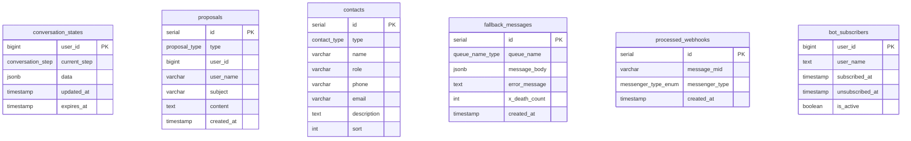
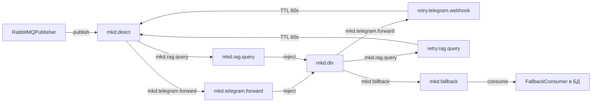
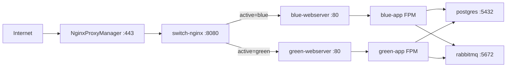
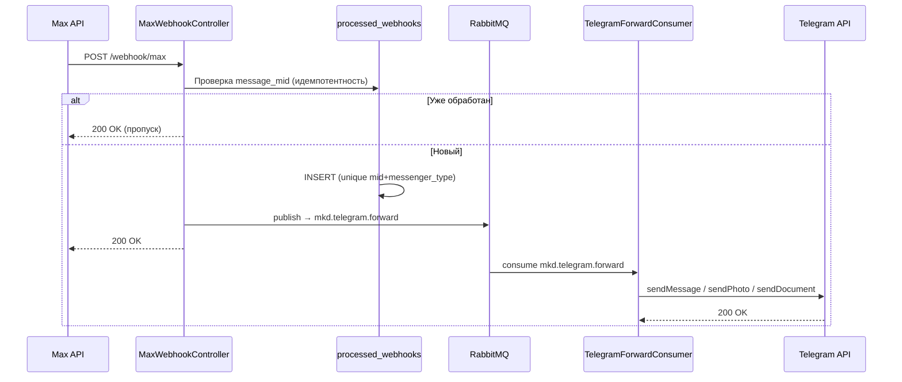
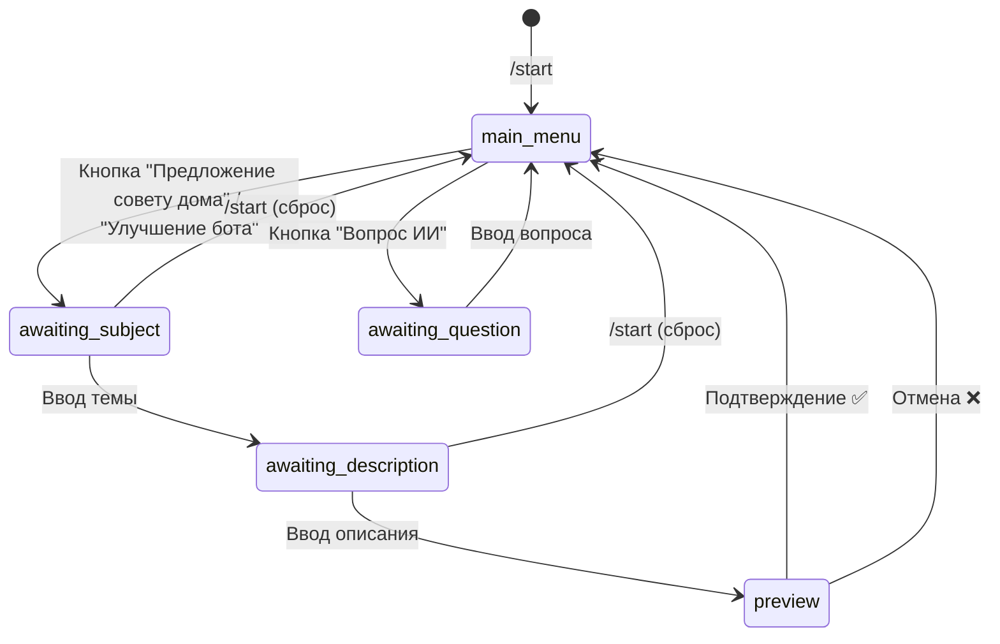
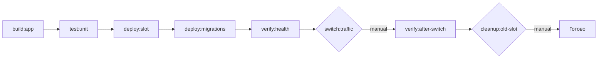

# МКД-Бот — чат-бот для многоквартирных домов

**МКД-Бот** — чат-бот для жителей многоквартирных домов с интерфейсом в мессенджере **Max** и дублированием в **Telegram**-канал. RAG-поиск по документам ЖКХ реализован через **Yandex Cloud** (Cloud Function + YandexGPT + File Search Tool).

> Финальный проект курса **OTUS: PHP Developer Professional**

---

## Функционал

### Главное меню бота

5 inline-кнопок, доступных после команды `/start`:

| Кнопка | Действие |
|--------|----------|
| УК | Контакты управляющей компании (`action: contacts, type: uk`) из БД |
| Совет дома | Контакты совета дома (`action: contacts, type: council`) из БД |
| Предложение совету дома | Многошаговый диалог: тема → описание → превью → подтверждение (`action: suggestion`) |
| Улучшение бота | Многошаговый диалог: тема → описание → превью → подтверждение (`action: feature`) |
| Вопрос ИИ | RAG-запрос через Yandex Cloud Function + YandexGPT (`action: rag_query`) |

### Дублирование Max → Telegram

Сообщения из Max-канала дублируются в Telegram-канал:

- **Текст** (`MessageType::Text`) — прямая пересылка
- **Фото по URL** (`MessageType::Photo`) — отправка через `sendPhoto`
- **Документы через InputFile** (`MessageType::Document`) — скачивание + отправка как документ
- **Ссылка на оригинал** — прикрепляется к каждому пересланному сообщению

### Многошаговый диалог предложений

Типы предложений (`ProposalType`): `feature` (новый функционал) и `suggestion` (предложение совету).

Шаги диалога (`ConversationStep`): `main_menu` → `awaiting_subject` → `awaiting_description` → `preview` → подтверждение/отмена.

### RAG: Yandex Cloud Function + YandexGPT + File Search Tool

Вопрос пользователя → очередь `mkd.rag.query` → Cloud Function `mkd-rag-search` → YandexGPT Response API с `file_search` tool → ответ с источниками.

### Контакты УК и совета дома

Хранятся в таблице `contacts` с типами `uk` и `council` и отображаются в боте.

### Email-уведомления о предложениях

[`PhpMailerProposalNotifier`](code/src/Infrastructure/Notification/PhpMailerProposalNotifier.php) отправляет уведомления на адреса из `PROPOSAL_NOTIFY_EMAILS` через SMTP.

---

## Архитектура

Проект построен по принципам **Clean Architecture** с чётким разделением на 4 слоя:

- **Domain** — бизнес-правила: сущности, enum-ы, контракты репозиториев и сервисов, Value Objects, доменные исключения.
- **Application** — варианты использования (Use Cases) и DTO; оркестрирует бизнес-логику, не зависит от инфраструктуры.
- **Infrastructure** — адаптеры внешних систем: Postgres-репозитории, RabbitMQ publisher/consumers, клиенты Max Bot API и Telegram Bot API, email-уведомления.
- **Presentation** — точка входа HTTP-запросов: Slim-контроллеры, мапперы входящих данных, middleware авторизации webhook.

---

## Стек технологий

| Компонент | Версия | Назначение |
|-----------|--------|------------|
| PHP | 8.2 | Основной язык |
| Slim | 4 | HTTP-фреймворк |
| PHP-DI | 7 | DI-контейнер |
| Postgres | 17 | БД |
| RabbitMQ | 4.1 | Очередь сообщений |
| Supervisor | — | Управление процессами (FPM + consumers) |
| Monolog | 3 | Логирование |
| Max Bot API SDK | 0.2.3 | Интеграция с Max |
| Telegram Bot SDK | 3.x | Интеграция с Telegram |
| PHPMailer | 6.9 | Email-уведомления |
| Docker | — | Контейнеризация |
| Yandex Cloud | — | Function + Object Storage + YandexGPT |
| PHPUnit | 11 | Тестирование |
| PHPStan | 2 | Статический анализ |
| PHP-CS-Fixer | 3 | Автоформатирование кода |

---

## Структура БД


```mermaid
erDiagram
    conversation_states {
        bigint user_id PK
        conversation_step current_step
        jsonb data
        timestamp updated_at
        timestamp expires_at
    }

    proposals {
        serial id PK
        proposal_type type
        bigint user_id
        varchar user_name
        varchar subject
        text content
        timestamp created_at
    }

    contacts {
        serial id PK
        contact_type type
        varchar name
        varchar role
        varchar phone
        varchar email
        text description
        int sort
    }

    fallback_messages {
        serial id PK
        queue_name_type queue_name
        jsonb message_body
        text error_message
        int x_death_count
        timestamp created_at
    }

    processed_webhooks {
        serial id PK
        varchar message_mid
        messenger_type_enum messenger_type
        timestamp created_at
    }

    bot_subscribers {
        bigint user_id PK
        text user_name
        timestamp subscribed_at
        timestamp unsubscribed_at
        boolean is_active
    }
```

---

## RabbitMQ

### Топология


```mermaid
graph LR
    P[RabbitMQPublisher] -->|publish| D[mkd.direct]
    D -->|mkd.telegram.forward| Q1[mkd.telegram.forward]
    D -->|mkd.rag.query| Q2[mkd.rag.query]

    Q1 -->|reject| DLX[mkd.dlx]
    Q2 -->|reject| DLX

    DLX -->|mkd.telegram.forward| R1[retry.telegram.webhook]
    DLX -->|mkd.rag.query| R2[retry.rag.query]

    R1 -->|TTL 60s| D
    R2 -->|TTL 60s| D

    DLX -->|mkd.fallback| DLQ[mkd.fallback]
    DLQ -->|consume| FC[FallbackConsumer в БД]
```

### Очереди

| Очередь                  | Exchange | Routing Key | Назначение |
|--------------------------|----------|-------------|------------|
| `mkd.telegram.forward`   | `mkd.direct` | `mkd.telegram.forward` | Пересылка сообщений Max → Telegram |
| `mkd.rag.query`          | `mkd.direct` | `mkd.rag.query` | RAG-запросы к Yandex Cloud Function |
| `retry.telegram.forward` | `mkd.dlx` | `mkd.telegram.forward` | Retry с TTL 60с → `mkd.telegram.forward` |
| `retry.rag.query`        | `mkd.dlx` | `mkd.rag.query` | Retry с TTL 60с → `mkd.rag.query` |
| `mkd.fallback`           | `mkd.dlx` | `mkd.fallback` | DLQ — сообщения после исчерпания retry |

### Механизм retry

1. Сообщение не обработано (reject/nack) → попадает в DLX `mkd.dlx`
2. DLX маршрутизирует в retry-очередь (TTL 60 с)
3. По истечении TTL → `x-dead-letter-exchange: mkd.direct` → `x-dead-letter-routing-key: <исходная очередь>` → возврат в исходную очередь
4. При повторном reject → снова DLX → retry → исходная очередь (цикл)
5. Если `x-death_count` превышен или сообщение не попадает ни в одну retry-очередь → `mkd.fallback`

### DLQ: `mkd.fallback`

[`FallbackConsumer`](code/src/Infrastructure/Queue/FallbackConsumer.php) читает сообщения из `mkd.fallback` и сохраняет в таблицу `fallback_messages` (поля: `queue_name`, `message_body`, `error_message`, `x_death_count`) для ручного разбора.

---

## Инфраструктура

### Dev: `docker-compose.yml`

| Сервис | Образ | Порт | Назначение |
|--------|-------|------|------------|
| `postgres` | postgres:17 | 5432 | БД, volume `pg_data` + `pg_dump` |
| `rabbitmq` | rabbitmq:4.1-management | 5672 / 15672 | Очереди, volume `rabbitmq_data` |
| `app` | custom PHP 8.2-FPM (`target: dev`) | — | FPM + consumers + cron (Supervisor) |
| `webserver` | nginx:stable | 80 | Reverse proxy → FPM unix socket |

Код монтируется через bind mount (`WWW_ROOT_DIR` → `/data/`). PHP-FPM и nginx общаются через именованный volume `php_socket`.

### Prod: Blue-Green деплой


```mermaid
graph LR
    Internet --> NPM[NginxProxyManager :443]
    NPM --> SN[switch-nginx :8080]
    SN -->|active=blue| BW[blue-webserver :80]
    SN -->|active=green| GW[green-webserver :80]
    BW --> BA[blue-app FPM]
    GW --> GA[green-app FPM]
    BA --> PG[postgres :5432]
    GA --> PG
    BA --> RM[rabbitmq :5672]
    GA --> RM
```

Переключение: `switch-slot.sh` → `sed` замена backend в конфиге switch-nginx → `nginx -s reload` → **~0 сек даунтайм**.

### SLOT_ROLE

| Значение | Поведение |
|----------|-----------|
| `active` | Все consumers + PHP-FPM |
| `passive` | Только PHP-FPM (consumers отключены) |

Дефолт: `SLOT_ROLE=passive` (fail-closed). В dev-среде явно указано `SLOT_ROLE=active`. Реализовано в [`entrypoint.sh`](fpm/entrypoint.sh) — при `passive` конфиги consumers и cron перемещаются в backup-директорию.

### Supervisor: процессы

| Процесс | Конфиг | Назначение |
|---------|--------|------------|
| `php-fpm` | `php-fpm.conf` | HTTP-обработка (webhook, health) |
| `consumer-telegram-longpoll` | `consumer-telegram-longpoll.conf` | Telegram long polling (только при `TELEGRAM_MODE=longpoll`) |
| `consumer-telegram-forward` | `consumer-telegram-forward.conf` | Пересылка Max → Telegram |
| `consumer-rag-query` | `consumer-rag-query.conf` | RAG-запросы к Yandex Cloud |
| `consumer-fallback` | `consumer-fallback.conf` | Обработка DLQ-сообщений |

### Multi-stage Dockerfile

```
base — PHP 8.2-FPM + ext: pdo_pgsql, pcntl, amqp + Composer + Supervisor
├─ dev — pcov для покрытия тестов, код через bind mount
├─ builder — composer install --no-dev --optimize-autoloader
├─ test — composer install (с dev-зависимостями для CI)
└─ prod — код из builder, без tests/phpunit.xml/phpstan.neon
```

---

## RAG (Yandex Cloud)

### Архитектурная схема

```
Пользователь → МКД-Бот → RabbitMQ (mkd.rag.query) → RagQueryConsumer
→ HTTP POST → Cloud Function (mkd-rag-search)
→ YandexGPT API (/v1/chat/responses) + file_search tool + vector_store_ids
→ Ответ + источники → Consumer → ProcessRagQuery → Пользователь
```

### Cloud Function: `mkd-rag-search`
#### Пока - это прототип - работает с Completion API(проверено) и нет связи с основным приложением(заглушка)
#### С Response API надо разбираться - документация Яндекс некорректна. Перед переводом в боевой режим будет добавлен токен в вебхук.

[`index.php`](yc/functions/rag-search/index.php) → [`RequestValidator`](yc/functions/rag-search/RequestValidator.php) → [`SearchService`](yc/functions/rag-search/SearchService.php) → YandexGPT Response API с `file_search` tool → [`ResponseBuilder`](yc/functions/rag-search/ResponseBuilder.php)

- **Runtime**: PHP 8.2, 256 MB, таймаут 30с
- **IAM-токен**: автоматически через metadata service сервисного аккаунта
- **API**: `https://llm.api.cloud.yandex.net/v1/chat/completions` (OpenAI-compatible)
- **Инструмент**: `file_search` с `vector_store_ids`

### Terraform: [`yc/main.tf`](yc/main.tf)

| Ресурс | Описание |
|--------|----------|
| `yandex_function.rag_search` | Cloud Function `mkd-rag-search` (php82, 256MB, 30s) |
| `yandex_storage_bucket.documents` | S3-бакет `mkd-chatbot-docs-<suffix>` для документов |
| `yandex_iam_service_account.sa` | Сервисный аккаунт `mkd-chatbot-sa` |
| IAM роли | `ai.languageModels.user`, `functions.functionInvoker`, `storage.uploader`, `storage.viewer` |
| `data.archive_file.rag_search_zip` | Автоматическая упаковка `functions/rag-search/` в ZIP |

### API функции

**Запрос:**
```json
{ "question": "Как оплатить ЖКХ?", "chat_id": 12345 }
```

**Ответ (успех):**
```json
{ "success": true, "answer": "Ответ на основе документов...", "sources": [{ "filename": "faq/faq.md" }] }
```

**Ответ (ошибка):**
```json
{ "success": false, "error": { "code": 400, "message": "Поле \"question\" обязательно" } }
```

---

## Потоки данных

### Webhook Max → Telegram


```mermaid
sequenceDiagram
    participant Max as Max API
    participant WH as MaxWebhookController
    participant PW as processed_webhooks
    participant MQ as RabbitMQ
    participant C as TelegramForwardConsumer
    participant TG as Telegram API

    Max->>WH: POST /webhook/max
    WH->>PW: Проверка message_mid (идемпотентность)
    alt Уже обработан
        WH-->>Max: 200 OK (пропуск)
    else Новый
        PW->>PW: INSERT (unique mid+messenger_type)
        WH->>MQ: publish → mkd.telegram.forward
        WH-->>Max: 200 OK
        MQ->>C: consume mkd.telegram.forward
        C->>TG: sendMessage / sendPhoto / sendDocument
        TG-->>C: 200 OK
    end
```

### Многошаговый диалог предложений


```mermaid
stateDiagram-v2
    [*] --> main_menu: /start
    main_menu --> awaiting_subject: Кнопка "Предложение совету дома" / "Улучшение бота"
    awaiting_subject --> awaiting_description: Ввод темы
    awaiting_description --> preview: Ввод описания
    preview --> main_menu: Подтверждение ✅
    preview --> main_menu: Отмена ❌
    awaiting_subject --> main_menu: /start (сброс)
    awaiting_description --> main_menu: /start (сброс)
    main_menu --> awaiting_question: Кнопка "Вопрос ИИ"
    awaiting_question --> main_menu: Ввод вопроса
```

---

## Быстрый старт

### 1. Клонирование

```bash
git clone <repo-url>
cd PHP_2025
```

### 2. Настройка `.env`

```bash
cp .env.example .env
```

Заполните обязательные переменные:

| Переменная | Описание |
|------------|----------|
| `APP_NAME` | Имя приложения (по умолчанию `mkd-bot`) |
| `APP_DOMAIN` | Домен приложения |
| `PG_HOST` | Хост Postgres |
| `PG_PORT` | Порт Postgres |
| `PG_DB` | Имя БД |
| `PG_USER` | Пользователь БД |
| `PG_PASSWORD` | Пароль БД |
| `RABBITMQ_HOST` | Хост RabbitMQ |
| `RABBITMQ_PORT` | Порт RabbitMQ |
| `RABBITMQ_LOGIN` | Логин RabbitMQ |
| `RABBITMQ_PASSWORD` | Пароль RabbitMQ |
| `MAX_TOKEN` | Токен бота Max |
| `MAX_CHANNEL` | ID канала Max |
| `MAX_WEBHOOK_SECRET` | Секрет для Max webhook |
| `TELEGRAM_TOKEN` | Токен бота Telegram |
| `TELEGRAM_CHANNEL` | ID канала Telegram |
| `TELEGRAM_SECRET_TOKEN` | Секрет для Telegram webhook |
| `TELEGRAM_MODE` | Режим Telegram: `longpoll` (по умолчанию) / `webhook` |
| `TELEGRAM_HTTP_PROXY` | HTTP-прокси для Telegram API |
| `TELEGRAM_PROXY_LOGIN` | Логин для прокси-авторизации Telegram |
| `TELEGRAM_PROXY_PASSWORD` | Пароль для прокси-авторизации Telegram |
| `SMTP_HOST` | SMTP-сервер для уведомлений |
| `SMTP_PORT` | SMTP-порт |
| `SMTP_USER` | SMTP-пользователь |
| `SMTP_PASSWORD` | SMTP-пароль |
| `SMTP_FROM_EMAIL` | Email отправителя |
| `PROPOSAL_NOTIFY_EMAILS` | Email-адреса для уведомлений о предложениях |
| `LOG_LEVEL` | Уровень логирования: `DEBUG` / `INFO` / `ERROR` |

### 3. Запуск

```bash
docker compose up -d
```

### 4. Миграции БД

```bash
docker exec app php /data/bin/migrate.php
```

### 5. Топология RabbitMQ

```bash
docker exec app php /data/bin/setup-rabbitmq.php
```

Или одной командой: `docker exec app make setup`

### 6. Регистрация webhook-ов

```bash
docker exec app php /data/bin/register-webhooks.php
```

### Режим Telegram

| Режим | Описание |
|-------|----------|
| `longpoll` (по умолчанию) | `consumer-telegram-longpoll` опрашивает Telegram API |
| `webhook` | Telegram отправляет POST на `/webhook/telegram`, longpoll consumer не запускается |

---

## Тестирование

### Наборы тестов

| Suite | Описание |
|-------|----------|
| Unit | Изолированные тесты домена и приложения (моки) |
| Feature | Тесты HTTP-эндпоинтов через Slim |
| Integration | Тесты с реальной БД и RabbitMQ |
| E2E | Сквозные тесты (требуют запущенное приложение) |

### Команды запуска

```bash
# Unit
docker exec app php vendor/bin/phpunit --testsuite=Unit --no-coverage

# Feature
docker exec app php vendor/bin/phpunit --testsuite=Feature --no-coverage

# Integration
docker exec app php vendor/bin/phpunit --testsuite=Integration --no-coverage

# Все кроме E2E
docker exec app php vendor/bin/phpunit --testsuite=Unit,Feature,Integration --no-coverage

# E2E (требует запущенное приложение)
docker exec app php vendor/bin/phpunit --group=e2e --no-coverage

# С покрытием
docker exec app make test-coverage
```

### Покрытие кода

- **Цель**: 70% строк
- **Проверка**: [`check-coverage.php`](code/bin/check-coverage.php) — парсит clover XML, сравнивает с порогом
- **Команда**: `docker exec app make test-coverage-check`

### Инструменты

| Инструмент | Версия | Назначение |
|------------|--------|------------|
| PHPUnit | 11 | Unit / Feature / integration / E2E тесты |
| PHPStan | 2 | Статический анализ |
| PHP-CS-Fixer | 3 | Автоформатирование кода |

---

## CI/CD и деплой

### Пайплайн


```mermaid
flowchart LR
    B[build:app] --> T[test:unit]
    T --> DS[deploy:slot]
    DS --> DM[deploy:migrations]
    DM --> VH[verify:health]
    VH --> SW{switch:traffic}
    SW -->|manual| PV[verify:after-switch]
    PV --> CO{cleanup:old-slot}
    CO -->|manual| DONE[Готово]
```

### Стадии пайплайна

| Стадия | Job | Описание |
|--------|-----|----------|
| **build** | `build:app` | `docker build --target prod`, push в Registry, определение `TARGET_SLOT` |
| **test** | `test:unit` | `docker build --target test`, запуск `phpunit --testsuite=Unit` |
| **deploy** | `deploy:slot` | `deploy-slot.sh` — запуск неактивного слота с новым образом |
| **deploy** | `deploy:migrations` | `docker exec <slot>-app php /data/bin/migrate.php` |
| **verify** | `verify:health` | `health-check.sh` — проверка `/ready` нового слота |
| **switch** | `switch:traffic` | **Manual** — `switch-slot.sh` — переключение nginx на новый слот |
| **post-verify** | `verify:after-switch` | Проверка `/ready` после переключения |
| **cleanup** | `cleanup:old-slot` | **Manual** — `cleanup-slot.sh` — остановка старого слота |

### Manual switch: `switch:traffic`

Переключение трафика через `switch-slot.sh` — замена `$active_backend` в конфиге switch-nginx + `nginx -s reload`. Требует ручного подтверждения в GitLab CI.

### Миграции: защита от параллельного запуска

[`MigrationRunner`](code/src/Infrastructure/Persistence/MigrationRunner.php) использует `pg_advisory_lock` (ID `20260529`) — одновременно может выполняться только одна миграция.

---

## Мониторинг

| Endpoint | Назначение | Проверка |
|----------|------------|----------|
| `GET /health` | Liveness — приложение работает | Всегда `{"status":"ok"}` |
| `GET /ready` | Readiness — БД + RabbitMQ доступны | `{"status":"ok","checks":{"database":true,"rabbitmq":true}}` или `503` |

---

## Makefile

Все команды выполняются внутри контейнера `app`:

```bash
docker exec app make <цель>
```

| Цель | Описание |
|------|----------|
| `setup` | Миграции БД + топология RabbitMQ |
| `migrate` | Выполнение SQL-миграций |
| `test` | Запуск тестов (PHPUnit) |
| `test-coverage` | Тесты с clover XML-отчётом покрытия |
| `test-coverage-check` | Тесты + проверка минимального порога покрытия (70%) |
| `stan` | PHPStan — статический анализ |
| `cs-fix` | PHP-CS-Fixer — исправление стиля кода |
