# Приложение обработки отложенных запросов

## Текст задания

Используя выбранный инструмент автоматического деплоя, необходимо реализовать автоматическую выкатку написанного ранее мини-приложения на собственный виртуальный сервер.

Критерии оценки:
- Автоматическая доставка на любую среду;
- Доставка без downtime;
- Желательно организовать отдельный закрытый репозиторий настроек, из которого формируются файлы конфигурации для выбранной среды в момент деплоя.

## Краткое описание реализации и демонстрация результата
1. В качестве ВМ настроена WSL на Windows - Ubuntu 24.04.1 LTS (GNU/Linux 6.6.114.1-microsoft-standard-WSL2 x86_64).

2. Установлены docker, docker compose, необходимые зависимости.
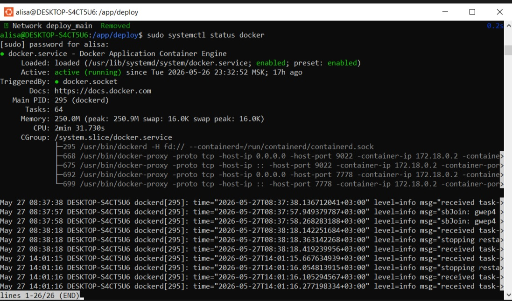

3. Установлены и настроены Gitlab и Gitlab Runner.
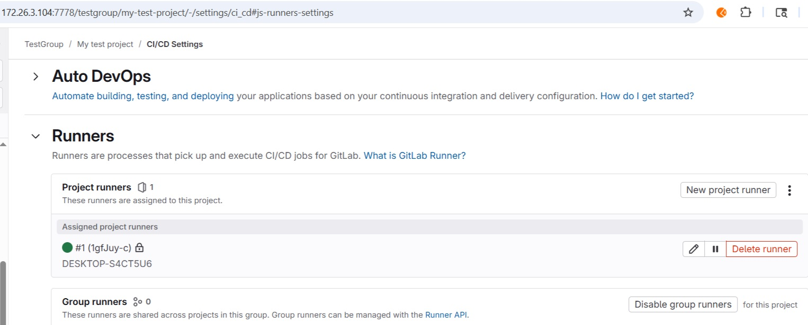

4. Созданы необходимые папки и скрипты для деплоя
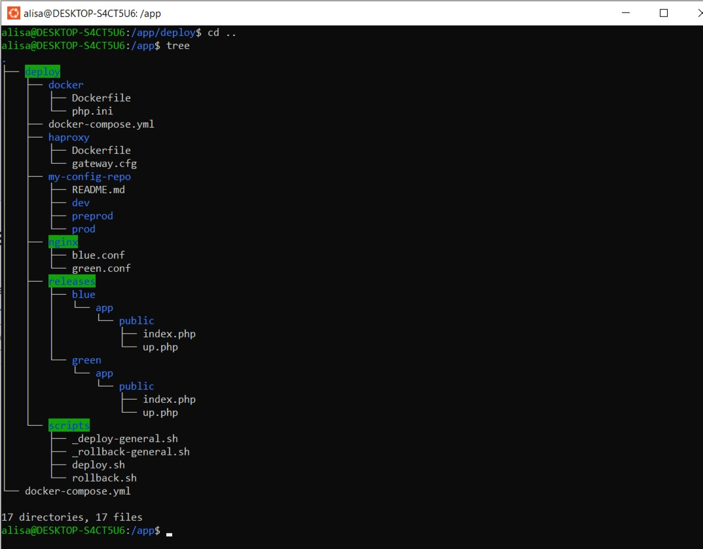

5. В Gitlab созданы два проекта: один - основной, второй - репозиторий настроек, из которого формируются файлы конфигурации для выбранной среды в момент деплоя.
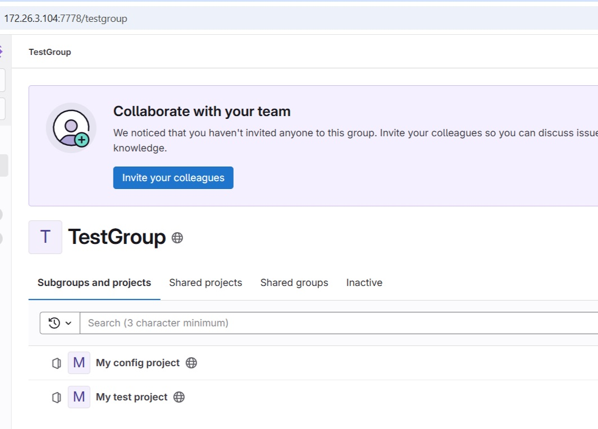

6. В основном репозитории в переменные GitLab добавлены такие переменные:
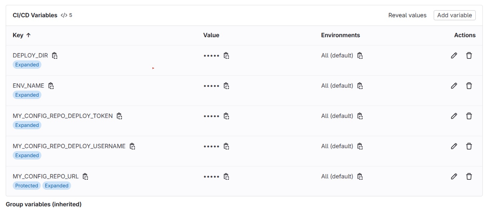

В зависимости от значения переменной ENV_NAME при деплое будут забираться те или иные настройки из репозитория настроек (.env):

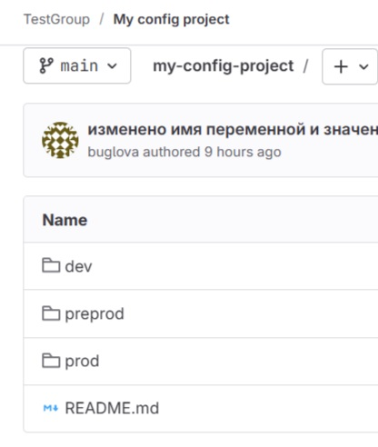

7. Проверено, что deploy запускается успешно, работает без downtime, сервер переключается на blue\green.
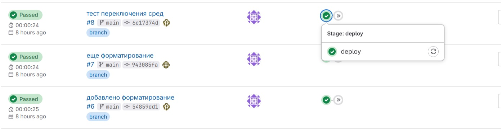

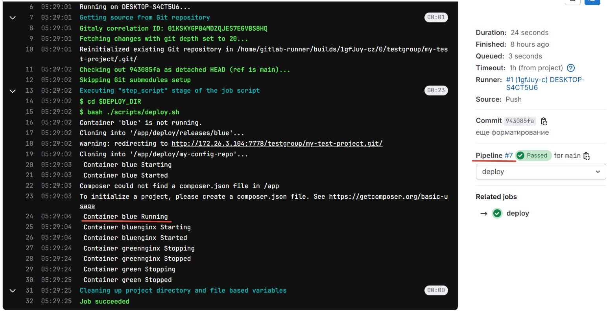

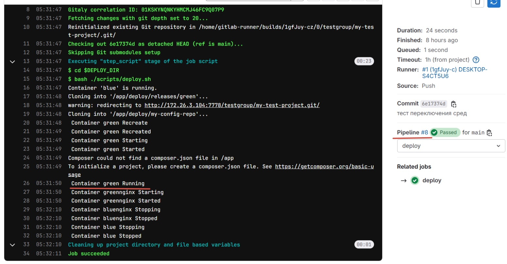

8. Проверено, что работает rollback.
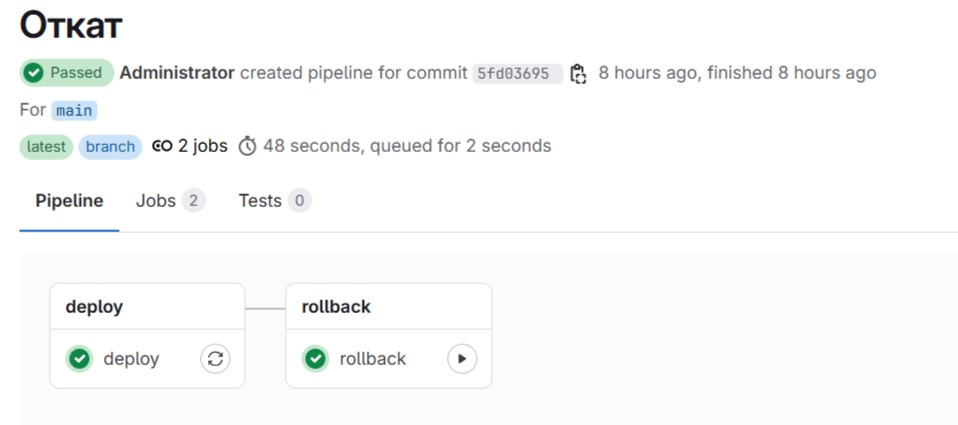

Было до:
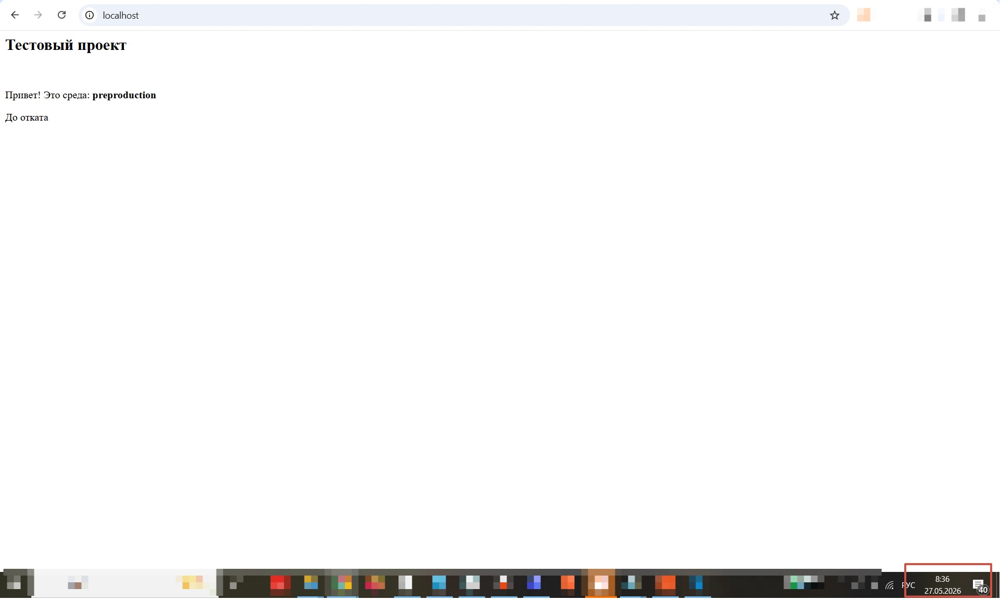

Закоммитили то, что будем откатывать:
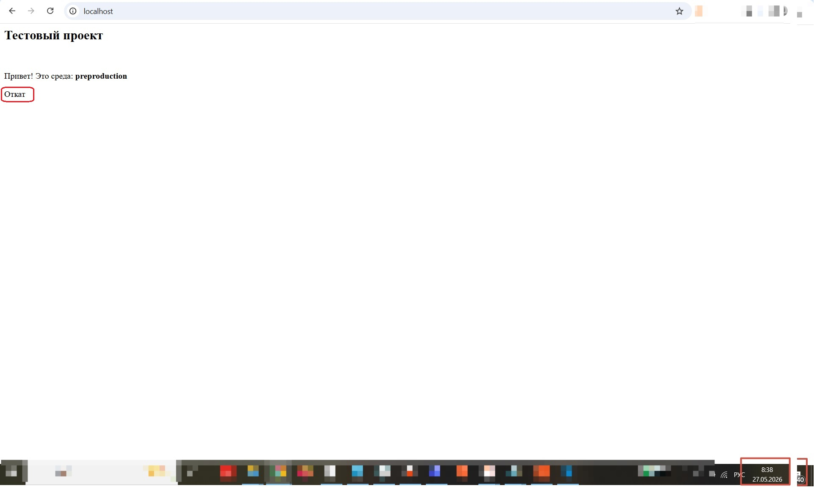

Откатили:
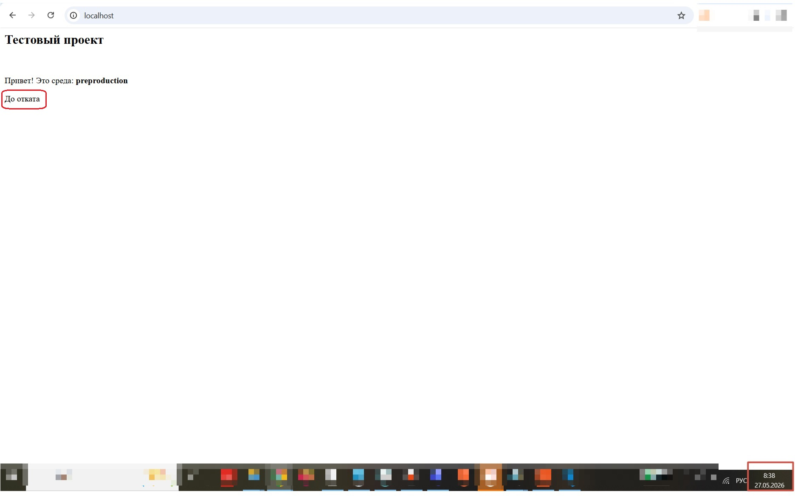

9. Проверено, что работает подтягивание нужных настроек в зависимости от значения GitLab переменной ENV_NAME.

При **ENV_NAME=prod**

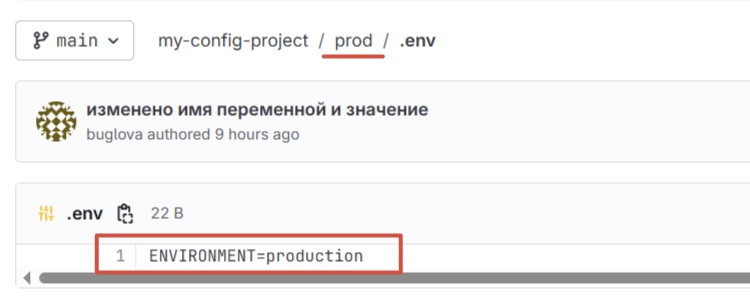

При **ENV_NAME=preprod**

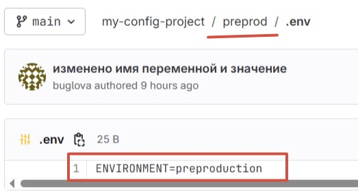