# Схема данных кинотеатр

Описание/Пошаговая инструкция выполнения домашнего задания:

Подготовить список из 6 основных запросов к БД, разработанной на предыдущих занятиях

1. Выбор всех фильмов на сегодня

2. Подсчёт проданных билетов за неделю

3. Формирование афиши (фильмы, которые показывают сегодня)

4. Поиск 3 самых прибыльных фильмов за неделю

5. Сформировать схему зала и показать на ней свободные и занятые места на конкретный сеанс

6. Вывести диапазон минимальной и максимальной цены за билет на конкретный сеанс

Целесообразно выбрать 3 "простых" (задействована 1 таблица), 3 "сложных" (агрегатные функции, связи таблиц).

Далее нужно заполнить таблицы, увеличив общее количество строк текстовых данных до 10000.

Затем проведите анализ производительности запросов к БД, сохранить планы выполнения.


Заполните таблицы, увеличив общее количество строк текстовых данных до 10000000.

Затем проведите анализ производительности запросов к БД, сохранить планы выполнения.


На основе анализа запросов и планов предложить оптимизации (индексы, структура, параметры и др.

Добавьте индексы и сравните результат, приложив планы выполнения.
---

Схему БД можно посмотреть на сайте [Mermaid](https://mermaid.live/edit#pako:eNqdUkFuwjAQ_Iq154CcBCXYV-DQA6KicKkiVVZsgtXETh1bKg38vQ4hqCgSh-5pZzQ7ux65hVxzARSEWUpWGFZlCvla7N92m_Vqi87nyUS3aLNdekBRXbJcNL2m5zrB-Sb4eNmt1l6Va2WZVDfd63az3C92D1aDUqq8dHxwvG9te9xVY41UBZJ8RClWiREpKibLnr38PfO5I2dWIG24T8F3I2ljmXXNg-vwqH9ceig1s6g2MhfjQ_tg_rhKZdGXY8pKe3rmAQEURnKg1jgRQCWMT8JDuHplYI_CHwHUt5yZzwwy1c3UTL1rXQ1jRrviCPTAysYjV3fB3D7GXSKUz2mhnbJAQ3K1ANrCt0fzdBqlcRITQnCE01kAJ6BRNMUkImFCYhzPcRxGlwB-rkvDaRjGKU7JLMRRMsM4ufwCMejARA), вставив код для создания схемы из файла cinema.mmd.


# Описание кинотеатра

Клиент может купить несколько билетов на сеанс в кинотеатре. 

Места в залах могут иметь разную цену.
---
# Анализ производительности запросов к БД

## Количество строк текстовых данных до 10000

| Запрос     | Затраты на получение первой строки | Затраты на получение всех строк |
|------------|------------------------------------|---------------------------------|
| Простой №1 | 8.31                               | 8.32                            |
| Простой №2 | 0.29                               | 4.30                            |
| Простой №3 | 0.29                               | 8.30                            |
| Сложный №1 | 534.34                             | 534.37                          |
| Сложный №2 | 445.57                             | 445.58                          |
| Сложный №3 | 584.76                             | 587.21                          |


### Простой запрос №1
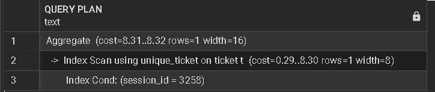
### Простой запрос №2
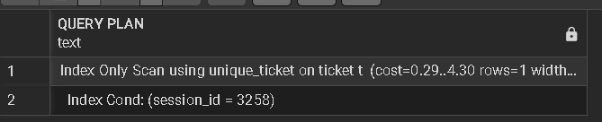
### Простой запрос №3
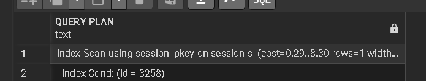

### Сложный запрос №1
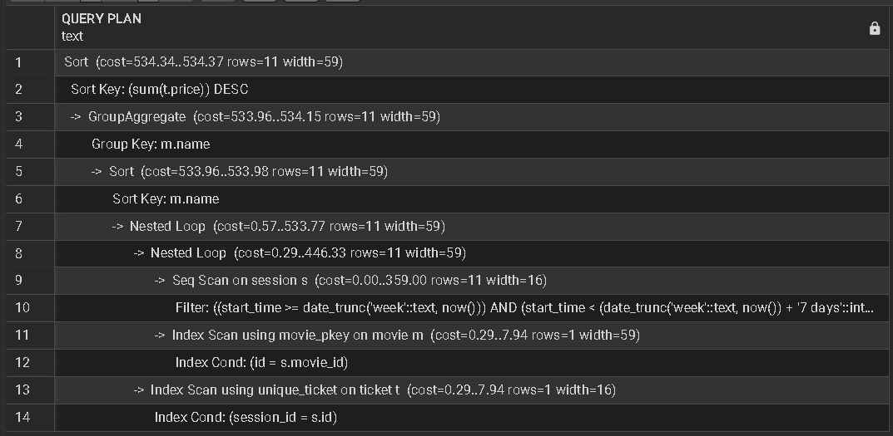
### Сложный запрос №2
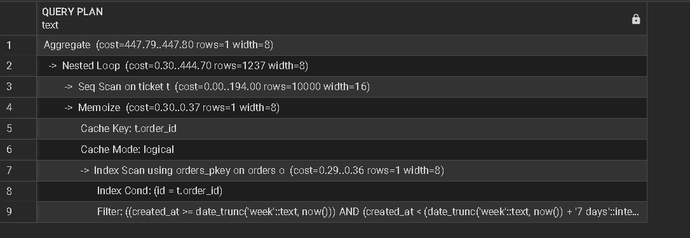
### Сложный запрос №3
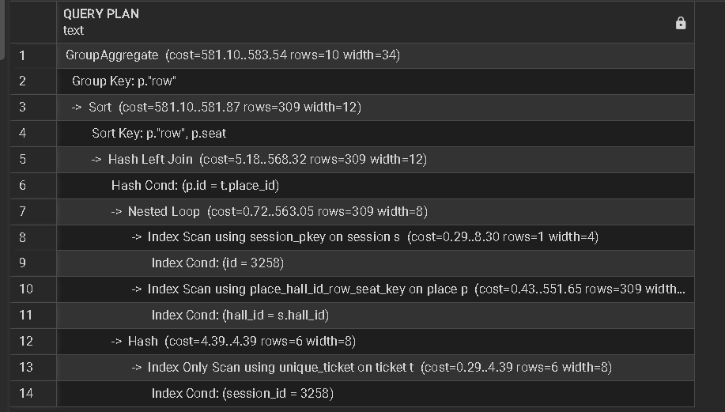

## Количество строк текстовых данных до 10.000.000
| Запрос     | Затраты на получение первой строки | Затраты на получение всех строк |
|------------|------------------------------------|---------------------------------|
| Простой №1 | 8.46                               | 8.47                            |
| Простой №2 | 0.43                               | 4.45                            |
| Простой №3 | 0.43                               | 8.45                            |
| Сложный №1 | 264262.06                          | 264286.36                       |
| Сложный №2 | 241532.21                          | 241532.21                       |
| Сложный №3 | 1145.73                            | 1148.07                         |


### Простой запрос №1
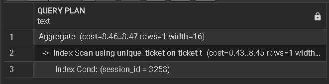
### Простой запрос №2
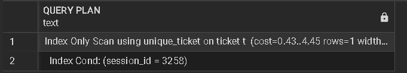
### Простой запрос №3
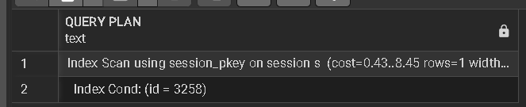

### Сложный запрос №1
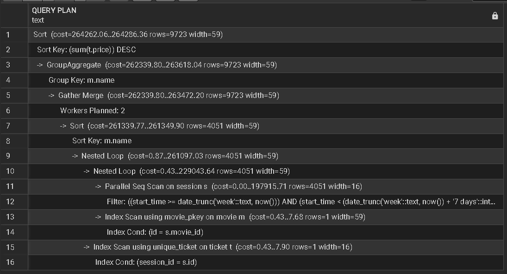
### Сложный запрос №2
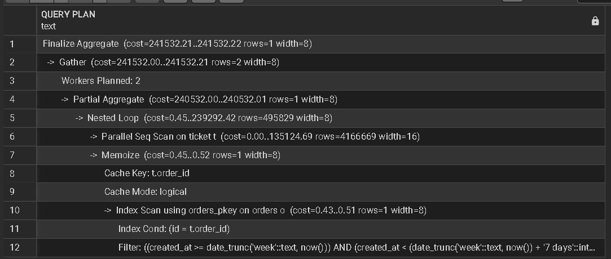
### Сложный запрос №3
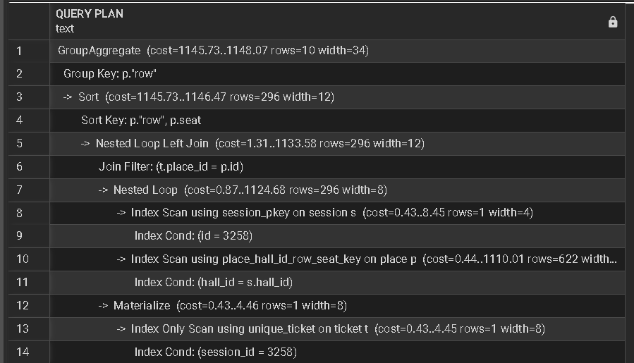

## Идеи для оптимизации

Для простых запросов стоимость не большая, предлагаю их не оптимизировать.

### Сложный запрос №1
Для таблицы cinema.ticket необходимо включить поле session_id в индекс. 
Для cinema.session необходимо добавить в индекс start_time

### Сложный запрос №2
Для таблицы cinema.orders необходимо включить поле created_at и id в индекс.

### Сложный запрос №3
Для таблицы cinema.place необходимо включить поле hall_id в индекс.


## После оптимизации


### Количество строк текстовых данных до 10.000.000, после оптимизации

| Запрос     | Затраты на получение первой строки (до оптимизации) | Затраты на получение всех строк (до оптимизации) | Затраты на получение первой строки (после оптимизации) | Затраты на получение всех строк (после оптимизации) |
|------------|-----------------------------------------------------|--------------------------------------------------|--------------------------------------------------------|-----------------------------------------------------|
| Простой №1 | 8.46                                                | 8.47                                             | 4.46                                                   | 4.47                                                |
| Простой №2 | 0.43                                                | 4.45                                             | 0.43                                                   | 4.45                                                |
| Простой №3 | 0.43                                                | 8.45                                             | 0.43                                                   | 8.45                                                |
| Сложный №1 | 264262.06                                           | 264286.36                                        | 78570.13                                               | 78594.44                                            |
| Сложный №2 | 241532.21                                           | 241532.21                                        | 160307.94                                              | 160307.95                                           |
| Сложный №3 | 1145.73                                             | 1148.07                                          | 54.39                                                  | 56.73                                               |

### Простой запросы №1-3

Для запросов 2 и з ничего не изменилось, поскольку я их не оптимизировал. 
Если сравнить query plan для 1-го запроса до и после оптимизации, то видно,
что сейчас данные берутся не из индекса unique_ticket, а из idx_ticket_session_id. Индекс idx_ticket_session_id содержит 
поле price, что используется в запросе, за счет этого у нас снизилась стоимость запроса почти в 2 раза. 
Цена берется сразу из индекса, не нужно брать ее из таблицы.

### Сложный запрос №1

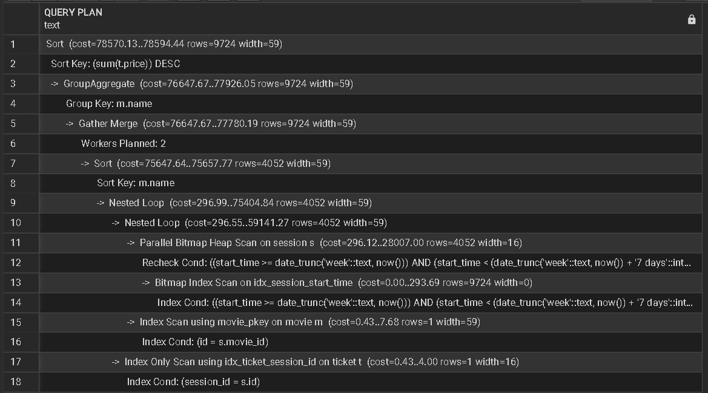
Для таблицы cinema.ticket включил поле session_id в индекс. Также в include я добавил поле "price", поскольку оно используется в запросе.
Для индекса idx_ticket_session_id был выбран тип b-tree, поскольку в запросе используется равенство:`join cinema.movie as m on m.id = s.movie_id`.

Для таблицы cinema.session добавил в индекс поле start_time (для ускорения поиска), в include добавил: id, movie_id.
Для индекса idx_session_start_time был выбран тип b-tree, поскольку в запросе используется сравнение в диапазоне (<, >=)): `where s.start_time >= date_trunc('week', now()) and  s.start_time < date_trunc('week', now()) + interval '1 week'`.

В итоге я добился того, что вместо Sequence Scan таблицы session данные берутся из индекса. Стоимость получения всех строк в запросе уменьшилась с 197915.71 до 293.69.

### Сложный запрос №2

Добавил в индекс таблицы cinema.orders поля: created_at, id. При помощи индекса удалось избавиться от вложенного цикла. Теперь заказы берутся из индекса, теперь не нужно делать полный проход по таблице orders.
Для индекса idx_orders_created_at_id был выбран тип b-tree, поскольку в запросе используется сравнение в диапазоне (<, >=)): `where o.created_at >= date_trunc('week', now()) and  o.created_at < date_trunc('week', now()) + interval '1 week'`.

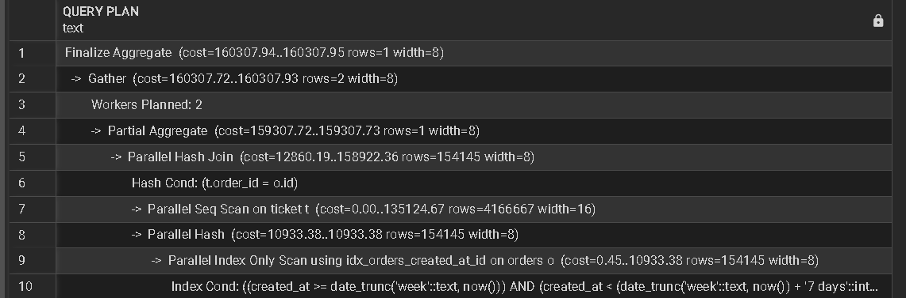

Добавил в индекс таблицы cinema.ticket поле order_id, но query plan не изменился.
Для индекса idx_ticket_order_id был выбран тип b-tree, поскольку в запросе используется равенство:` join cinema.orders as o on o.id = t.order_id`.

Выбрав первые 10 строк таблицы cinema.ticket вижу, что У всех билетов одинаковый id заказа

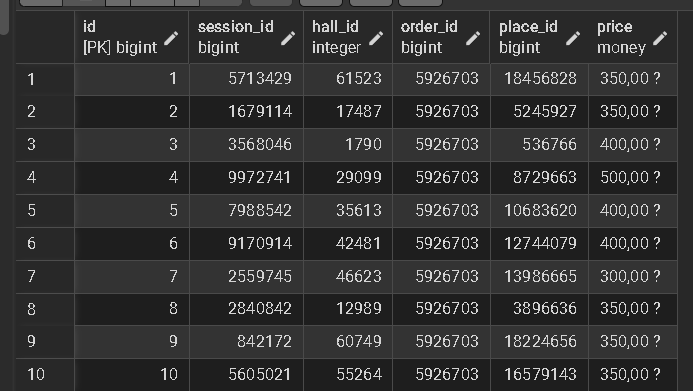

Выполнив запрос
```sql
select count(*) from cinema.ticket where order_id = 5926703;
```
получаю, что в таблице 10.000.000 записей с одинаковым id заказа. В таком случае планировщик запроса решает, что ему проще сделать Sequence Scan всей таблицы, чем брать данные из индекса.

### Сложный запрос №3

Добавил в индекс таблицы cinema.place поле hall_id.
Для индекса idx_place_hall_id был выбран тип b-tree, поскольку в запросе используется равенство: `join hall h on p.hall_id = h.id`.

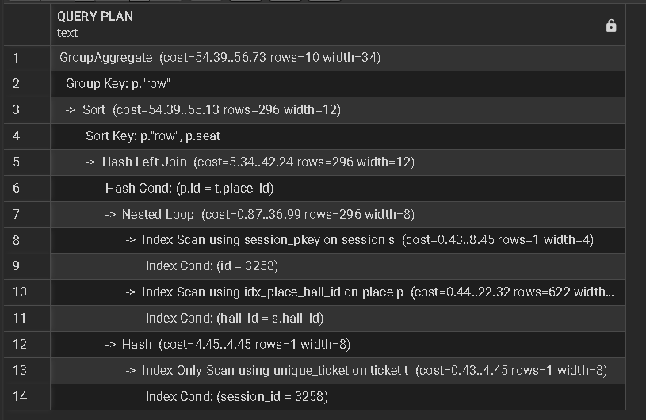

В сотни раз уменьшилась стоимость. Теперь для join не приходится пробегаться по таблице cinema.place в поиске нужных строк, данные берутся из индекса, что уменьшило стоимость запроса.

## Вывод

После добавления индексов снизилась оценка затрат на получение данных для сложных запросов. 
Индексация таблиц позволяет оптимизировать запрос за счет уменьшения времени получения данных. 
Индекс теряет смысл, если в нем содержаться много одинаковых значений, в таком случае планировщик запросов после оценки понимает, что ему проще пройтись по всей таблице, чем получать данные из индекса. Если индекс не используется, он просто занимает лишнее место в памяти. 