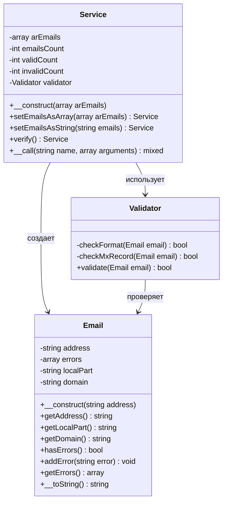
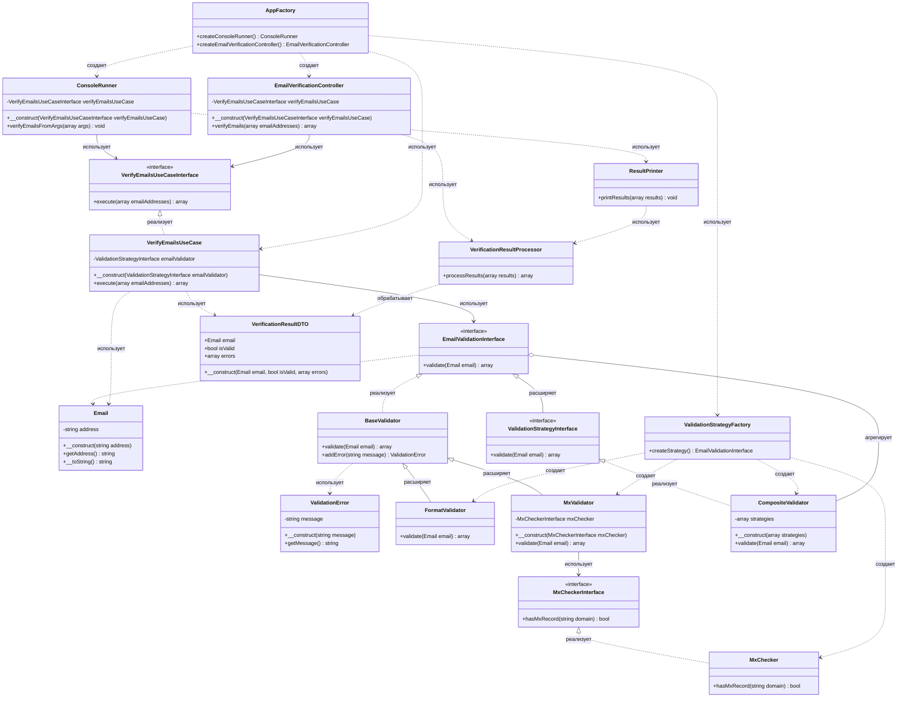

# Анализ кода (HW#14)

## Описание
Cервис для верификации email-адресов. В папке `/old` находится текущая реализация, а в папке `/new` - улучшенная, соответствующая принципам чистой архитектуры.

## Анализ существующего кода (/old)

### Нарушения принципов

#### 1. Принцип DRY
- **Нарушение в файле `Service.php`**: В методе `setEmailsAsString()` логика обработки разделителей (`,` и `;`) дублируется, за исключением символа разделителя.

#### 2. Принцип KISS
- **Нарушение в файле `Service.php`**: Метод `__call()` реализует сложную логику для динамического вызова геттеров, что делает его менее понятным и усложняет отладку.
- **Нарушение в файле `Email.php`**: Конструктор сразу же парсит email-адрес, что делает его более сложным.

#### 3. Принцип YAGNI
- **Нарушение в файле `Service.php`**: В классе определены переменные `$arEmailsValid` и `$arEmailsInvalid` на будущее, но они нигде не используются в коде.

#### 4. Принципы SOLID

##### Single Responsibility Principle (SRP)
- **Нарушение в файле `Service.php`**: Класс `Service` выполняет слишком много обязанностей: управляет массивом email-адресов, проводит валидацию, подсчитывает статистику и предоставляет динамический доступ к свойствам через магический метод `__call`.

##### Open/Closed Principle (OCP)
- **Нарушение в файле `Validator.php`**: Класс жестко привязан к конкретной реализации проверки формата и MX-записей. Добавление новых типов проверок потребует модификации существующего класса.

##### Interface Segregation Principle (ISP)
- **Нарушение в файле `Service.php`**: Класс предоставляет слишком много методов через магический метод `__call`, что может привести к использованию только части интерфейса.

##### Dependency Inversion Principle (DIP)
- **Нарушение в файле `Service.php`**: Класс напрямую зависит от конкретного класса `Validator`, а не от абстракции.

### UML-диаграмма классов до рефакторинга:

```mermaid
classDiagram
    class Email {
        -string address
        -array errors
        -string localPart
        -string domain
        +__construct(string address)
        +getAddress() string
        +getLocalPart() string
        +getDomain() string
        +hasErrors() bool
        +addError(string error) void
        +getErrors() array
        +__toString() string
    }

    class Validator {
        -checkFormat(Email email) bool
        -checkMxRecord(Email email) bool
        +validate(Email email) bool
    }

    class Service {
        -array arEmails
        -int emailsCount
        -int validCount
        -int invalidCount
        -Validator validator
        +__construct(array arEmails)
        +setEmailsAsArray(array arEmails) Service
        +setEmailsAsString(string emails) Service
        +verify() Service
        +__call(string name, array arguments) mixed
    }

    Service --> Validator : использует
    Service --> Email : создает
    Validator --> Email : проверяет
```

## Новая реализация (/new)

### Распределение по слоям:
- `Domain` - Email, ValidationError, Validators, EmailValidationInterface, MxCheckerInterface
- `Application` - VerificationResultDTO, CompositeValidator, ValidationStrategyInterface, VerifyEmailsUseCaseInterface, VerifyEmailsUseCase
- `Infrastructure` - MxChecker, ValidationStrategyFactory
- `Presentation` - ConsoleRunner, EmailVerificationController, VerificationResultProcessor, ResultPrinter, AppFactory

### UML-диаграмма классов после рефакторинга:

```mermaid
classDiagram
    %% Domain-классы
    class Email {
        -string address
        +__construct(string address)
        +getAddress() string
        +__toString() string
    }

    class ValidationError {
        -string message
        +__construct(string message)
        +getMessage() string
    }

    class BaseValidator {
        +validate(Email email) array
        +addError(string message) ValidationError
    }

    class FormatValidator {
        +validate(Email email) array
    }

    class MxValidator {
        -MxCheckerInterface mxChecker
        +__construct(MxCheckerInterface mxChecker)
        +validate(Email email) array
    }

    %% Domain-интерфейсы
    class EmailValidationInterface {
        <<interface>>
        +validate(Email email) array
    }

    class MxCheckerInterface {
        <<interface>>
        +hasMxRecord(string domain) bool
    }


    %% Application-классы
    class VerificationResultDTO {
        +Email email
        +bool isValid
        +array errors
        +__construct(Email email, bool isValid, array errors)
    }

    class CompositeValidator {
        -array strategies
        +__construct(array strategies)
        +validate(Email email) array
    }

    class VerifyEmailsUseCase {
        -ValidationStrategyInterface emailValidator
        +__construct(ValidationStrategyInterface emailValidator)
        +execute(array emailAddresses) array
    }

    %% Application-интерфейсы

    class ValidationStrategyInterface {
        <<interface>>
        +validate(Email email) array
    }

    class VerifyEmailsUseCaseInterface {
        <<interface>>
        +execute(array emailAddresses) array
    }


    %% Infrastructure-классы
    class MxChecker {
        +hasMxRecord(string domain) bool
    }

    class ValidationStrategyFactory {
        +createStrategy() EmailValidationInterface
    }


    %% Presentation-классы
    class ConsoleRunner {
        -VerifyEmailsUseCaseInterface verifyEmailsUseCase
        +__construct(VerifyEmailsUseCaseInterface verifyEmailsUseCase)
        +verifyEmailsFromArgs(array args) void
    }

    class EmailVerificationController {
        -VerifyEmailsUseCaseInterface verifyEmailsUseCase
        +__construct(VerifyEmailsUseCaseInterface verifyEmailsUseCase)
        +verifyEmails(array emailAddresses) array
    }

    class VerificationResultProcessor {
        +processResults(array results) array
    }

    class ResultPrinter {
        +printResults(array results) void
    }

    class AppFactory {
        +createConsoleRunner() ConsoleRunner
        +createEmailVerificationController() EmailVerificationController
    }

    %% Связи
    EmailValidationInterface ..> Email : использует
    EmailValidationInterface <|.. BaseValidator : реализует
    BaseValidator ..> ValidationError : использует
    BaseValidator <|-- FormatValidator : расширяет
    BaseValidator <|-- MxValidator : расширяет
    MxValidator --> MxCheckerInterface : использует

    EmailValidationInterface <|-- ValidationStrategyInterface : расширяет
    ValidationStrategyInterface <|.. CompositeValidator : реализует
    CompositeValidator --o EmailValidationInterface : агрегирует
    VerifyEmailsUseCaseInterface <|.. VerifyEmailsUseCase : реализует
    VerifyEmailsUseCase --> EmailValidationInterface : использует
    VerifyEmailsUseCase ..> Email : использует
    VerifyEmailsUseCase ..> VerificationResultDTO : использует

    MxCheckerInterface <|.. MxChecker : реализует
    ValidationStrategyFactory ..> CompositeValidator : создает
    ValidationStrategyFactory ..> MxChecker : создает
    ValidationStrategyFactory ..> FormatValidator : создает
    ValidationStrategyFactory ..> MxValidator : создает

    ConsoleRunner --> VerifyEmailsUseCaseInterface : использует
    ConsoleRunner ..> ResultPrinter : использует
    EmailVerificationController --> VerifyEmailsUseCaseInterface : использует
    EmailVerificationController ..> VerificationResultProcessor : использует
    VerificationResultProcessor ..> VerificationResultDTO : обрабатывает
    ResultPrinter ..> VerificationResultProcessor : использует
    AppFactory ..> ConsoleRunner : создает
    AppFactory ..> EmailVerificationController : создает
    AppFactory ..> ValidationStrategyFactory : использует
    AppFactory ..> VerifyEmailsUseCase : использует
```
