### HW21

**Задание:**
Используя выбранный инструмент автоматического деплоя, необходимо реализовать автоматическую выкатку написанного ранее мини-приложения на собственный виртуальный сервер.

---

**Краткая демонстрация настройки blue/green деплоя (триггер - push в ветку main)**

1. Развернул виртуальную машину Ubuntu 24 LTS (VMware Workstation PRO), обновил и установил необходимые зависимости  
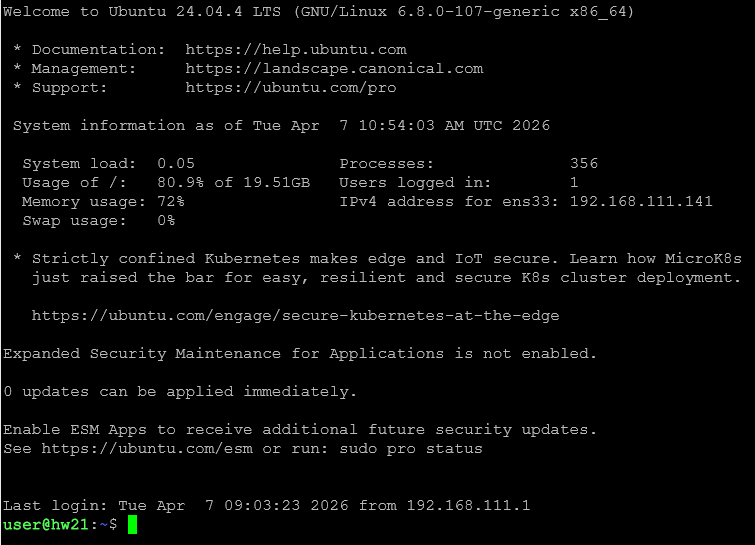

2. Установил и настроил Gitlab и Gitlab runner

**Gitlab docker-compose.yml файл**  
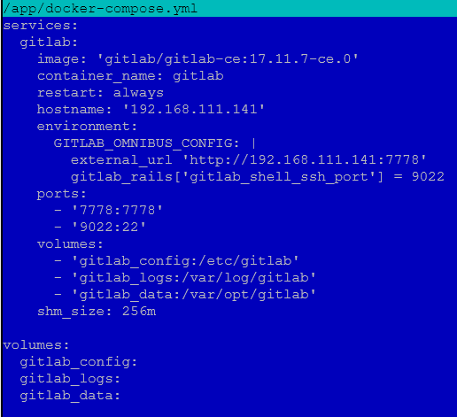

**Gitlab runner**  
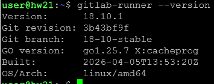

3. Создал необходимые директории и файлы

**Структура папок по пути /app/deploy**  
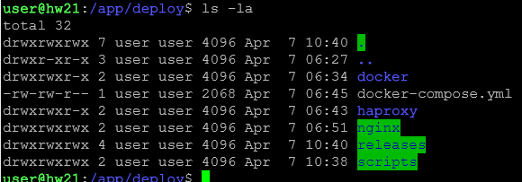

4. В Gitlab создал два репозитория, с конфигами и приложением  

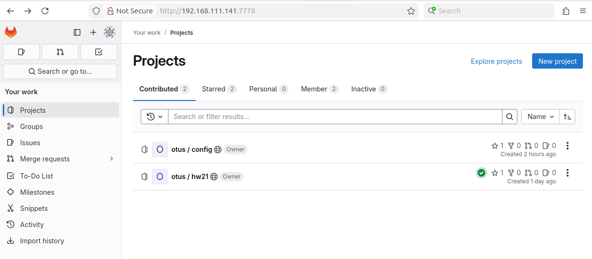

**Репозиторий config**  
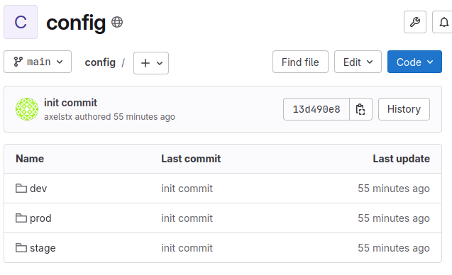  

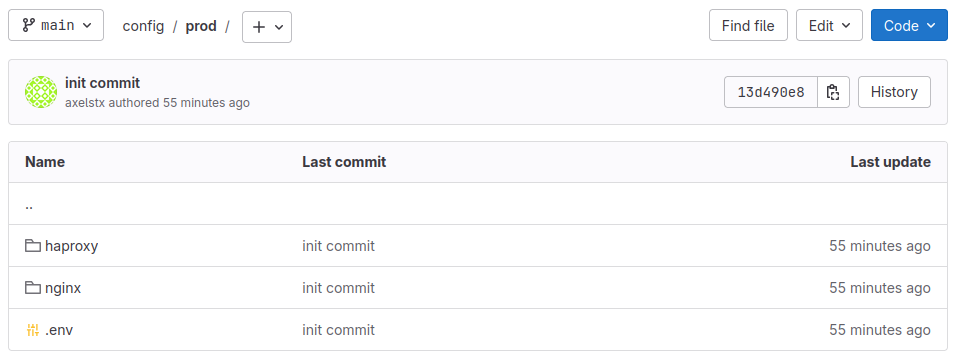

**Репозиторий hw21 (приложение)**
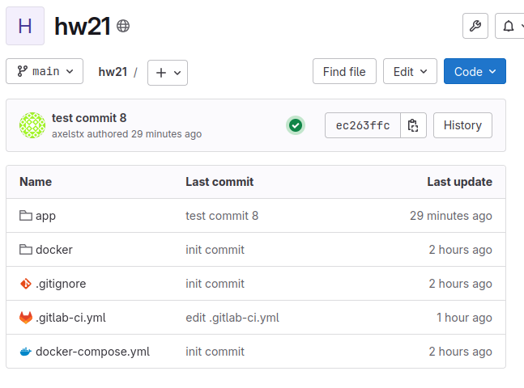  

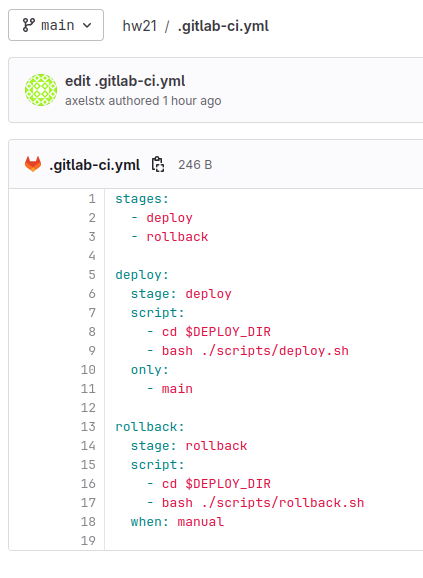

5. Настройки CI/CD

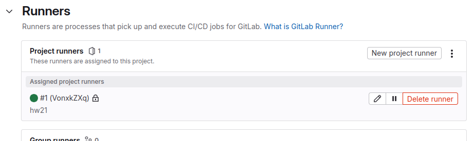  

**Необходимые переменные для работы скриптов**  
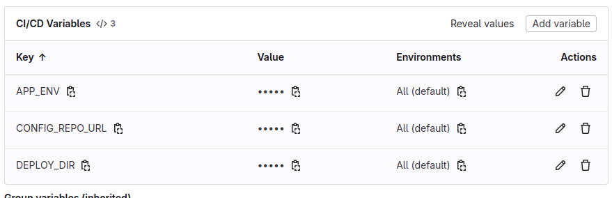

> В зависимости от переменной **APP_ENV** (dev/prod/stage) применятся разные конфиги из репозитория **config**

6. Pipelines

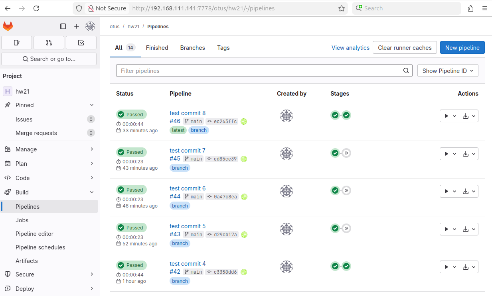

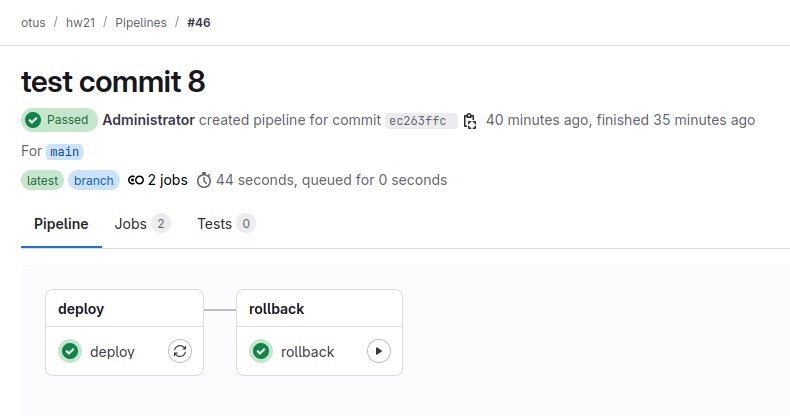

**Приложение успешно проходит deploy и rollback**

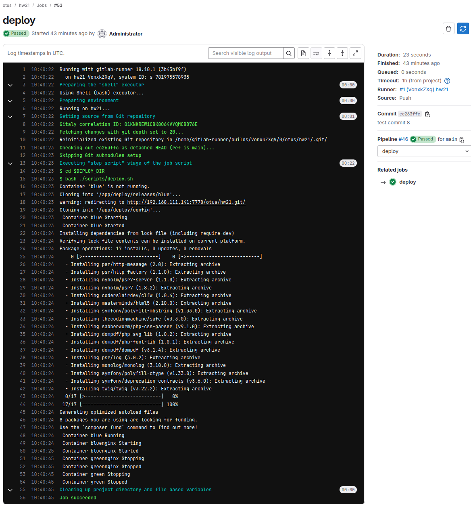

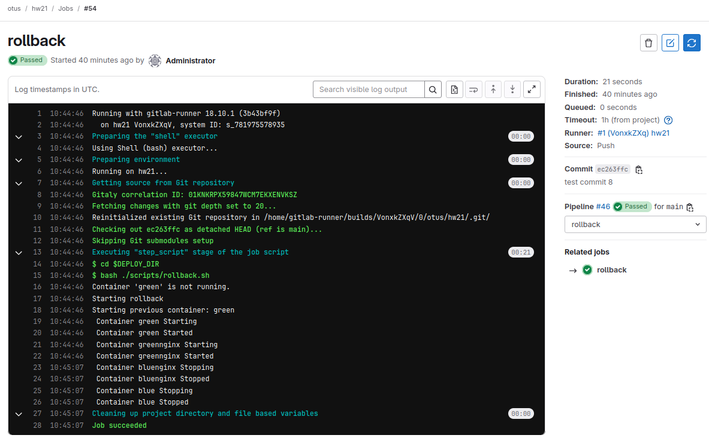

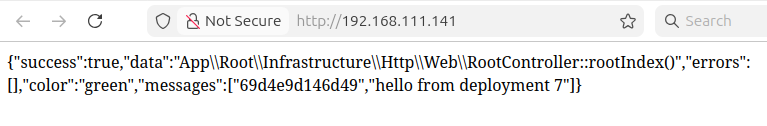
