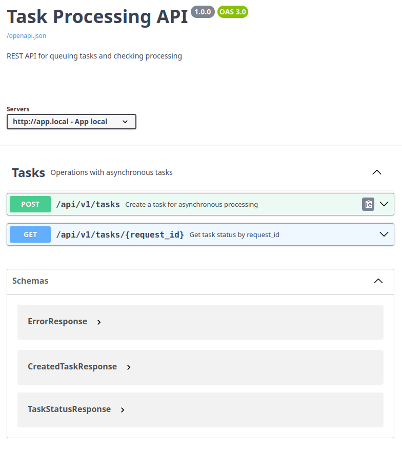

# HW20

Rest API

1. Необходимо реализовать Rest API с использованием очередей.  
2. Ваши клиенты будут отправлять запросы на обработку, а вы будете складывать их в очередь и возвращать номер запроса.  
3. В фоновом режиме вы будете обрабатывать запросы, а ваши клиенты периодически, используя номер запроса, будут проверять статус его обработки.  

---

Документация по API - http://app.local/docs/  
RabbitMQ - http://localhost:15672/  

[Методы API находятся тут](src/Http/Api/v1/Task)

Инструкция по запуску:

1. Выполнить
> docker-compose build

>docker-compose up -d

2. Создать файл .env по типу .env.local
3. Зайти в контейнер php-fpm
> docker exec -it название_контейнера bash

4. Выполнить внутри контейнера php-fpm
> composer install

5. Также запустить обработчик
> php bin/task-worker.php

6. Ознакомиться с документацией по методам API
> Документация по API - http://app.local/docs/ 

