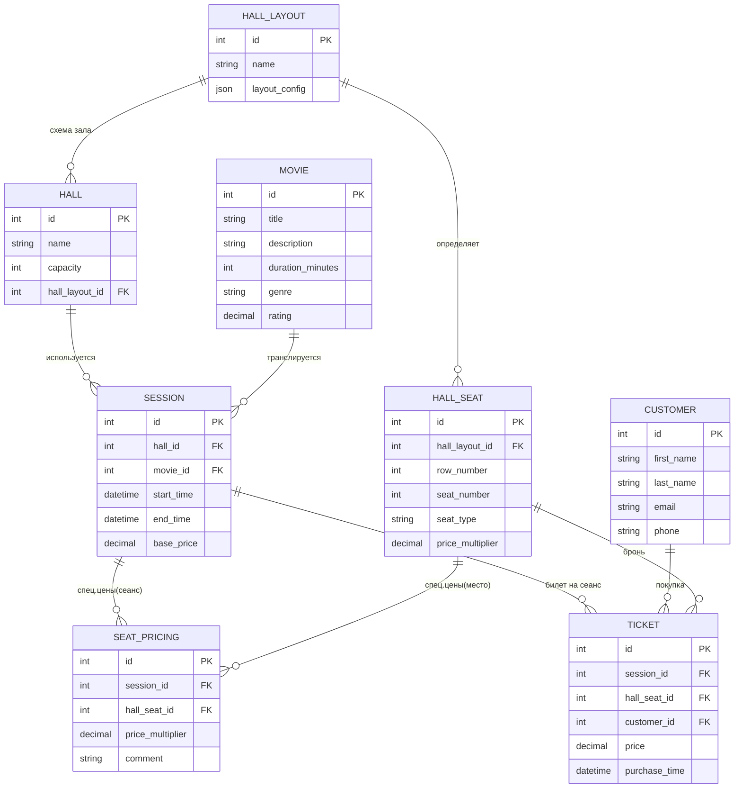

# Индексирование данных (нагрузочное тестирование и оптимизация) (HW#9)

## Тесты производительности и оптимизации
Уже на этапе генерации возникла проблема слишком долгого создания тестовых таблиц, используя pgTune сделал свой вариант конфига.

Даже с учетом оптимизации настроек генерация большого набора данных заняла бы около месяца, потому сделал новые варианты функций generate_pricings_optimized и generate_tickets_optimized. В итоге стало генерироваться за 5-10 минут.

## Факт генерации (MIN)
| Таблица | Размер | Строк |
|---------|--------|-------|
| customer | 328 KB | 1000 |
| hall | 40 KB | 4 |
| hall_layout | 32 KB | 4 |
| hall_seat | 144 KB | 1198 |
| movie | 32 KB | 10 |
| seat_pricing | 224 KB | 1000 |
| session | 104 KB | 30 |
| ticket | 1.21 MB | 7171 |

## Факт генерации (MAX)
| Таблица | Размер (до/после оптимизации) | Строк |
|---------|--------|-------|
| customer | 277.47 MB | 1000000 |
| hall | 40 KB | 40 |
| hall_layout | 32 KB | 40 |
| hall_seat | 1.07/1.42 MB | 11107 |
| movie | 2.02 MB | 10000 |
| seat_pricing | 170.7 MB | 1000000 |
| session | 5.79/7.98 MB | 30257 |
| ticket | 1.28/3.07 GB | 8406555 |

## Результаты по каждому из 6 запросов

Для чистоты эксперимента после оптимизаций CURRENT_DATE менял на случайную дату, то же самое с ID сессии.

| Запрос | План на БД до 10000 строк | План на БД до 10000000 строк | План на БД до 10000000 строк, что удалось улучшить | Перечень оптимизаций с пояснениями |
|--------|---------------------------|------------------------------|---------------------------------------------------|----------------------------------|
| 1. Выбор всех фильмов на сегодня | min-1.txt (0.263/0.120мс) | max-1.txt (1.134/3.686мс) | max-1o.txt (0.281/0.137мс) | Индекс: `CREATE INDEX idx_session_date ON SESSION((start_time::DATE));` |
| 2. Подсчёт проданных билетов за неделю | min-2.txt (0.234/1.681мс) | max-2.txt (1.034/2.834мс) | max-2o.txt (1.149/2.807мс) | Расчитываемое поле: `ALTER TABLE TICKET ADD COLUMN session_start_time TIMESTAMP;`, Расчет с нужной периодичностью: `UPDATE TICKET t SET session_start_time = s.start_time FROM SESSION s WHERE t.session_id = s.id;`, Индекс: `CREATE INDEX idx_ticket_session_time ON TICKET(session_id, session_start_time);`; Положительный эффект не увидел. |
| 3. Формирование афиши (фильмы, которые показывают сегодня) | min-3.txt (0.413/0.138мс) | max-3.txt (0.483/3.131мс) | max-3o.txt (0.623/0.150мс) | Создание такого же индекса как в п1. или лучше: `CREATE INDEX idx_session_date2 ON SESSION((start_time::DATE), movie_id, hall_id);` |
| 4. Поиск 3 самых прибыльных фильмов за неделю | min-4.txt (0.596/4.986мс) | max-4.txt (0.638/66.471мс) | max-4o.txt (0.707/5.904мс) | Покрывающий индекс: `CREATE INDEX idx_ticket_sp_cover ON TICKET(session_id) INCLUDE (price);` и композитный: `CREATE INDEX idx_session_time_movie ON SESSION(start_time, id, movie_id);` |
| 5. Сформировать схему зала и показать на ней свободные и занятые места на конкретный сеанс | min-5.txt (0.425/0.472мс) | max-5.txt (1.124/0.449мс) | max-5o.txt (1.063/0.342мс) | Уже был создан для ускорения генерации: `CREATE INDEX idx_ticket_session_seat ON TICKET(session_id, hall_seat_id);` + для ускорения сортировки: `CREATE INDEX idx_hall_seat_layout_row_seat ON HALL_SEAT(hall_layout_id, row_number, seat_number);` |
| 6. Вывести диапазон минимальной и максимальной цены за билет на конкретный сеанс | min-6.txt (0.226/0.387мс) | max-6.txt (0.331/1.786мс) | max-6o.txt (0.511/0.122мс) | Можно создать: `CREATE INDEX idx_ticket_session_price ON TICKET(session_id, price);`, но уже есть подобный (покрывающий) в п.4 (либо оставить из 2 только этот) |

## Таблица с размерами объектов БД (15 самых больших)

| Сущность | Тип | Размер, Мб | size_b |
|----------|-----|------------|--------|
| ticket | TABLE | 1031 MB | 1080590336 |
| idx_ticket_session_seat | INDEX | 431 MB | 452050944 |
| ticket_session_id_hall_seat_id_key | INDEX | 431 MB | 452050944 |
| ticket_pkey | INDEX | 360 MB | 377659392 |
| idx_ticket_session_price | INDEX | 253 MB | 265560064 |
| idx_ticket_sp_cover | INDEX | 253 MB | 265183232 |
| idx_ticket_hall_seat_id | INDEX | 174 MB | 182804480 |
| idx_ticket_session_id | INDEX | 147 MB | 154361856 |
| seat_pricing | TABLE | 120 MB | 126091264 |
| customer | TABLE | 93 MB | 97419264 |
| idx_customer_email | INDEX | 67 MB | 69763072 |
| customer_email_key | INDEX | 67 MB | 69763072 |
| idx_ticket_session_time | INDEX | 58 MB | 61177856 |
| customer_phone_key | INDEX | 30 MB | 31563776 |
| seat_pricing_session_id_hall_seat_id_key | INDEX | 29 MB | 30466048 |

## Таблица самых часто используемых индексов

| Индекс | Таблица | Сканирований |
|--------|---------|--------------|
| session_pkey | session | 9406575 |
| hall_seat_pkey | hall_seat | 9406559 |
| seat_pricing_session_id_hall_seat_id_key | seat_pricing | 9406555 |
| customer_pkey | customer | 8406555 |
| ticket_session_id_hall_seat_id_key | ticket | 8406555 |

## Таблица самых редко используемых индексов

| Индекс | Таблица | Сканирований |
|--------|---------|--------------|
| idx_session_hall_id | session | 0 |
| idx_hall_layout_id | hall | 0 |
| idx_hall_seat_layout_row_seat | hall_seat | 0 |
| idx_session_end_time | session | 0 |
| seat_pricing_pkey | seat_pricing | 0 |

## ERD-диаграмма

```mermaid
erDiagram
    %% "Схема управления кинотеатром"

    HALL {
        int id PK
        string name
        int capacity
        int hall_layout_id FK
    }

    HALL_LAYOUT {
        int id PK
        string name
        json layout_config
    }

    HALL_SEAT {
        int id PK
        int hall_layout_id FK
        int row_number
        int seat_number
        string seat_type
        decimal price_multiplier
    }

    MOVIE {
        int id PK
        string title
        string description
        int duration_minutes
        string genre
        decimal rating
    }

    SESSION {
        int id PK
        int hall_id FK
        int movie_id FK
        datetime start_time
        datetime end_time
        decimal base_price
    }

    CUSTOMER {
        int id PK
        string first_name
        string last_name
        string email
        string phone
    }

    SEAT_PRICING {
        int id PK
        int session_id FK
        int hall_seat_id FK
        decimal price_multiplier
        string comment
    }

    TICKET {
        int id PK
        int session_id FK
        int hall_seat_id FK
        int customer_id FK
        decimal price
        datetime purchase_time
    }

    HALL ||--o{ SESSION : "используется"
    MOVIE ||--o{ SESSION : "транслируется"
    HALL_LAYOUT ||--o{ HALL_SEAT : "определяет"
    HALL_LAYOUT ||--o{ HALL : "схема зала"
    SESSION ||--o{ TICKET : "билет на сеанс"
    CUSTOMER ||--o{ TICKET : "покупка"
    SESSION ||--o{ SEAT_PRICING : "спец.цены(сеанс)"
    HALL_SEAT ||--o{ SEAT_PRICING : "спец.цены(место)"
    HALL_SEAT ||--o{ TICKET : "бронь"
```

## Сущности:

- **HALL** - кинозалы с информацией о вместимости и схеме расположения мест
- **HALL_LAYOUT** - схемы залов с конфигурацией мест
- **HALL_SEAT** - отдельные места в залах с различными типами и коэффициентами цены
- **MOVIE** - фильмы, которые транслируются в кинотеатре
- **SESSION** - сеансы фильмов в конкретных залах с базовыми ценами
- **CUSTOMER** - клиенты, покупающие билеты
- **SEAT_PRICING** - специальные цены для конкретных мест на конкретные сеансы
- **TICKET** - проданные билеты на сеансы
