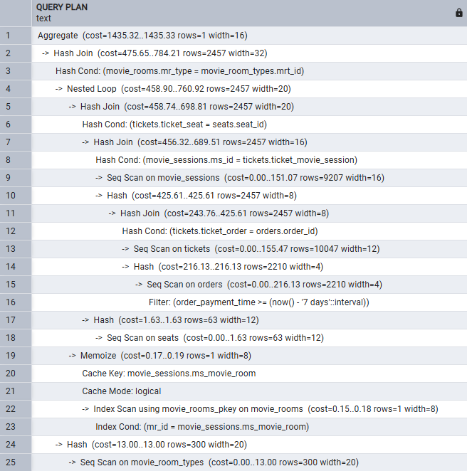
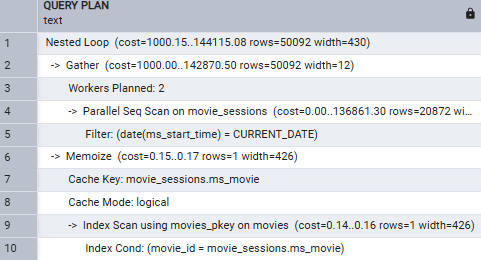

## Описание предметной области

Кинотеатр 'Бронепоезд' имеет 3 кинозала, в каждом зале идет несколько сеансов в течение дня. Один кинозал является премиум кинозалом и имеет повышенный тариф.

Все три кинозала имеют одинаковое количество мест и одинаковую рассадку (представлена на рисунке `movie_room_seats_plan.jpeg`).

#### Как рассчитывается цена билета

Цена билета в этом кинотеатре зависит от:
- Времени и даты сеанса. Билеты 
	1. с 10:00 до 11:00 билеты дешевле на 40%,
	2. с 18:00 до 23:00 ,билеты дороже на 15% 
- Места в кинозале
	1. 'Синие' места дешевле на 10% в стандартном кинозале.
- Кинозала
	1. В премиум зале сеансы дороже на 100.

Допустим, цена не зависит от фильма и возраста покупателя билета.

#### Сущности

База данных разработана для сайта кинотеатра, на котором возможна покупка билетов.

##### Фильм

Обычно на сайте информация о фильме включает в себя:
- название
- описание
- актерский состав
- режиссер
- возрастной рейтинг
- длительность
- кадры

Допустим, часть из этой информации (в т.ч. актерский состав, режиссер, описание) получается из стороннего сервиса и хранится в виде HTML или JSON (это только для того, чтобы не плодить сущности, которые к основному заданию не относятся).

##### Сеанс

Сеанс - это показ определенного фильма в определенном кинозале и в свое время (в т.ч. дата), набор этих 3-х атрибутов уникален, т.е. потенциальным ключом.

Но все же для удобства используем отдельный ключ с autoincrement значением. 

## Оптимизация

### 1. Выбор всех фильмов на сегодня

``` sql
SELECT movie_title
FROM movies
    JOIN movie_sessions ON movie_sessions.ms_movie = movies.movie_id
WHERE
    ms_start_time >= CURRENT_DATE
    AND ms_start_time < CURRENT_DATE + INTERVAL '1 day'
GROUP BY
    movie_title;
```


| Количество записей             | Расчётное время выполнения | Фактическое время выполнения |
| ------------------------------ | -------------------------- | ---------------------------- |
| 10 000                         | 0.161                      | 1.731                        |
| 10 000 000                     | 0.171                      | 543.769                      |
| 10 000 000 (после оптимизации) | 0.258                      | 8.710                        |


***План выполнения при 10 000 записях:***


***План выполнения при 10 000 000 записях:***


### 2. Подсчёт проданных билетов за неделю

``` sql
SELECT COUNT(*) AS "Tickets count", SUM(
        ms_time_coefficient * seat_coefficient * mrt_price
    ) AS "Week profit"
FROM
    seats
    JOIN tickets_partitioned ON ticket_seat = seat_id
    JOIN orders ON order_id = ticket_order
    JOIN movie_sessions ON ms_id = ticket_movie_session
    JOIN movie_rooms ON mr_id = ms_movie_room
    JOIN movie_room_types ON mrt_id = mr_type
WHERE
    order_payment_time >= NOW() - INTERVAL '7 days'
    AND order_payment_time < CURRENT_DATE
    AND order_id IS NOT NULL;
```


| Количество записей             | Расчётное время выполнения | Фактическое время выполнения |
| ------------------------------ | -------------------------- | ---------------------------- |
| 10 000                         | 0.533                      | 9.615                        |
| 10 000 000                     | 1.272                      | 6177.114                     |
| 10 000 000 (после оптимизации) | 0.862                      | 1554.274                     |


***План выполнения при 10 000 записях:***



***План выполнения при 10 000 000 записях:***


### 3. Формирование афиши (фильмы, которые показывают сегодня)

``` sql
SELECT
    movie_title,
    movie_duration,
    ms_start_time
FROM movies
    JOIN movie_sessions ON movie_sessions.ms_movie = movies.movie_id
WHERE
    ms_start_time >= NOW()
    AND ms_start_time < CURRENT_DATE + INTERVAL '1 day';
```


| Количество записей             | Расчётное время выполнения | Фактическое время выполнения |
| ------------------------------ | -------------------------- | ---------------------------- |
| 10 000                         | 0.166                      | 1.306                        |
| 10 000 000                     | 0.179                      | 452.219                      |
| 10 000 000 (после оптимизации) | 0.261                      | 7.403                        |


***План выполнения при 10 000 записях:***


***План выполнения при 10 000 000 записях:***




### 4. Поиск 3 самых прибыльных фильмов за неделю

``` sql
SELECT movie_title, SUM(
        ms_time_coefficient * seat_coefficient * mrt_price
    ) AS "Week profit"
FROM
    tickets_partitioned
    LEFT JOIN seats ON seat_id = ticket_seat
    LEFT JOIN movie_sessions ON ms_id = ticket_movie_session
    LEFT JOIN movie_rooms ON movie_rooms.mr_id = ms_movie_room
    LEFT JOIN movie_room_types ON movie_room_types.mrt_id = movie_rooms.mr_type
    LEFT JOIN movies ON movie_id = ms_movie
    LEFT JOIN (
        SELECT order_id
        FROM orders
        WHERE
            order_payment_time >= CURRENT_DATE - INTERVAL '7 days'
            AND order_payment_time < CURRENT_DATE
    ) t ON t.order_id = ticket_order
WHERE
    order_id IS NOT NULL
GROUP BY
    movie_title
ORDER BY "Week profit" DESC
LIMIT 3;
```

| Количество записей             | Расчётное время выполнения | Фактическое время выполнения |
| ------------------------------ | -------------------------- | ---------------------------- |
| 10 000                         | 2.308                      | 10.647                       |
| 10 000 000                     | 2.142                      | 5847.863                     |
| 10 000 000 (после оптимизации) | 2.206                      | 1354.354                     |


***План выполнения при 10 000 записях:***


***План выполнения при 10 000 000 записях:***


### 5. Сформировать схему зала и показать на ней свободные и занятые места на конкретный сеанс

``` sql
SELECT s.seat_id, s.seat_row, s.seat_cell, COALESCE(t.seat_status, 'свободно') AS "Статус"
FROM seats s
    LEFT JOIN (
        SELECT ticket_seat, 'занято' AS seat_status
        FROM tickets
            JOIN movie_sessions ON movie_sessions.ms_id = tickets.ticket_movie_session
        WHERE
            ms_id = 10018272
    ) t ON s.seat_id = t.ticket_seat;
```


| Количество записей             | Расчётное время выполнения | Фактическое время выполнения |
| ------------------------------ | -------------------------- | ---------------------------- |
| 10 000                         | 0.250                      | 0.091                        |
| 10 000 000                     | 0.226                      | 0.144                        |
| 10 000 000 (после оптимизации) | 1.365                      | 0.200                        |


***План выполнения при 10 000 записях:***


***План выполнения при 10 000 000 записях:***


### 6. Вывести диапазон минимальной и максимальной цены за билет на конкретный сеанс

``` sql
SELECT MIN(
        calculate_time_coefficient (ms_start_time) * seat_coefficient * mrt_price
    ) AS "Min ticket price", MAX(
        calculate_time_coefficient (ms_start_time) * seat_coefficient * mrt_price
    ) AS "Max ticket price"
FROM
    seats
    JOIN tickets ON tickets.ticket_seat = seats.seat_id
    JOIN orders ON orders.order_id = tickets.ticket_order
    JOIN movie_sessions ON movie_sessions.ms_id = tickets.ticket_movie_session
    JOIN movie_rooms ON movie_rooms.mr_id = movie_sessions.ms_movie_room
    JOIN movie_room_types ON movie_room_types.mrt_id = movie_rooms.mr_type
WHERE
    ms_id = 10018272; 
```


| Количество записей             | Расчётное время выполнения | Фактическое время выполнения |
| ------------------------------ | -------------------------- | ---------------------------- |
| 10 000                         | 0.458                      | 0.202                        |
| 10 000 000                     | 0.512                      | 0.190                        |
| 10 000 000 (после оптимизации) | 0.754                      | 0.163                        |


***План выполнения при 10 000 записях:***


***План выполнения при 10 000 000 записях:***


### Перечень оптимизаций

1. Добавление индексов для столбцов задействованных в связях таблиц и столбцов, используемых в `WHERE`.

``` sql
CREATE INDEX idx_ticket_seat ON tickets (ticket_seat);

CREATE INDEX idx_ticket_order ON tickets (ticket_order);

CREATE INDEX idx_ticket_movie_session ON tickets (ticket_movie_session);

CREATE INDEX idx_ms_movie ON movie_sessions (ms_movie);

CREATE INDEX idx_mr_type ON movie_rooms (mr_type);

CREATE INDEX idx_brin_ms_start_time ON movie_sessions USING BRIN (ms_start_time);

CREATE INDEX idx_brin_order_payment_time ON orders USING BRIN (order_payment_time);
```

2. Изменения условных конструкций `WHERE` для задействования индексов.

Было:

``` sql
WHERE DATE(movie_sessions.ms_start_time) = CURRENT_DATE
```

Стало:

``` sql
WHERE
    ms_start_time >= CURRENT_DATE
    AND ms_start_time < CURRENT_DATE + INTERVAL '1 day'
```

3. Удаление из функции преобразования `TIMESTAMP` в `TIME`

Было:

``` sql
time := CAST(start_time AS TIME);
```

Стало:

``` sql
EXTRACT(HOUR FROM start_time)
```

Данные улучшения существенно повысили производительность 4-х запросов. 


4. Добавление столбца для хранения временного коэффициента в таблицу `movie_sessions`

``` sql
ALTER TABLE movie_sessions
ADD COLUMN ms_time_coefficient NUMERIC(5, 2);
```

4.1 Заполнение столбца значениями

``` sql
UPDATE movie_sessions
SET
    ms_time_coefficient = 0.6
WHERE
    EXTRACT(
        HOUR
        FROM ms_start_time
    ) < 11;

UPDATE movie_sessions
SET
    ms_time_coefficient = 1.15
WHERE
    EXTRACT(
        HOUR
        FROM ms_start_time
    ) >= 18;
```
Замена функции вычисления временного коэффициента на столбец не помогло улучшить время выполнения оставшихся 2-х запросов:
- Поиск 3 самых прибыльных фильмов за неделю
- Диапазон минимальной и максимальной цены за билет на конкретный сеанс

Поскольку коэффициенты являются редко изменяемыми данными (их в системе нужно менять значительно реже чем выполнять выборку и вставку в таблицы),
то их можно хранить в таблице `movie_sessions`. Но тогда вычислять коэффициент придется при вставке, что не очень хорошо (Но можно вычислять его не в базе данных, а в самом приложении). 

Хранение в `movie_sessions` также сделает коэффициент более гибким и удобным для изменения.

5. Уменьшение количества JOIN

``` sql
SELECT COUNT(*) FROM tickets 
	LEFT JOIN movie_sessions ON ms_id = ticket_movie_session
 LEFT JOIN (
        SELECT order_id FROM orders
		WHERE
           order_payment_time >= CURRENT_DATE - INTERVAL '6 days' 
		   AND order_payment_time < CURRENT_DATE + INTERVAL '1 days'
    ) t ON t.order_id = ticket_order
```

Уменьшаем кол-во JOIN, выводя данные только о количестве проданных билетов

6. Секционирование. Разбиение таблицы `tickets` в несколько раз улучшило производительность.

``` sql
CREATE TABLE tickets_partitioned (
    ticket_id SERIAL PRIMARY KEY,
    ticket_movie_session INT NOT NULL,
    ticket_seat INT NOT NULL ,
    ticket_order INT NOT NULL,
    FOREIGN KEY (ticket_movie_session) REFERENCES movie_sessions (ms_id) ON UPDATE CASCADE ON DELETE CASCADE,
    FOREIGN KEY (ticket_seat) REFERENCES seats (seat_id) ON UPDATE CASCADE ON DELETE CASCADE,
    FOREIGN KEY (ticket_order) REFERENCES orders (order_id) ON UPDATE CASCADE ON DELETE CASCADE,
    UNIQUE (
	ticket_id,
        ticket_movie_session,
        ticket_seat,
		ticket_order
    )
)  PARTITION BY RANGE (ticket_id);

CREATE INDEX idx_ticket_p_seat ON tickets_partitioned (ticket_seat);

CREATE INDEX idx_ticket_p_order ON tickets_partitioned (ticket_order);

CREATE INDEX idx_ticket_p_movie_session ON tickets_partitioned (ticket_movie_session);

CREATE TABLE tickets_1 PARTITION OF tickets_partitioned
    FOR VALUES FROM (1) TO (200000);

CREATE TABLE tickets_2 PARTITION OF tickets_partitioned
    FOR VALUES FROM (200000) TO (400000);

CREATE TABLE tickets_3 PARTITION OF tickets_partitioned
    FOR VALUES FROM (400000) TO (600000);


INSERT INTO tickets_partitioned (
	ticket_id,
	ticket_movie_session,
	ticket_seat,
	ticket_order
	)
SELECT ticket_id,
	ticket_movie_session,
	ticket_seat,
	ticket_order
FROM tickets;
```
