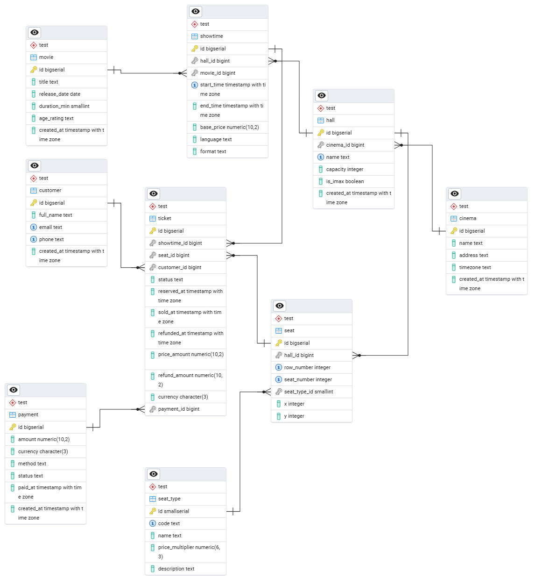

# Система управления кинотеатром — логическая модель и SQL

Файлы в директории:
- schema.sql — DDL скрипты создания таблиц;
- data_generator.sql — скрипт генерации тестовых данных (≥2 кинотеатра, 3–7 залов в каждом, 10–35 мест, 5 фильмов, ≥300 проданных билетов);
- most_profitable_movie.sql — запрос для расчёта самого прибыльного фильма.

## Ключевые бизнес‑сущности и правила
- Кинотеатр состоит из одного или нескольких филиалов (кинокомплекс «Cinema»), каждый филиал имеет несколько залов.
- В каждом зале проходит множество сеансов (показы конкретного фильма в конкретное время).
- Зал имеет фиксированную схему посадочных мест (ряды/места), каждое место может иметь тип (обычное, VIP и т. п.).
- Цена билета зависит:
  - от базовой цены на сеанс (динамическая цена для конкретного показа);
  - от типа места (множитель цены).
- При покупке фиксируется «фактическая цена продажи» билета; она не меняется при изменении ценовых правил в будущем.
- Допускаются возвраты билетов (полные/частичные) — для корректного расчёта выручки и «прибыльности» фильма.

Цена на сеанс задаётся отдельно (base_price у showtime). Каждое место имеет тип, задающий множитель цены (seat_type.price_multiplier). Итоговая цена билета рассчитывается при покупке как base_price × multiplier и сохраняется в билете (ticket.price_amount). Цена не меняется при обновлении справочников, что позволяет корректно строить отчёты за прошлые периоды.

У зала фиксированный набор мест. Каждое место описывается атрибутами: row_number, seat_number, seat_type и (опционально) координатами x/y для визуального рендера схемы. Уникальность места — в пределах зала по (hall_id, row_number, seat_number).

## ER-диаграмма

