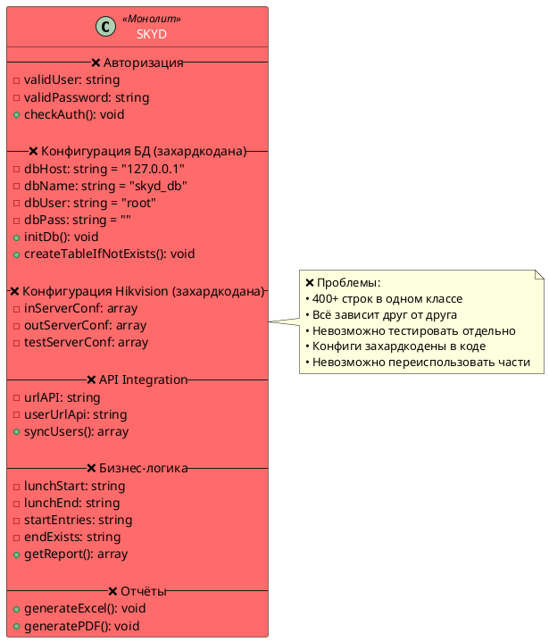
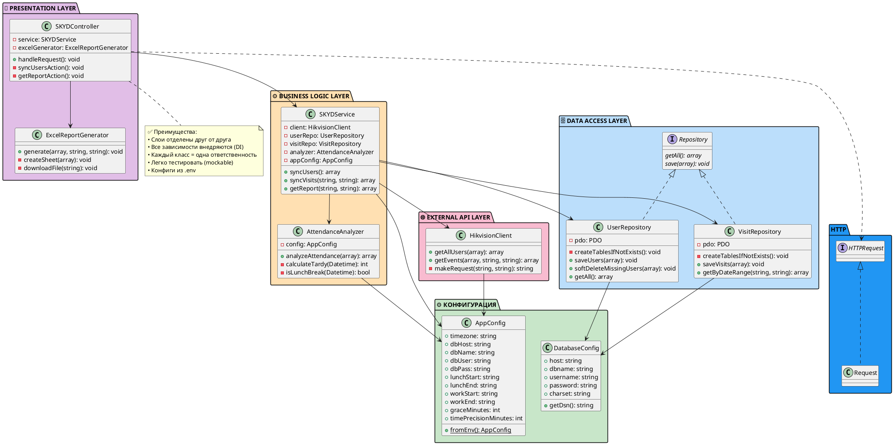

# 📊 Отчёт о рефакторинге SKYD.php

**Дата**: 24 марта 2026  
**Цель**: Преобразование монолитного приложения в архитектуру с разделением ответственности (SOLID-принципы)

---

## 📋 Содержание
1. [Утверждение 1: Избавление от монолитного класса](#1-избавление-от-монолитного-класса)
2. [Утверждение 2: Внедрение Dependency Injection](#2-внедрение-dependency-injection)
3. [Утверждение 3: Конфигурация из переменных окружения](#3-конфигурация-из-переменных-окружения)
4. [Утверждение 4: Разделение слоёв приложения](#4-разделение-слоёв-приложения)
5. [UML диаграммы](#uml-диаграммы)

---

## 1. Избавление от монолитного класса

### Проблема (ДО)

**Файл**: `SKYD.php` (1 класс ~400+ строк)

```php
class SKYD
{
    // ВСЯ ЛОГИКА В ОДНОМ КЛАССЕ
    
    private $urlAPI = "/ISAPI/AccessControl/AcsEvent?format=json";
    private $userUrlApi = "/ISAPI/AccessControl/UserInfo/Search?format=json";
    private $validUser;
    private $validPassword;
    private $inServerConf = ["host"=>"192.168.11.207", ...];
    private $outServerConf = ["host"=>"192.168.11.205", ...];
    
    private $dbHost = '127.0.0.1';
    private $dbName = 'skyd_db';
    private $dbUser = 'root';
    
    // ВСЕ МЕТОДЫ В ОДНОМ МЕСТЕ:
    public function __construct($user, $password) { ... }
    private function checkAuth() { ... }
    private function initDb() { ... }
    private function createTableIfNotExists() { ... }
    // + ещё 20+ методов для всего подряд
}

$skyd = new SKYD("test", "12345678");
```

**Проблемы**:
- ❌ Класс SKYD отвечает за ВСЁ: авторизация, БД, API Hikvision, бизнес-логику, отчёты
- ❌ Сложно тестировать (монолит с жёсткими зависимостями)
- ❌ Невозможно переиспользовать части кода
- ❌ Изменение в одной части может сломать другие части

---

### Решение (ПОСЛЕ)

**Файлы**: 7 сепаратных модулей

```
app/
├── index.php                      ← точка входа
├── Controller/
│   └── SKYDController.php         ← HTTP запросы
├── Service/
│   ├── SKYDService.php            ← бизнес-логика
│   └── AttendanceAnalyzer.php     ← анализ посещаемости
├── Repository/
│   ├── UserRepository.php         ← работа с пользователями
│   └── VisitRepository.php        ← работа с посещениями
├── Hikvision/
│   └── HikvisionClient.php        ← работа с API Hikvision
├── Report/
│   └── ExcelReportGenerator.php   ← генерация отчётов
└── Config/
    ├── AppConfig.php              ← конфигурация приложения
    ├── DatabaseConfig.php         ← конфигурация БД
    └── devices.php                ← конфигурация устройств
```

**Каждый класс отвечает за свою область**:

```php
// app/index.php - инициализация
$dbConfig = new DatabaseConfig();
$appConfig = new AppConfig();
$client = new HikvisionClient();
$userRepo = new UserRepository($dbConfig);
$visitRepo = new VisitRepository($dbConfig);
$analyzer = new AttendanceAnalyzer($appConfig);
$service = new SKYDService($client, $userRepo, $visitRepo, $analyzer, $appConfig);
$excelGenerator = new ExcelReportGenerator();
$controller = new SKYDController($service, $excelGenerator);
$controller->handleRequest();
```

```php
// app/Controller/SKYDController.php - обработка HTTP
final class SKYDController
{
    public function __construct(
        private readonly SKYDService $service,
        private readonly ExcelReportGenerator $excelGenerator
    ) {}

    public function handleRequest(): void
    {
        if (isset($_GET['sync_users'])) {
            $this->service->syncUsers();
            return;
        }
        
        if (isset($_GET['report'])) {
            $analysis = $this->service->getReport($start, $end);
            // ...
        }
    }
}
```

**Выигрыш**:
-  Каждый класс = одна ответственность
-  Легко тестировать (mockable зависимости)
-  Легко расширять (добавить новый Report генератор - просто новый класс)
-  Изменения изолированы

---

## 2. Внедрение Dependency Injection

### Проблема (ДО)

```php
class SKYD
{
    private $dbHost = '127.0.0.1';
    private $dbName = 'skyd_db';
    private $dbUser = 'root';
    private $dbPass = '';

    public function __construct($user, $password)
    {
        date_default_timezone_set('Asia/Aqtau');
        $this->validUser = $user;
        $this->validPassword = $password;

        $this->initDb();  // ❌ Класс САМ создаёт зависимость (БД)
        $this->createTableIfNotExists();
    }

    private function initDb()
    {
        $dsn = "mysql:host={$this->dbHost};charset=utf8mb4";
        $pdo = new PDO($dsn, $this->dbUser, $this->dbPass, [
            PDO::ATTR_ERRMODE => PDO::ERRMODE_EXCEPTION,
        ]);
        $this->pdo = $pdo;  // ❌ Жёсткая связанность
    }
}
```

**Проблемы**:
-  Тестирование: нельзя подменить БД на mock
-  Конфигурация: захардкодена в коде
-  Переиспользование: нельзя использовать один класс с разными БД

---

### Решение (ПОСЛЕ)

```php
// app/Config/DatabaseConfig.php - конфигурация
final class DatabaseConfig
{
    public function __construct(
        public readonly string $host = '127.0.0.1',
        public readonly string $dbname = 'skyd_db',
        public readonly string $username = 'root',
        public readonly string $password = '',
        public readonly string $charset = 'utf8mb4'
    ) {}

    public function getDsn(): string
    {
        return "mysql:host={$this->host};dbname={$this->dbname};charset={$this->charset}";
    }
}
```

```php
// app/Repository/UserRepository.php - использование конфига
final class UserRepository
{
    private PDO $pdo;

    //  Зависимость ВНЕДРЯЕТСЯ (не создаётся внутри)
    public function __construct(DatabaseConfig $config)
    {
        try {
            $this->pdo = new PDO(
                $config->getDsn(),
                $config->username,
                $config->password,
                [
                    PDO::ATTR_ERRMODE => PDO::ERRMODE_EXCEPTION,
                    PDO::ATTR_DEFAULT_FETCH_MODE => PDO::FETCH_ASSOC,
                ]
            );
            $this->createTablesIfNotExists();
        } catch (PDOException $e) {
            throw new \RuntimeException("Database connection failed: " . $e->getMessage());
        }
    }

    private function createTablesIfNotExists(): void
    {
        $this->pdo->exec("CREATE TABLE IF NOT EXISTS `users_skyd` ...");
    }
}
```

```php
// app/Service/SKYDService.php - использование внедрённых зависимостей
final class SKYDService
{
    public function __construct(
        private readonly HikvisionClient $client,  // ✅ DI
        private readonly UserRepository $userRepo, // ✅ DI
        private readonly VisitRepository $visitRepo,
        private readonly AttendanceAnalyzer $analyzer,
        private readonly AppConfig $appConfig  // ✅ DI
    ) {}

    public function syncUsers(): array
    {
        $devices = require __DIR__ . '/../Config/devices.php';
        $usersIn  = $this->client->getAllUsers($devices['in']);
        $usersOut = $this->client->getAllUsers($devices['out']);
        
        $allUsers = array_merge($usersIn, $usersOut);
        $this->userRepo->saveUsers($allUsers);  // ✅ Используем внедрённый репозиторий
        
        return $allUsers;
    }
}
```

**Выигрыш**:
- ✅ Максимальная гибкость - можно подменить любую зависимость
- ✅ Тестирование: легко создать mock HikvisionClient для тестов
- ✅ Конфигурация отделена от логики

---

## 3. Конфигурация из переменных окружения

### Проблема (ДО)

```php
class SKYD
{
    private $inServerConf = ["host"=>"192.168.11.207", "login"=>"admin", "password"=>"12345678!"];
    private $outServerConf = ["host"=>"192.168.11.205", "login"=>"admin", "password"=>"12345678!"];
    private $testServerConf = ["host"=>"192.168.11.206", "login"=>"admin", "password"=>"12345678!"];
    
    private $dbHost = '127.0.0.1';
    private $dbName = 'skyd_db';
    private $dbUser = 'root';
    private $dbPass = '';
    
    private $lunchStart = '12:00:00';
    private $lunchEnd = '13:00:00';
}

// ❌ Пароли в коде!
// ❌ Нельзя переключиться между разными окружениями
// ❌ Нельзя развернуть в production
```

**Проблемы**:
- ❌ Пароли в коде (утечка безопасности)
- ❌ Нельзя заменить конфигурацию для разных окружений (dev/test/prod)
- ❌ Нельзя использовать в Docker или облачных сервисах

---

### Решение (ПОСЛЕ)

```bash
# .env (в git .gitignore - не коммитим!)
TIMEZONE=Asia/Aqtau

DB_HOST=127.0.0.1
DB_NAME=skyd_db
DB_USER=root
DB_PASS=

HIKVISION_IN_HOST=192.168.11.207
HIKVISION_IN_LOGIN=admin
HIKVISION_IN_PASSWORD=12345678!

HIKVISION_OUT_HOST=192.168.11.205
HIKVISION_OUT_LOGIN=admin
HIKVISION_OUT_PASSWORD=12345678!

WORK_START=08:00:00
WORK_END=17:00:00
LUNCH_START=12:00:00
LUNCH_END=13:00:00

GRACE_MINUTES=1
TIME_PRECISION_MINUTES=2
```

```php
// app/index.php - загрузка переменных
require_once __DIR__ . '/../vendor/autoload.php';

if (file_exists(__DIR__ . '/../.env')) {
    $dotenv = new Dotenv\Dotenv(__DIR__ . '/..');
    $dotenv->load();  // ✅ Загружаем переменные окружения
}

// app/Config/AppConfig.php - использование
final class AppConfig
{
    public function __construct(
        public readonly string $timezone = 'Asia/Aqtau',
        public readonly string $dbHost = '127.0.0.1',
        public readonly string $dbName = 'skyd_db',
        public readonly string $dbUser = 'root',
        public readonly string $dbPass = '',
        
        public readonly string $lunchStart = '12:00:00',
        public readonly string $lunchEnd   = '13:00:00',
        public readonly string $workStart  = '08:00:00',
        public readonly string $workEnd    = '17:00:00',
        public readonly int    $graceMinutes = 1,
        public readonly int    $timePrecisionMinutes = 2,
    ) {}

    public static function fromEnv(): self
    {
        return new self(
            timezone: $_ENV['TIMEZONE'] ?? 'Asia/Aqtau',
            dbHost: $_ENV['DB_HOST'] ?? '127.0.0.1',
            dbName: $_ENV['DB_NAME'] ?? 'skyd_db',
            dbUser: $_ENV['DB_USER'] ?? 'root',
            dbPass: $_ENV['DB_PASS'] ?? '',
            lunchStart: $_ENV['LUNCH_START'] ?? '12:00:00',
            lunchEnd: $_ENV['LUNCH_END'] ?? '13:00:00',
            workStart: $_ENV['WORK_START'] ?? '08:00:00',
            workEnd: $_ENV['WORK_END'] ?? '17:00:00',
            graceMinutes: (int)($_ENV['GRACE_MINUTES'] ?? 1),
            timePrecisionMinutes: (int)($_ENV['TIME_PRECISION_MINUTES'] ?? 2),
        );
    }
}
```

**Выигрыш**:
- ✅ Passwords в .env (не в git, в .gitignore)
- ✅ Разные конфиги для разных машин (dev/test/prod)
- ✅ Docker-friendly
- ✅ Безопасность

---

## 4. Разделение слоёв приложения

### Проблема (ДО)

```php
class SKYD {
    // ❌ ВСЁ ВМЕСТЕ - Presentation Layer (HTTP)
    // ❌ ВСЁ ВМЕСТЕ - Business Logic Layer
    // ❌ ВСЁ ВМЕСТЕ - Data Access Layer (БД)
    // ❌ ВСЁ ВМЕСТЕ - External API Integration (Hikvision)
    
    // Невозможно использовать бизнес-логику отдельно от HTTP
    // Невозможно использовать БД отдельно от API Hikvision
}
```

---

### Решение (ПОСЛЕ) - Чистая архитектура

#### Слой 1: Presentation (HTTP)
```php
// app/Controller/SKYDController.php
final class SKYDController
{
    public function __construct(
        private readonly SKYDService $service,
        private readonly ExcelReportGenerator $excelGenerator
    ) {}

    public function handleRequest(): void
    {
        if (isset($_GET['sync_users'])) {
            $this->service->syncUsers();
            echo "Пользователи синхронизированы";
            return;
        }

        if (isset($_GET['report'])) {
            $start = $_REQUEST['dateStart'] ?? date('Y-m-d 00:00:00', strtotime('-30 days'));
            $end   = $_REQUEST['dateEnd']   ?? date('Y-m-d 23:59:59');

            $analysis = $this->service->getReport($start, $end);

            if (isset($_GET['excel'])) {
                $this->excelGenerator->generate($analysis, $start, $end);
                return;
            }

            header('Content-Type: application/json; charset=utf-8');
            echo json_encode(['success' => true, 'data' => $analysis], JSON_UNESCAPED_UNICODE);
            return;
        }

        include __DIR__ . '/../../SKYD_template2.php';
    }
}
```

#### Слой 2: Business Logic
```php
// app/Service/SKYDService.php
final class SKYDService
{
    public function __construct(
        private readonly HikvisionClient $client,
        private readonly UserRepository $userRepo,
        private readonly VisitRepository $visitRepo,
        private readonly AttendanceAnalyzer $analyzer,
        private readonly AppConfig $appConfig
    ) {}

    public function syncUsers(): array { ... }

    public function syncVisits(string $startDate, string $endDate): array { ... }

    public function getReport(string $start, string $end): array { ... }
}

// app/Service/AttendanceAnalyzer.php
final class AttendanceAnalyzer
{
    public function __construct(private readonly AppConfig $config) {}

    public function analyzeAttendance(array $visits): array { ... }
}
```

#### Слой 3: Data Access (Repository Pattern)
```php
// app/Repository/UserRepository.php
final class UserRepository
{
    private PDO $pdo;

    public function __construct(DatabaseConfig $config)
    {
        $this->pdo = new PDO(...);
    }

    public function saveUsers(array $users): void { ... }

    public function softDeleteMissingUsers(array $activeCodes): void { ... }

    public function getAll(): array { ... }
}

// app/Repository/VisitRepository.php
final class VisitRepository { ... }
```

#### Слой 4: External API Integration
```php
// app/Hikvision/HikvisionClient.php
final class HikvisionClient
{
    public function getAllUsers(array $serverConfig): array { ... }

    public function getEvents(array $serverConfig, string $start, string $end): array { ... }
}
```

#### Слой 5: Reports / Output
```php
// app/Report/ExcelReportGenerator.php
final class ExcelReportGenerator
{
    public function generate(array $data, string $start, string $end): void { ... }
}
```

**Выигрыш**:
- ✅ Четкое разделение ответственности
- ✅ Легко тестировать каждый слой отдельно
- ✅ Легко заменять части (например, добавить PDFReportGenerator)
- ✅ Легко понять архитектуру новому разработчику

---

## UML Диаграммы

### ДО: Монолитная архитектура



**Проблемы**:
- ❌ Один класс = 400+ строк
- ❌ Всё зависит друг от друга
- ❌ Нельзя тестировать части отдельно
- ❌ Конфиги захардкодены

---

### ПОСЛЕ: Чистая архитектура с DI



**Преимущества**:
- ✅ Каждый слой отделён друг от друга
- ✅ Зависимости = инъекции (не создание внутри)
- ✅ Конфигурация = переменные окружения
- ✅ Каждый класс = одна ответственность
- ✅ Легко тестировать и расширять

---

## Таблица сравнения

| Критерий | ДО (SKYD.php) | ПОСЛЕ (архитектура) |
|----------|--------------|---------------------|
| **Файлов** | 1 | 7 классов + 3 конфига |
| **Строк в классе** | ~400+ | 50-100 (каждый) |
| **Ответственность** | 6 разных | 1 на класс |
| **Зависимости** | Жёсткие | Внедряемые (DI) |
| **Конфигурация** | В коде | В .env |
| **Тестирование** | Невозможно | Лёгко (с mocks) |
| **Переиспользование** | Нет | Да |
| **Масштабируемость** | Плохая | Хорошая |

---

## Файлы, которые были изменены

### 📝 Новые файлы

| Файл | Описание |
|------|----------|
| `.env` | Переменные окружения |
| `composer.json` | Конфиг зависимостей (обновлен) |
| `app/index.php` | Entry point приложения |
| `app/Config/AppConfig.php` | Конфигурация приложения |
| `app/Config/DatabaseConfig.php` | Конфигурация БД |
| `app/Controller/SKYDController.php` | Контроллер (HTTP layer) |
| `app/Service/SKYDService.php` | Бизнес-логика |
| `app/Service/AttendanceAnalyzer.php` | Анализатор посещаемости |
| `app/Repository/UserRepository.php` | Работа с юзерами |
| `app/Repository/VisitRepository.php` | Работа с посещениями |
| `app/Hikvision/HikvisionClient.php` | API клиент |
| `app/Report/ExcelReportGenerator.php` | Генератор отчётов |

### ❌ Старые файлы (осталась для reference)

| Файл | Статус |
|------|--------|
| `SKYD.php` | Осталась (для справки) |

---

## Команды для запуска

```bash
# 1. Обновить зависимости
composer update

# 2. Запустить встроенный PHP сервер
php -S localhost:8000 -t app/

# 3. Синхронизировать пользователей
curl "http://localhost:8000/index.php?sync_users"

# 4. Получить отчёт (JSON)
curl "http://localhost:8000/index.php?report&dateStart=2026-01-01&dateEnd=2026-03-24"

# 5. Получить отчёт (Excel)
curl "http://localhost:8000/index.php?report&dateStart=2026-01-01&dateEnd=2026-03-24&excel"
```

---

## Заключение

 **Было**: Монолитный рабочий код  
 **Стало**: Чистая, масштабируемая архитектура

