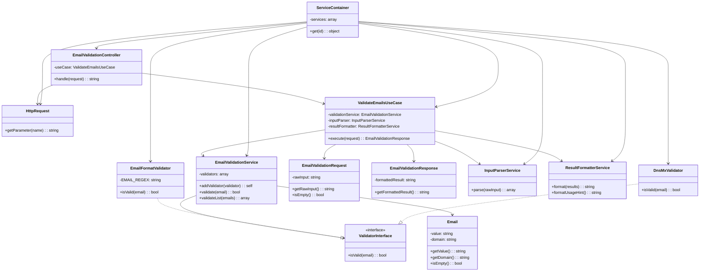

# Простая UML-схема "ПОСЛЕ" рефакторинга

## Диаграмма классов

## Улучшения новой архитектуры:

1. **Четкое разделение на слои** (Domain, Application, Infrastructure)
2. **Доменная сущность Email** - центральный объект
3. **Use Case** - четкий сценарий использования
4. **DTO объекты** - для передачи данных между слоями
5. **DI-контейнер** - управление зависимостями
6. **Разделение ответственностей** - каждый класс имеет одну задачу
