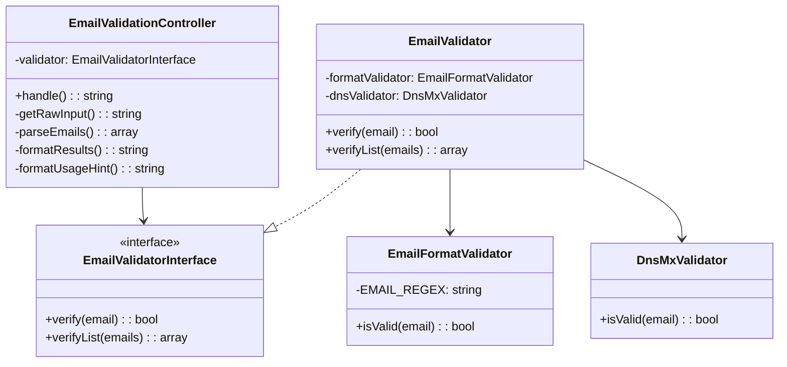

# Простая UML-схема "ДО" рефакторинга

## Диаграмма классов

## Проблемы исходной архитектуры:

1. **EmailValidator создает зависимости внутри себя** (нарушение DIP)
2. **Контроллер смешивает ответственности** (парсинг, валидация, форматирование)
3. **Нет четкого разделения на слои**
4. **Жесткая связанность** - сложно добавить новые валидаторы
5. **Отсутствие доменных сущностей**
