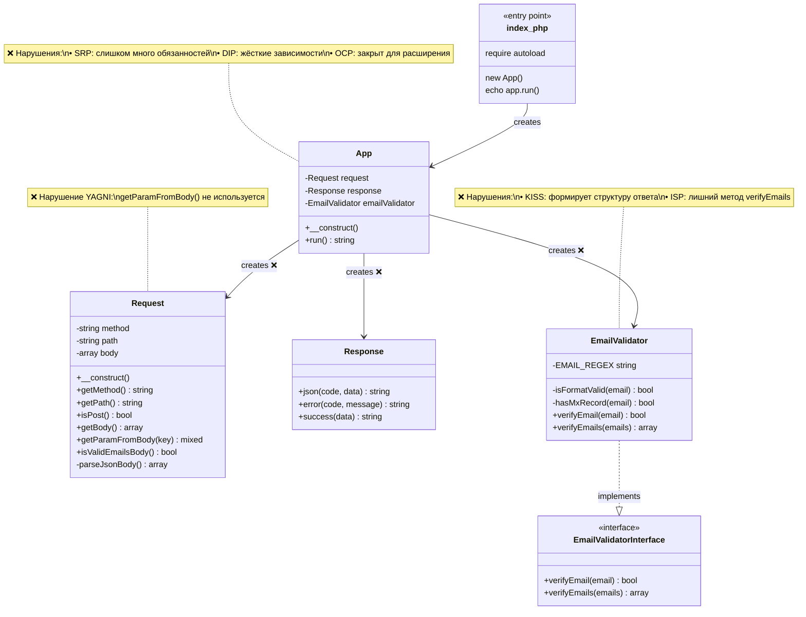

# UML-диаграмма старого кода (`old_code`)

## Диаграмма классов (Mermaid)

```mermaid
classDiagram
    direction TB

    %% ===== ENTRY POINT =====
    class index_php {
        <<entry point>>
        require autoload
        new App()
        echo app.run()
    }

    %% ===== MAIN APPLICATION =====
    class App {
        -Request request
        -Response response
        -EmailValidator emailValidator
        +__construct()
        +run() string
    }

    %% ===== HTTP LAYER =====
    class Request {
        -string method
        -string path
        -array body
        +__construct()
        +getMethod() string
        +getPath() string
        +isPost() bool
        +getBody() array
        +getParamFromBody(key) mixed
        +isValidEmailsBody() bool
        -parseJsonBody() array
    }

    class Response {
        +json(code, data) string
        +error(code, message) string
        +success(data) string
    }

    %% ===== SERVICE LAYER =====
    class EmailValidator {
        -EMAIL_REGEX string
        -isFormatValid(email) bool
        -hasMxRecord(email) bool
        +verifyEmail(email) bool
        +verifyEmails(emails) array
    }

    %% ===== INTERFACE =====
    class EmailValidatorInterface {
        <<interface>>
        +verifyEmail(email) bool
        +verifyEmails(emails) array
    }

    %% ===== RELATIONSHIPS =====
    index_php --> App : creates

    App --> Request : creates ❌
    App --> Response : creates ❌
    App --> EmailValidator : creates ❌

    EmailValidator ..|> EmailValidatorInterface : implements

    %% ===== NOTES =====
    note for App "❌ Нарушения:\n• SRP: слишком много обязанностей\n• DIP: жёсткие зависимости\n• OCP: закрыт для расширения"

    note for EmailValidator "❌ Нарушения:\n• KISS: формирует структуру ответа\n• ISP: лишний метод verifyEmails"

    note for Request "❌ Нарушение YAGNI:\ngetParamFromBody() не используется"
```

# UML-диаграмма нового кода (`code`)

```mermaid
classDiagram
    direction TB

    %% ===== DOMAIN LAYER (Ядро) =====
    namespace Domain {
        class EmailValidatorInterface {
            <<interface>>
            +validate(email) bool
        }

        class EmailValidator {
            -EMAIL_REGEX string
            -isFormatValid(email) bool
            -hasMxRecord(email) bool
            +validate(email) bool
        }

        class EmailValidationRequest {
            <<readonly DTO>>
            +array emails
            +__construct(emails)
        }

        class EmailValidationResult {
            <<readonly DTO>>
            +mixed email
            +bool isValid
            +__construct(email, isValid)
            +toArray() array
        }
    }

    %% ===== APPLICATION LAYER (Use Cases) =====
    namespace Application {
        class ValidateEmailsUseCaseInterface {
            <<interface>>
            +execute(request) EmailValidationResult[]
        }

        class ValidateEmailsUseCase {
            -EmailValidatorInterface emailValidator
            +__construct(emailValidator)
            +execute(request) EmailValidationResult[]
        }
    }

    %% ===== INFRASTRUCTURE LAYER =====
    namespace Infrastructure {
        class Request {
            -array server
            -array body
            +init()$ Request
            +getMethod() string
            +getPath() string
            +isPost() bool
            +getBody() array
        }

        class Response {
            -int statusCode
            -string content
            -array headers
            +success(data)$ Response
            +error(message, code)$ Response
            +send() void
        }

        class Container {
            -array definitions
            -array instances
            +set(id, definition) void
            +get(id) mixed
            +has(id) bool
            +singleton(id, definition) void
        }

        class ContainerBuilder {
            +build()$ Container
        }
    }

    %% ===== PRESENTATION LAYER =====
    namespace Presentation {
        class ControllerInterface {
            <<interface>>
            +handleRequest(request) Response
            +run() void
        }

        class ActionInterface {
            <<interface>>
            +supports(request) bool
            +handle(request) Response
        }

        class Controller {
            -ActionInterface[] actions
            +__construct(actions)
            +handleRequest(request) Response
            +run() void
        }

        class ValidateEmailsAction {
            -ValidateEmailsUseCaseInterface useCase
            +__construct(useCase)
            +supports(request) bool
            +handle(request) Response
        }
    }

    %% ===== RELATIONSHIPS =====

    %% Domain Layer (внутренние связи)
    EmailValidator ..|> EmailValidatorInterface : implements

    %% Application Layer
    ValidateEmailsUseCase ..|> ValidateEmailsUseCaseInterface : implements
    ValidateEmailsUseCase --> EmailValidatorInterface : depends on
    ValidateEmailsUseCase --> EmailValidationRequest : uses
    ValidateEmailsUseCase --> EmailValidationResult : creates

    %% Presentation Layer
    Controller ..|> ControllerInterface : implements
    Controller --> ActionInterface : uses
    ValidateEmailsAction ..|> ActionInterface : implements
    ValidateEmailsAction --> ValidateEmailsUseCaseInterface : depends on
    ValidateEmailsAction --> EmailValidationRequest : creates

    %% Infrastructure
    ContainerBuilder --> Container : creates
    Controller --> Request : uses
    Controller --> Response : uses
    ValidateEmailsAction --> Request : uses
    ValidateEmailsAction --> Response : uses
```
