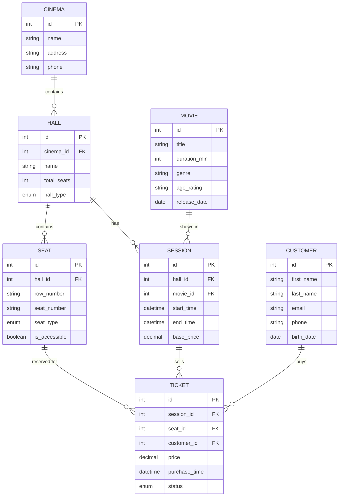

# Проектирование БД для системы управления кинотеатром

## ✅ Этап 1. Анализ предметной области

**Что делает система?**  
Кинотеатр проводит сеансы фильмов в залах. Клиенты покупают билеты на конкретный сеанс и конкретное место.

**Пользователи:**  
- Клиенты (покупают билеты)  
- Сотрудники кинотеатра (администраторы, кассиры) — в данной модели не выделяем отдельную таблицу, но учитываем при проектировании прав доступа.


## ✅ Этап 2. Сущности (исправленный список)

| Сущность     | Описание                                  |
|--------------|-------------------------------------------|
| `cinema`     | Кинотеатр (если сеть)                     |
| `hall`       | Зал (принадлежит кинотеатру)              |
| `movie`      | Фильм                                     |
| `session`    | Сеанс (в зале, время, фильм, базовая цена)|
| `seat`       | Место в зале (ряд, номер, тип)            |
| `customer`   | Клиент (покупатель)                       |
| `ticket`     | Билет (продажа на сеанс + место)          |

**Убраны лишние связочные таблицы** (Кинотеатр_Зал, Кинотеатр_Сеанс) — связи «один ко многим» реализуются через внешние ключи.

## ✅ Этап 3. Атрибуты (детально, с типами данных и обоснованием)

### 3.1. `cinema` — кинотеатр
| Поле      | Тип          | Ограничения          | Описание               |
|-----------|--------------|----------------------|------------------------|
| id        | INT          | PK, AUTO_INCREMENT   | Уникальный идентификатор|
| name      | VARCHAR(100) | NOT NULL             | Название кинотеатра    |
| address   | VARCHAR(255) | NOT NULL             | Адрес                  |
| phone     | VARCHAR(20)  |                      | Контактный телефон     |


### 3.2. `hall` — зал
| Поле         | Тип                             | Ограничения                     | Описание                         |
|--------------|---------------------------------|---------------------------------|----------------------------------|
| id           | INT                             | PK, AUTO_INCREMENT              |                                  |
| cinema_id    | INT                             | FK → cinema.id, NOT NULL        | К какому кинотеатру относится    |
| name         | VARCHAR(50)                     | NOT NULL                        | Номер или название зала          |
| total_seats  | INT UNSIGNED                    | NOT NULL                        | Общее количество мест            |
| hall_type    | ENUM('standard','imax','vip')   | NOT NULL DEFAULT 'standard'     | Тип зала (влияет на цену)        |


### 3.3. `movie` — фильм
| Поле           | Тип          | Ограничения       | Описание                         |
|----------------|--------------|-------------------|----------------------------------|
| id             | INT          | PK, AUTO_INCREMENT|                                  |
| title          | VARCHAR(255) | NOT NULL          | Название фильма                  |
| duration_min   | INT UNSIGNED | NOT NULL          | Длительность в минутах           |
| genre          | VARCHAR(100) |                   | Жанр (строка)                    |
| age_rating     | VARCHAR(10)  |                   | Возрастное ограничение           |
| release_date   | DATE         |                   | Дата премьеры                    |


### 3.4. `session` — сеанс
| Поле        | Тип           | Ограничения                | Описание                              |
|-------------|---------------|----------------------------|---------------------------------------|
| id          | INT           | PK, AUTO_INCREMENT         |                                       |
| hall_id     | INT           | FK → hall.id, NOT NULL     | В каком зале                          |
| movie_id    | INT           | FK → movie.id, NOT NULL    | Какой фильм                           |
| start_time  | DATETIME      | NOT NULL                   | Дата и время начала                   |
| end_time    | DATETIME      | NOT NULL                   | Время окончания (можно вычислять, но для индексов храним) |
| base_price  | DECIMAL(10,2) | NOT NULL                   | Базовая цена билета на этот сеанс     |


### 3.5. `seat` — место в зале
| Поле           | Тип                               | Ограничения                              | Описание                       |
|----------------|-----------------------------------|------------------------------------------|--------------------------------|
| id             | INT                               | PK, AUTO_INCREMENT                       |                                |
| hall_id        | INT                               | FK → hall.id, NOT NULL                   | В каком зале                   |
| row_number     | VARCHAR(5)                        | NOT NULL                                 | Номер ряда (буква/цифра)       |
| seat_number    | VARCHAR(5)                        | NOT NULL                                 | Номер места                    |
| seat_type      | ENUM('standard','comfort','vip')  | NOT NULL DEFAULT 'standard'              | Тип кресла                     |
| is_accessible  | BOOLEAN                           | DEFAULT FALSE                            | Для людей с ограниченными возможностями |
| **UNIQUE KEY** | **UNIQUE (hall_id, row_number, seat_number)** |                              | Гарантирует уникальность места в зале |


### 3.6. `customer` — клиент
| Поле        | Тип           | Ограничения      | Описание                         |
|-------------|---------------|------------------|----------------------------------|
| id          | INT           | PK, AUTO_INCREMENT|                                |
| first_name  | VARCHAR(100)  | NOT NULL         | Имя                              |
| last_name   | VARCHAR(100)  | NOT NULL         | Фамилия                          |
| email       | VARCHAR(255)  | UNIQUE           | Email                            |
| phone       | VARCHAR(20)   |                  | Телефон                          |
| birth_date  | DATE          |                  | Дата рождения (для скидок)       |


### 3.7. `ticket` — билет
| Поле          | Тип                                    | Ограничения                         | Описание                            |
|---------------|----------------------------------------|-------------------------------------|-------------------------------------|
| id            | INT                                    | PK, AUTO_INCREMENT                  |                                     |
| session_id    | INT                                    | FK → session.id, NOT NULL           | Сеанс                               |
| seat_id       | INT                                    | FK → seat.id, NOT NULL              | Место                               |
| customer_id   | INT                                    | FK → customer.id, NULL              | Клиент (NULL для анонимной продажи) |
| price         | DECIMAL(10,2)                          | NOT NULL                            | Фактическая цена продажи            |
| purchase_time | DATETIME                               | DEFAULT CURRENT_TIMESTAMP           | Время покупки                       |
| status        | ENUM('booked','paid','cancelled','refunded') | NOT NULL DEFAULT 'paid'       | Статус билета                       |
| **UNIQUE KEY**| **UNIQUE (session_id, seat_id)**       |                                     | Запрещает продажу одного места дважды на один сеанс |


## ✅ Этап 4. Связи

Кинотеатр (cinema)
   │
   └───► Зал (hall) [FK: cinema_id]
           │
           ├───► Место (seat) [FK: hall_id]
           │       │
           │       └──────────────┐
           │                      ▼
           └───► Сеанс (session) [FK: hall_id] ◄─── Фильм (movie)
                   │              │              [FK: movie_id]
                   └──────────────┤
                                  ▼
          Клиент (customer) ──► Билет (ticket)
                                [FK: session_id, seat_id, customer_id]

## ✅ Этап 5. Первичные и внешние ключи

| Таблица   | Первичный ключ | Внешние ключи                          |
|-----------|----------------|----------------------------------------|
| cinema    | id             | —                                      |
| hall      | id             | cinema_id → cinema.id                  |
| movie     | id             | —                                      |
| session   | id             | hall_id → hall.id, movie_id → movie.id |
| seat      | id             | hall_id → hall.id                      |
| customer  | id             | —                                      |
| ticket    | id             | session_id → session.id, seat_id → seat.id, customer_id → customer.id |


## 📐 Логическая модель (ER‑диаграмма в Mermaid)

Скопируйте код в редактор **https://mermaid.live** для визуализации.



## DDL‑скрипты (Postgres)
-- 0. Создание типов ENUM (в Postgres они создаются как отдельные объекты)
```
CREATE TYPE hall_type_enum AS ENUM ('standard', 'imax', 'vip');
CREATE TYPE seat_type_enum AS ENUM ('standard', 'comfort', 'vip');
CREATE TYPE ticket_status_enum AS ENUM ('booked', 'paid', 'cancelled', 'refunded');
```

-- 1. Кинотеатр
```
CREATE TABLE cinema (
    id SERIAL PRIMARY KEY,
    name VARCHAR(100) NOT NULL,
    address VARCHAR(255) NOT NULL,
    phone VARCHAR(20)
);
```

-- 2. Зал
```
CREATE TABLE hall (
    id SERIAL PRIMARY KEY,
    cinema_id INT NOT NULL,
    name VARCHAR(50) NOT NULL,
    total_seats INT NOT NULL CHECK (total_seats >= 0),
    hall_type hall_type_enum NOT NULL DEFAULT 'standard',

    CONSTRAINT fk_hall_cinema 
        FOREIGN KEY (cinema_id) 
            REFERENCES cinema(id) 
            ON DELETE CASCADE
);
```

-- 3. Фильм
```
CREATE TABLE movie (
    id SERIAL PRIMARY KEY,
    title VARCHAR(255) NOT NULL,
    -- продолжительность фильма должно быть > 0 
    duration_min INT NOT NULL CHECK (duration_min > 0),
    genre VARCHAR(100),
    age_rating VARCHAR(10),
    release_date DATE
);
```

-- 4. Сеанс
```
CREATE TABLE session (
    id SERIAL PRIMARY KEY,
    hall_id INT NOT NULL,
    movie_id INT NOT NULL,
    start_time TIMESTAMP(0) NOT NULL,
    end_time TIMESTAMP(0) NOT NULL,
    base_price DECIMAL(10,2) NOT NULL,

    -- время окончания не должно быть меньше чем время начала 
    CONSTRAINT check_session_duration 
        CHECK (end_time > start_time),

    -- ограничение на отрицательную цену
    CONSTRAINT check_session_base_price CHECK (base_price >= 0),

    -- ограничение, удаление зала связанным с ним сеансом 
    CONSTRAINT fk_session_hall 
        FOREIGN KEY (hall_id) 
            REFERENCES hall(id) 
            ON DELETE CASCADE,

    -- ограничение, когда удаление фильма опасно если на него уже завязаны данные (сеансы).
    CONSTRAINT fk_session_movie 
        FOREIGN KEY (movie_id) 
            REFERENCES movie(id) 
            ON DELETE RESTRICT
);
```

-- Индекс в Postgres создается отдельной командой
```
CREATE INDEX idx_start_time ON session (start_time);
```

-- 5. Место
```
CREATE TABLE seat (
    id SERIAL PRIMARY KEY,
    hall_id INT NOT NULL,
    row_number VARCHAR(5) NOT NULL,
    seat_number VARCHAR(5) NOT NULL,
    seat_type seat_type_enum NOT NULL DEFAULT 'standard',
    is_accessible BOOLEAN DEFAULT FALSE,
    CONSTRAINT fk_seat_hall FOREIGN KEY (hall_id) REFERENCES hall(id) ON DELETE CASCADE,
    CONSTRAINT unique_seat UNIQUE (hall_id, row_number, seat_number)
);
```

-- 6. Клиент
```
CREATE TABLE customer (
    id SERIAL PRIMARY KEY,
    first_name VARCHAR(100) NOT NULL,
    last_name VARCHAR(100) NOT NULL,
    email VARCHAR(255) UNIQUE,
    phone VARCHAR(20),
    birth_date DATE
);
```

-- 7. Билет
```
CREATE TABLE ticket (
    id SERIAL PRIMARY KEY,
    session_id INT NOT NULL,
    seat_id INT NOT NULL,
    customer_id INT,
    price DECIMAL(10,2) NOT NULL,
    purchase_time TIMESTAMP(0) DEFAULT CURRENT_TIMESTAMP,
    status ticket_status_enum NOT NULL DEFAULT 'paid',

    -- Запрет отмены сеанса, на который уже проданы билеты
    CONSTRAINT fk_ticket_session
        FOREIGN KEY (session_id) 
            REFERENCES session(id) 
            ON DELETE RESTRICT,

    -- Контроль корректности суммы фактической оплаты
    CONSTRAINT check_ticket_final_price
        CHECK (price >= 0),

    -- Аннулирование билетов при физическом удалении места из схемы зала
    CONSTRAINT fk_ticket_seat
        FOREIGN KEY (seat_id) 
            REFERENCES seat(id) 
            ON DELETE CASCADE,
            
    -- Сохранение данных о продаже при удалении профиля клиента 
    CONSTRAINT fk_ticket_customer 
        FOREIGN KEY (customer_id) 
            REFERENCES customer(id) 
            ON DELETE SET NULL,

    -- Защита от двойной продажи одного места на конкретный сеанс
    CONSTRAINT unique_ticket 
        UNIQUE (session_id, seat_id)
);
```

Сценарии для проверки «на прочность»
1. Кейс «Сеанс из будущего в прошлом» [1, 2]
Попробуйте создать сеанс в таблице session, где end_time (время окончания) хронологически меньше, чем start_time (время начала). Позволит ли база это сделать?
Для этого было написанно ограничение
```
CONSTRAINT check_session_duration CHECK (end_time > start_time),
```
Проверка кейса
```
INSERT INTO session (hall_id, movie_id, start_time, end_time, base_price) 
VALUES (1, 1, '2024-05-10 20:00:00', '2024-05-10 18:00:00', 500.00);
```

2. Кейс «Бесплатное кино» [1, 2]
Попробуйте создать сеанс с base_price = 0.00 или отрицательным значением. Допустимо ли это для вашего бизнеса? (В MySQL DECIMAL может быть отрицательным, если нет UNSIGNED или CHECK).

Шаг 1: Тест на «отрицательную» цену (Диверсия)

```
INSERT INTO session (hall_id, movie_id, start_time, end_time, base_price) 
VALUES (1, 1, '2024-06-01 10:00:00', '2024-06-01 12:00:00', -150.50);
```

Ожидаемый результат:
```
ERROR: new row for relation "session" violates check constraint "check_session_base_price"
Failing row contains (..., -150.50).
```

Шаг 2: Тест на «нулевую» цену (Бесплатный сеанс)

```
INSERT INTO session (hall_id, movie_id, start_time, end_time, base_price) 
VALUES (1, 1, '2024-06-01 13:00:00', '2024-06-01 15:00:00', 0.00);
```

3. Кейс «Удаление истории» [1, 2]
Удалите запись из таблицы cinema. Проверьте, что произойдет с таблицей ticket. Останутся ли у вас данные о выручке (деньгах) за прошлый год, если кинотеатр закрылся и вы удалили его из справочника?

Попытка «диверсии» (Удаление кинотеатра)
Теперь попробуем удалить кинотеатр «Октябрь». Учитывая DDL, цепочка CASCADE должна дойти до билетов и наткнуться на RESTRICT.

```
DELETE FROM cinema WHERE name = 'Октябрь';
```
Ожидаемый результат:
```
ERROR: update or delete on table "session" violates foreign key constraint "fk_ticket_session" on table "ticket"
DETAIL: Key (id)=(1) is still referenced from table "ticket".
```

Проверка «выживших» данных
После ошибки в Шаге 2 убедимся, что база данных ничего не удалила (транзакция откатилась полностью)

```
-- Проверяем, на месте ли кинотеатр
SELECT * FROM cinema WHERE name = 'Октябрь';

-- Проверяем, на месте ли билеты
SELECT count(*) FROM ticket;
```

4. Кейс «Фильм-призрак» [1, 2]
Создайте фильм с duration_min = 0. Позволит ли это система? Как это повлияет на расчет end_time в сеансах?

insert into movie (title, duration_min, genre, age_rating, release_date) values('Унесенные ветром', 0, 'action movie', '18+',  '2024-06-01 10:00:00');

5. Кейс «Проверка на дубликаты билетов» [1, 2]
Попробуйте создать два билета на один и тот же session_id и один и тот же seat_id. 

```
insert into ticket (session_id, seat_id, customer_id, price, purchase_time) values(1, 7, 1, 550.80, '2024-06-01 13:00:00');
```
при повторном выполнении будет выброшена ошибка 

ERROR:  duplicate key value violates unique constraint "unique_ticket"
Key (session_id, seat_id)=(1, 7) already exists. 

6. Сохранение данных о продаже при удалении профиля клиента 

Удаляем пользователя 
```
DELETE FROM customer WHERE id = 2;
```
Видим что в таблице ticket в колонке customer_id значение null


## ✅ Этап 6. Самый прибыльный фильм

```
SELECT
    m.id,
    m.title,
    COUNT(t.id) AS tickets_sold
FROM movie m
JOIN session s ON m.id = s.movie_id
JOIN ticket t ON s.id = t.session_id
WHERE t.status = 'paid'
GROUP BY m.id, m.title
ORDER BY tickets_sold DESC
LIMIT 1;
```

## Подсказки
## 🔑 = PK (Primary Key) — главный ключ
## 🟦 = FK (Foreign Key) — внешний ключ (ссылка на 🔑)
# Запускаем заново с принудительным пересозданием
```
docker compose up -d --force-recreate
```
```
docker compose down -v && docker compose up -d # Флаг -v удаляет volumes (ваши данные)
```