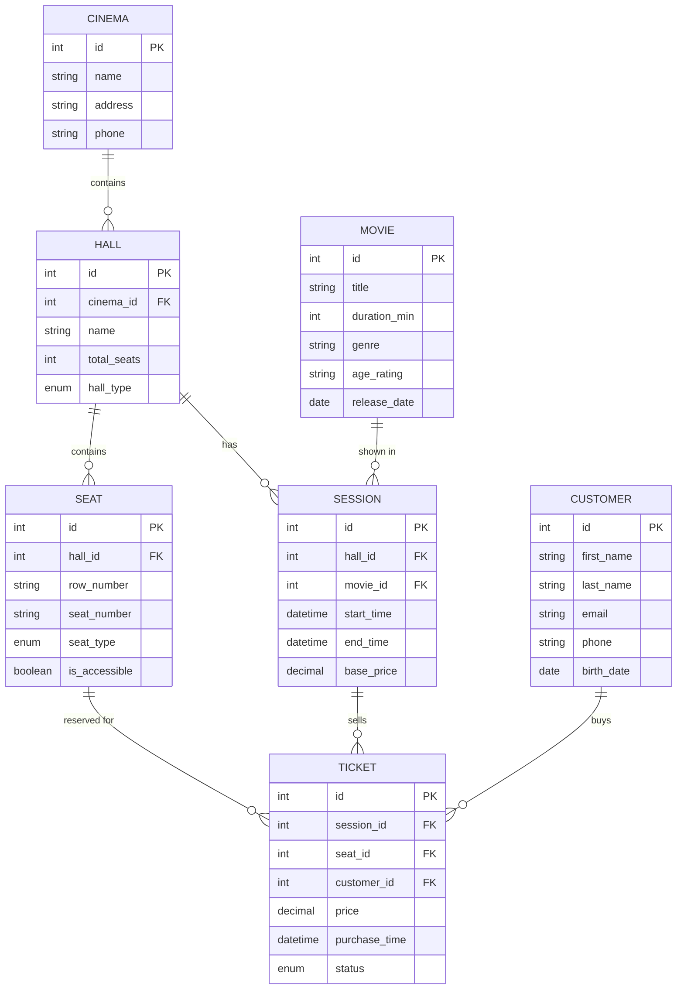

# Проектирование БД для системы управления кинотеатром

## Домашнее задание: полное решение с разбором ошибок, нормализацией, ER‑диаграммой, DDL и SQL

## 🔑 = PK (Primary Key) — главный ключ
## 🟦 = FK (Foreign Key) — внешний ключ (ссылка на 🔑)

---

## ✅ Этап 1. Анализ предметной области (уточнённый)

**Что делает система?**  
Кинотеатр проводит сеансы фильмов в залах. Клиенты покупают билеты на конкретный сеанс и конкретное место.

**Пользователи:**  
- Клиенты (покупают билеты)  
- Сотрудники кинотеатра (администраторы, кассиры) — в данной модели не выделяем отдельную таблицу, но учитываем при проектировании прав доступа.

**Бизнес‑правила (отвечаем на вопросы учителя):**  
1. **Не все сеансы и места стоят одинаково**  
   → Цена зависит от времени сеанса, типа зала, типа места, акций.  
   Реализация: таблица `session` хранит базовую цену, таблица `seat` хранит тип места, в билете фиксируется финальная цена.  
2. **Схема зала** → таблица `seat`, где каждое место привязано к залу, имеет ряд, номер и тип.

---

## ✅ Этап 2. Сущности (исправленный список)

| Сущность     | Описание                                  |
|--------------|-------------------------------------------|
| `cinema`     | Кинотеатр (если сеть)                    |
| `hall`       | Зал (принадлежит кинотеатру)             |
| `movie`      | Фильм                                    |
| `session`    | Сеанс (в зале, время, фильм, базовая цена) |
| `seat`       | Место в зале (ряд, номер, тип)           |
| `customer`   | Клиент (покупатель)                      |
| `ticket`     | Билет (продажа на сеанс + место)         |

**Убраны лишние связочные таблицы** (Кинотеатр_Зал, Кинотеатр_Сеанс) — связи «один ко многим» реализуются через внешние ключи.

---

## ✅ Этап 3. Атрибуты (детально, с типами данных и обоснованием)

### 3.1. `cinema` — кинотеатр
| Поле      | Тип          | Ограничения          | Описание               |
|-----------|--------------|----------------------|------------------------|
| id        | INT          | PK, AUTO_INCREMENT   | Уникальный идентификатор |
| name      | VARCHAR(100) | NOT NULL             | Название кинотеатра    |
| address   | VARCHAR(255) | NOT NULL             | Адрес                  |
| phone     | VARCHAR(20)  |                      | Контактный телефон     |

---

### 3.2. `hall` — зал
| Поле         | Тип                             | Ограничения                     | Описание                         |
|--------------|---------------------------------|---------------------------------|----------------------------------|
| id           | INT                             | PK, AUTO_INCREMENT              |                                  |
| cinema_id    | INT                             | FK → cinema.id, NOT NULL        | К какому кинотеатру относится    |
| name         | VARCHAR(50)                     | NOT NULL                        | Номер или название зала          |
| total_seats  | INT UNSIGNED                    | NOT NULL                        | Общее количество мест            |
| hall_type    | ENUM('standard','imax','vip')   | NOT NULL DEFAULT 'standard'     | Тип зала (влияет на цену)        |

---

### 3.3. `movie` — фильм
| Поле           | Тип          | Ограничения       | Описание                         |
|----------------|--------------|-------------------|----------------------------------|
| id             | INT          | PK, AUTO_INCREMENT|                                  |
| title          | VARCHAR(255) | NOT NULL          | Название фильма                 |
| duration_min   | INT UNSIGNED | NOT NULL          | Длительность в минутах          |
| genre          | VARCHAR(100) |                   | Жанр (строка)                   |
| age_rating     | VARCHAR(10)  |                   | Возрастное ограничение (0+, 6+ и т.д.) |
| release_date   | DATE         |                   |  Дата премьеры                   |

---

### 3.4. `session` — сеанс
| Поле        | Тип           | Ограничения                | Описание                              |
|-------------|---------------|----------------------------|---------------------------------------|
| id          | INT           | PK, AUTO_INCREMENT         |                                       |
| hall_id     | INT           | FK → hall.id, NOT NULL     | В каком зале                         |
| movie_id    | INT           | FK → movie.id, NOT NULL    | Какой фильм                          |
| start_time  | DATETIME      | NOT NULL                   | Дата и время начала                  |
| end_time    | DATETIME      | NOT NULL                   | Время окончания (можно вычислять, но для индексов храним) |
| base_price  | DECIMAL(10,2) | NOT NULL                   | Базовая цена билета на этот сеанс    |

---

### 3.5. `seat` — место в зале
| Поле           | Тип                               | Ограничения                              | Описание                       |
|----------------|-----------------------------------|------------------------------------------|--------------------------------|
| id             | INT                               | PK, AUTO_INCREMENT                       |                                |
| hall_id        | INT                               | FK → hall.id, NOT NULL                  | В каком зале                  |
| row_number     | VARCHAR(5)                        | NOT NULL                                | Номер ряда (буква/цифра)      |
| seat_number    | VARCHAR(5)                        | NOT NULL                                | Номер места                   |
| seat_type      | ENUM('standard','comfort','vip') | NOT NULL DEFAULT 'standard'             | Тип кресла                    |
| is_accessible  | BOOLEAN                           | DEFAULT FALSE                           | Для людей с ограниченными возможностями |
| **UNIQUE KEY** | **UNIQUE (hall_id, row_number, seat_number)** | | Гарантирует уникальность места в зале |

---

### 3.6. `customer` — клиент
| Поле        | Тип           | Ограничения      | Описание                         |
|-------------|---------------|------------------|----------------------------------|
| id          | INT           | PK, AUTO_INCREMENT |                                  |
| first_name  | VARCHAR(100)  | NOT NULL         | Имя                              |
| last_name   | VARCHAR(100)  | NOT NULL         | Фамилия                          |
| email       | VARCHAR(255)  | UNIQUE           | Email                            |
| phone       | VARCHAR(20)   |                  | Телефон                          |
| birth_date  | DATE          |                  | Дата рождения (для скидок)       |

---

### 3.7. `ticket` — билет
| Поле          | Тип                                    | Ограничения                         | Описание                            |
|---------------|----------------------------------------|-------------------------------------|-------------------------------------|
| id            | INT                                    | PK, AUTO_INCREMENT                  |                                     |
| session_id    | INT                                    | FK → session.id, NOT NULL          | Сеанс                               |
| seat_id       | INT                                    | FK → seat.id, NOT NULL             | Место                               |
| customer_id   | INT                                    | FK → customer.id, NULL             | Клиент (NULL для анонимной продажи) |
| price         | DECIMAL(10,2)                         | NOT NULL                           | Фактическая цена продажи            |
| purchase_time | DATETIME                              | DEFAULT CURRENT_TIMESTAMP          | Время покупки                      |
| status        | ENUM('booked','paid','cancelled','refunded') | NOT NULL DEFAULT 'paid' | Статус билета                      |
| **UNIQUE KEY**| **UNIQUE (session_id, seat_id)**      |                                     | Запрещает продажу одного места дважды на один сеанс |

---

## ✅ Этап 4. Связи (правильные, с FK)

1. **cinema (1)** —— **(M) hall**  → `hall.cinema_id` FK  
2. **hall (1)**   —— **(M) session** → `session.hall_id` FK  
3. **hall (1)**   —— **(M) seat**   → `seat.hall_id` FK  
4. **movie (1)**  —— **(M) session** → `session.movie_id` FK  
5. **session (1)** —— **(M) ticket** → `ticket.session_id` FK  
6. **seat (1)**   —— **(M) ticket** → `ticket.seat_id` FK (с уникальностью пары session_id+seat_id)  
7. **customer (1)** —— **(M) ticket** → `ticket.customer_id` FK (может быть NULL)

**Никаких лишних связочных таблиц** — все связи «один‑ко‑многим» реализованы прямыми внешними ключами.

---

## ✅ Этап 5. Первичные и внешние ключи (исправленные)

| Таблица   | Первичный ключ | Внешние ключи                          |
|-----------|----------------|----------------------------------------|
| cinema    | id             | —                                      |
| hall      | id             | cinema_id → cinema.id                 |
| movie     | id             | —                                      |
| session   | id             | hall_id → hall.id, movie_id → movie.id |
| seat      | id             | hall_id → hall.id                     |
| customer  | id             | —                                      |
| ticket    | id             | session_id → session.id, seat_id → seat.id, customer_id → customer.id |

**Составные уникальные ограничения:**  
- `seat`: (hall_id, row_number, seat_number)  
- `ticket`: (session_id, seat_id)

---

## 📐 Логическая модель (ER‑диаграмма в Mermaid)

Скопируйте код в редактор **https://mermaid.live** для визуализации.

## DDL‑скрипты (MySQL)

-- 1. Кинотеатр
CREATE TABLE cinema (
    id INT PRIMARY KEY AUTO_INCREMENT,
    name VARCHAR(100) NOT NULL,
    address VARCHAR(255) NOT NULL,
    phone VARCHAR(20)
);

-- 2. Зал
CREATE TABLE hall (
    id INT PRIMARY KEY AUTO_INCREMENT,
    cinema_id INT NOT NULL,
    name VARCHAR(50) NOT NULL,
    total_seats INT UNSIGNED NOT NULL,
    hall_type ENUM('standard', 'imax', 'vip') NOT NULL DEFAULT 'standard',
    FOREIGN KEY (cinema_id) REFERENCES cinema(id) ON DELETE CASCADE
);

-- 3. Фильм
CREATE TABLE movie (
    id INT PRIMARY KEY AUTO_INCREMENT,
    title VARCHAR(255) NOT NULL,
    duration_min INT UNSIGNED NOT NULL,
    genre VARCHAR(100),
    age_rating VARCHAR(10),
    release_date DATE
);

-- 4. Сеанс
CREATE TABLE session (
    id INT PRIMARY KEY AUTO_INCREMENT,
    hall_id INT NOT NULL,
    movie_id INT NOT NULL,
    start_time DATETIME NOT NULL,
    end_time DATETIME NOT NULL,
    base_price DECIMAL(10,2) NOT NULL,
    FOREIGN KEY (hall_id) REFERENCES hall(id) ON DELETE CASCADE,
    FOREIGN KEY (movie_id) REFERENCES movie(id) ON DELETE CASCADE,
    INDEX idx_start_time (start_time)
);

-- 5. Место
CREATE TABLE seat (
    id INT PRIMARY KEY AUTO_INCREMENT,
    hall_id INT NOT NULL,
    row_number VARCHAR(5) NOT NULL,
    seat_number VARCHAR(5) NOT NULL,
    seat_type ENUM('standard', 'comfort', 'vip') NOT NULL DEFAULT 'standard',
    is_accessible BOOLEAN DEFAULT FALSE,
    FOREIGN KEY (hall_id) REFERENCES hall(id) ON DELETE CASCADE,
    UNIQUE KEY unique_seat (hall_id, row_number, seat_number)
);

-- 6. Клиент
CREATE TABLE customer (
    id INT PRIMARY KEY AUTO_INCREMENT,
    first_name VARCHAR(100) NOT NULL,
    last_name VARCHAR(100) NOT NULL,
    email VARCHAR(255) UNIQUE,
    phone VARCHAR(20),
    birth_date DATE
);

-- 7. Билет
CREATE TABLE ticket (
    id INT PRIMARY KEY AUTO_INCREMENT,
    session_id INT NOT NULL,
    seat_id INT NOT NULL,
    customer_id INT,
    price DECIMAL(10,2) NOT NULL,
    purchase_time DATETIME DEFAULT CURRENT_TIMESTAMP,
    status ENUM('booked', 'paid', 'cancelled', 'refunded') NOT NULL DEFAULT 'paid',
    FOREIGN KEY (session_id) REFERENCES session(id) ON DELETE CASCADE,
    FOREIGN KEY (seat_id) REFERENCES seat(id) ON DELETE CASCADE,
    FOREIGN KEY (customer_id) REFERENCES customer(id) ON DELETE SET NULL,
    UNIQUE KEY unique_ticket (session_id, seat_id)
);