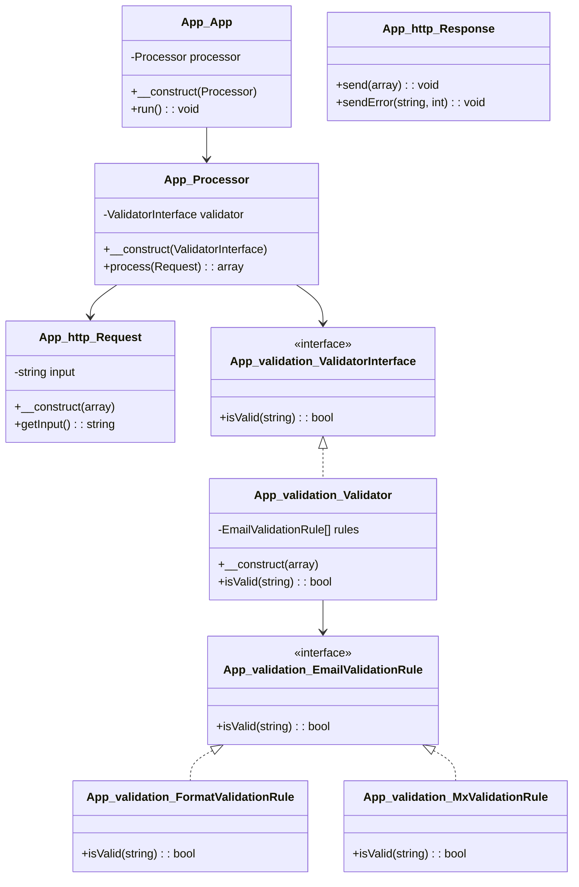

```mermaid
classDiagram

%% Основные компоненты
class App_App {
    -Processor processor
    +__construct(Processor)
    +run(): void
}

class App_Processor {
    -ValidatorInterface validator
    +__construct(ValidatorInterface)
    +process(Request): array
}

class App_http_Request {
    -string input
    +__construct(array)
    +getInput(): string
}

class App_http_Response {
    +send(array): void
    +sendError(string, int): void
}

%% Валидация
class App_validation_ValidatorInterface {
    <<interface>>
    +isValid(string): bool
}

class App_validation_Validator {
    -EmailValidationRule[] rules
    +__construct(array)
    +isValid(string): bool
}

class App_validation_EmailValidationRule {
    <<interface>>
    +isValid(string): bool
}

class App_validation_FormatValidationRule {
    +isValid(string): bool
}

class App_validation_MxValidationRule {
    +isValid(string): bool
}

%% Связи
App_App --> App_Processor
App_Processor --> App_http_Request
App_Processor --> App_validation_ValidatorInterface
App_validation_ValidatorInterface <|.. App_validation_Validator
App_validation_EmailValidationRule <|.. App_validation_FormatValidationRule
App_validation_EmailValidationRule <|.. App_validation_MxValidationRule
App_validation_Validator --> App_validation_EmailValidationRule
```