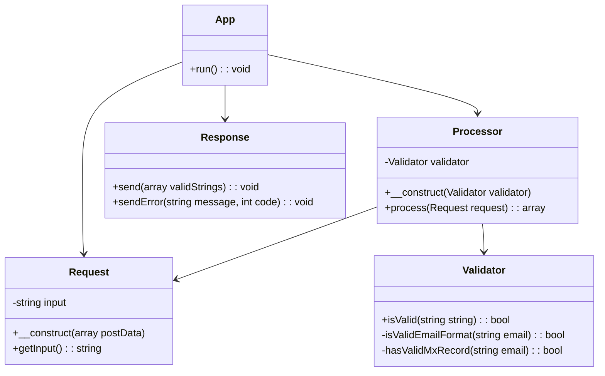

```mermaid
classDiagram
    class App {
        +run(): void
    }

    class Processor {
        -Validator validator
        +__construct(Validator validator)
        +process(Request request): array
    }

    class Request {
        -string input
        +__construct(array postData)
        +getInput(): string
    }

    class Response {
        +send(array validStrings): void
        +sendError(string message, int code): void
    }

    class Validator {
        +isValid(string string): bool
        -isValidEmailFormat(string email): bool
        -hasValidMxRecord(string email): bool
    }

    %% Dependencies
    App --> Request
    App --> Response
    App --> Processor
    Processor --> Validator
    Processor --> Request
```
