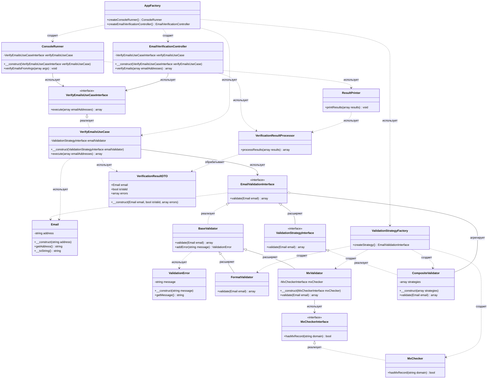

```mermaid
classDiagram
    %% Domain-классы
    class Email {
        -string address
        +__construct(string address)
        +getAddress() string
        +__toString() string
    }

    class ValidationError {
        -string message
        +__construct(string message)
        +getMessage() string
    }

    class BaseValidator {
        +validate(Email email) array
        +addError(string message) ValidationError
    }

    class FormatValidator {
        +validate(Email email) array
    }

    class MxValidator {
        -MxCheckerInterface mxChecker
        +__construct(MxCheckerInterface mxChecker)
        +validate(Email email) array
    }

    %% Domain-интерфейсы
    class EmailValidationInterface {
        <<interface>>
        +validate(Email email) array
    }

    class MxCheckerInterface {
        <<interface>>
        +hasMxRecord(string domain) bool
    }


    %% Application-классы
    class VerificationResultDTO {
        +Email email
        +bool isValid
        +array errors
        +__construct(Email email, bool isValid, array errors)
    }

    class CompositeValidator {
        -array strategies
        +__construct(array strategies)
        +validate(Email email) array
    }

    class VerifyEmailsUseCase {
        -ValidationStrategyInterface emailValidator
        +__construct(ValidationStrategyInterface emailValidator)
        +execute(array emailAddresses) array
    }

    %% Application-интерфейсы

    class ValidationStrategyInterface {
        <<interface>>
        +validate(Email email) array
    }

    class VerifyEmailsUseCaseInterface {
        <<interface>>
        +execute(array emailAddresses) array
    }


    %% Infrastructure-классы
    class MxChecker {
        +hasMxRecord(string domain) bool
    }

    class ValidationStrategyFactory {
        +createStrategy() EmailValidationInterface
    }


    %% Presentation-классы
    class ConsoleRunner {
        -VerifyEmailsUseCaseInterface verifyEmailsUseCase
        +__construct(VerifyEmailsUseCaseInterface verifyEmailsUseCase)
        +verifyEmailsFromArgs(array args) void
    }

    class EmailVerificationController {
        -VerifyEmailsUseCaseInterface verifyEmailsUseCase
        +__construct(VerifyEmailsUseCaseInterface verifyEmailsUseCase)
        +verifyEmails(array emailAddresses) array
    }

    class VerificationResultProcessor {
        +processResults(array results) array
    }

    class ResultPrinter {
        +printResults(array results) void
    }

    class AppFactory {
        +createConsoleRunner() ConsoleRunner
        +createEmailVerificationController() EmailVerificationController
    }

    %% Связи
    EmailValidationInterface ..> Email : использует
    EmailValidationInterface <|.. BaseValidator : реализует
    BaseValidator ..> ValidationError : использует
    BaseValidator <|-- FormatValidator : расширяет
    BaseValidator <|-- MxValidator : расширяет
    MxValidator --> MxCheckerInterface : использует

    EmailValidationInterface <|-- ValidationStrategyInterface : расширяет
    ValidationStrategyInterface <|.. CompositeValidator : реализует
    CompositeValidator --o EmailValidationInterface : агрегирует
    VerifyEmailsUseCaseInterface <|.. VerifyEmailsUseCase : реализует
    VerifyEmailsUseCase --> EmailValidationInterface : использует
    VerifyEmailsUseCase ..> Email : использует
    VerifyEmailsUseCase ..> VerificationResultDTO : использует

    MxCheckerInterface <|.. MxChecker : реализует
    ValidationStrategyFactory ..> CompositeValidator : создает
    ValidationStrategyFactory ..> MxChecker : создает
    ValidationStrategyFactory ..> FormatValidator : создает
    ValidationStrategyFactory ..> MxValidator : создает

    ConsoleRunner --> VerifyEmailsUseCaseInterface : использует
    ConsoleRunner ..> ResultPrinter : использует
    EmailVerificationController --> VerifyEmailsUseCaseInterface : использует
    EmailVerificationController ..> VerificationResultProcessor : использует
    VerificationResultProcessor ..> VerificationResultDTO : обрабатывает
    ResultPrinter ..> VerificationResultProcessor : использует
    AppFactory ..> ConsoleRunner : создает
    AppFactory ..> EmailVerificationController : создает
    AppFactory ..> ValidationStrategyFactory : использует
    AppFactory ..> VerifyEmailsUseCase : использует
```
