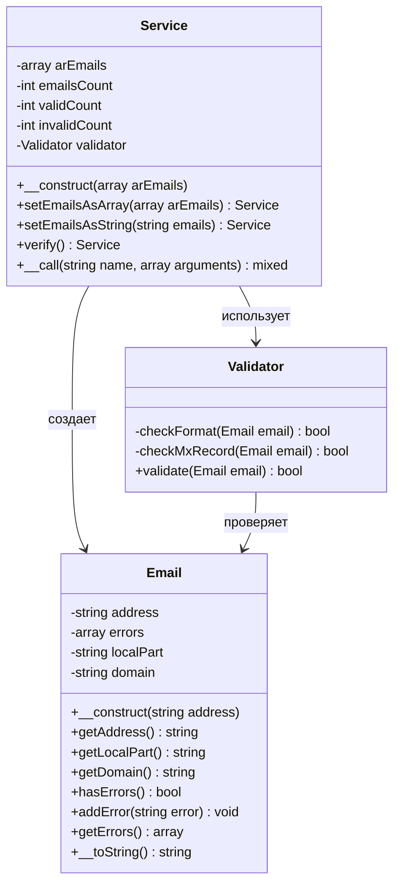

```mermaid
classDiagram
    class Email {
        -string address
        -array errors
        -string localPart
        -string domain
        +__construct(string address)
        +getAddress() string
        +getLocalPart() string
        +getDomain() string
        +hasErrors() bool
        +addError(string error) void
        +getErrors() array
        +__toString() string
    }

    class Validator {
        -checkFormat(Email email) bool
        -checkMxRecord(Email email) bool
        +validate(Email email) bool
    }

    class Service {
        -array arEmails
        -int emailsCount
        -int validCount
        -int invalidCount
        -Validator validator
        +__construct(array arEmails)
        +setEmailsAsArray(array arEmails) Service
        +setEmailsAsString(string emails) Service
        +verify() Service
        +__call(string name, array arguments) mixed
    }

    Service --> Validator : использует
    Service --> Email : создает
    Validator --> Email : проверяет
```
